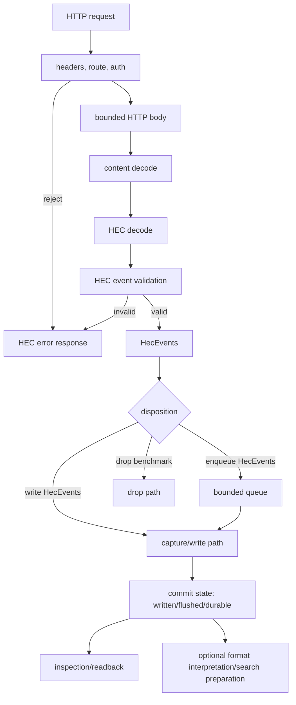

# HECpoc — Focused HEC Receiver Design

HECpoc is a focused Rust implementation of a small, testable HTTP Event Collector receiver. The first product is a local endpoint that accepts realistic Splunk HEC traffic, preserves accepted events, exposes enough inspection to assert what arrived, and makes compatibility differences explicit.

Mandate: own the product contract, HEC-visible behavior, staged architecture, and documentation authority for the project. The full documentation map and inclusion rules are maintained in Section 8.

The starting user is a developer or CI engineer who wants to test code that sends logs to Splunk HEC without running full Splunk for every run. The immediate benefit is practical: catch bad tokens, malformed payloads, missing metadata, gzip mistakes, raw endpoint surprises, retry behavior, and storage/inspection mismatches before production.

Scope is intentionally narrow: HEC ingest, local capture, inspection, validation, and measurement. Search, parser specialization, Sigma, retention, repair, TLS hardening, full ACK semantics, and performance-specific storage enter only after the HEC path proves correct enough to need them. This document defines the product contract, protocol behavior, high-level architecture, staged decisions, documentation map, and references for the HECpoc documentation set.

---

## 1. Scope, Wants, And Capability Bundles

The design starts from user wants and then derives feature bundles. It should not be organized around every Splunk feature that can be named.

### 1.1 User Wants And Benefits

The user wants to start a local endpoint, send events using ordinary HEC clients, see clear success or failure, inspect accepted events, compare selected behavior with Splunk, and repeat the same run in development and CI.

| Feature | Benefit |
|---------|---------|
| HEC JSON ingest | Applications and shippers use their real output path |
| Raw ingest | Raw endpoint users and line senders can be tested |
| Token auth | Bad-token and missing-auth failures are caught |
| Gzip decode | Common compressed client behavior is covered |
| Metadata capture | Tests assert time, host, source, sourcetype, and index |
| File capture sink | Accepted events are directly inspectable |
| Backpressure response | Overload becomes visible, not silently accepted |
| Local inspection | Tests assert stored output without reading internals |
| Bounded resource use | Bad inputs and slow sinks do not consume unbounded memory or runtime capacity |
| Resilient failure reporting | Users can distinguish rejected, accepted, written, flushed, durable, and failed-after-accept cases |

### 1.2 Capability Bundles

Group capabilities by functional bundle and likely sequence, not by requirement prefix.

| Bundle | Contents | Stage | Action |
|--------|----------|-------|--------|
| A. JSON, raw, files | `ING-HEC-JSON`, `ING-HEC-RAW`, `EVT-RAW`; visible file/capture evidence | First | keep protocol tests and capture readback passing |
| B. Backpressure | `ING-BACKPRESS`; explicit retryable failure under saturation | First | add bounded queue and deterministic queue-full response |
| C. Time and metadata | `EVT-TIME`, `EVT-HOST`, `EVT-SOURCE`, `EVT-SOURCETYPE`; event identity | First | verify storage fields and Splunk comparison cases |
| D. Auth and gzip | `ING-HEC-AUTH`, `ING-HEC-GZIP`; realistic client behavior | First | complete malformed/oversize/unsupported tests |
| E. Inspection | `SCH-TERM`, `SCH-TIME`, maybe `SCH-FIELDS`; assertion surface | Early | expose stable fixture readback before indexing |
| F. More sinks, index, metrics | `EVT-INDEX`, `OBS-METRICS`, durable sink work | Later | define Store interface and benchmark profiles first |
| G. ACK and capability metadata | `ING-HEC-ACK`, `PAR-CAP`; commit and parser capability semantics | Later | implement only after commit-boundary design is encoded |
| H. Resource and resilience controls | body limits, queue limits, slow-sink behavior, health degradation | First | make limits configurable and observable |

### 1.3 Design Detail Level

Capture concrete requirements, high-level architecture, event validation, sink/store boundaries, and only the low-level details that block implementation. Work decomposition should stay short and actionable. Validation is designed alongside code, not appended after it.

---

## 2. Protocol And Event Semantics

Protocol design is the first technical center of gravity. It defines the externally visible HEC behavior, the internal data units that survive request handling, and the states the receiver may truthfully report.

### 2.1 Definitive Data Path, States, And Entities

The active HECpoc data path is:

```text
transport stream
  -> HTTP request/framing
  -> HTTP headers and route
  -> auth and request metadata validation
  -> HTTP body
  -> content decode
  -> HEC decode
  -> HEC event validation
  -> HecEvents formation
  -> concrete disposition
  -> selected commit state
  -> optional format interpretation
  -> optional search preparation
```

Short form:

```text
receive HTTP request -> validate headers/auth -> read HTTP body -> content decode -> HEC decode -> validate events -> form HecEvents -> disposition -> commit state -> optional interpretation/search-prep
```

Request states used by implementation, tests, and reporting:

| State | Meaning | Failure/Response Implication |
|-------|---------|------------------------------|
| `authenticated` | HEC auth requirements passed | failures map to auth HEC errors before body-dependent work |
| `body_read` | bounded HTTP body was read under configured limits | failures map to body limit, timeout, or read errors |
| `decoded` | content encoding such as gzip was decoded | failures map to unsupported or malformed encoding outcomes |
| `hec_decoded` | `/event` JSON envelopes or `/raw` line units were decoded | failures map to endpoint/protocol parse outcomes |
| `validated` | HEC event requirements passed | failures map to missing/blank event, invalid fields, or configured index policy |
| `accepted` | valid `HecEvents` exist | success may claim only accepted unless a stronger disposition completed |
| `queued` | `HecEvents` entered a bounded queue | valid benchmark or ACK boundary only when configured |
| `written` | write call returned for the selected sink/store path | not crash durable |
| `flushed` | userspace flush returned | kernel/page-cache visible but not power-loss durable |
| `durable` | `fsync`, DB commit, or equivalent durable boundary completed | first production-grade ACK boundary |
| `search_ready` | search-prep structures exist for the evidence | query acceleration is available |

Core entities:

| Entity | Meaning | Owner |
|--------|---------|-------|
| `HecRequest` | Method, path, headers, body stream, route, peer facts when exposed | Stack/HEC receiver boundary |
| `HecCredential` | Parsed auth scheme and token class | HEC auth |
| `HecEnvelope` | One JSON object decoded from `/services/collector/event` | HEC decode |
| `RequestRaw` | Decoded `/raw` HTTP body before LF splitting | HEC raw endpoint |
| `RawEvents` | Non-empty raw events produced by LF splitting `RequestRaw` | HEC raw endpoint |
| `HecEvent` | One normalized accepted HEC event | HEC validation |
| `HecEvents` | Valid HEC events from one HTTP request after HEC decode and validation | HEC receiver; passed to queue/write path |
| `ParseBatch` | Optional group selected for format interpretation | Format/search preparation only |
| `WriteBlock` | Store/output aggregation unit selected for append/write efficiency | Store/write path |
| commit state | Strongest completed state visible to response, ACK, validation, and reporting | Sink/store policy |
| `InspectQuery` | Minimal read path over stored capture evidence | Inspection |

Appendix B records naming rationale and external terminology comparisons. It is not a competing definition of the data path.

### 2.2 Endpoint Behavior

Minimum surface:

- `/services/collector/event`: accept one or more stacked JSON `HecEnvelope` objects and JSON array batches observed from Splunk verification.
- `/services/collector/raw`: accept LF-framed raw events with documented CRLF behavior.
- `/services/collector/health`: report availability and lifecycle phase.
- `/services/collector/ack`: return a deliberate disabled/unsupported response until ACK commit semantics exist.
- Body encoding: identity and gzip, with explicit pre-decode and post-decode size policy.
- Resource gates: bounded HTTP body, decoded body, per-event raw size, event count, and bounded queue insertion when queue mode exists.

Route aliases such as `/services/collector/1.0/*` should wait for client evidence. Incorrect paths are protocol validation cases, not generic Axum 404 trivia.

### 2.3 Event Fields And Metadata

Initial field rules:

- `_raw`: preserve event text for comparison; raw byte preservation becomes a sink/store property before replay claims.
- `_time`: store parsed event time with explicit precision; choose microseconds or nanoseconds after Splunk comparison and sink format review.
- `host`, `source`, `sourcetype`: store payload values and make defaults visible.
- `index`: logical namespace first; default to `main`; validate against token-associated allowed indexes before physical partitioning exists.
- `fields`: accept an object with scalar, null, and direct array values; reject nested object values and non-object top-level `fields`.

Metadata extracted before store/write decisions includes endpoint, token/channel class, request id, event ordinal, HTTP body length, decoded length, content encoding, source query params, and validation outcome. Store/output grouping may split or coalesce events later, but it must retain request provenance.

### 2.4 Protocol Validation Surface

Protocol validation belongs here because it defines externally visible HEC behavior. Detailed HTTP status/code matrices and limit cases are in Appendix A.

| Group | Immediate Cases | Action |
|-------|-----------------|--------|
| Auth | missing, malformed, wrong scheme, empty token, invalid token, valid token | keep distinct enough for Splunk comparison and operator diagnosis |
| JSON | empty, malformed, stacked envelopes, later invalid envelope, missing/null/blank `event`, object/array/scalar event | reject whole request unless Splunk verification requires a different policy |
| Raw | empty body, trailing newline, CRLF, blank line, whitespace-only line, invalid UTF-8 if text output is used | define LF splitting and byte/text preservation before optimizing |
| Gzip and size | valid gzip, malformed gzip, empty decoded body, pre-decode limit, post-decode limit | enforce both advertised and decoded caps |
| Metadata | missing values, explicit empty strings, nested fields, non-scalar fields | store what is supported; reject or preserve unsupported forms deliberately |
| Backpressure | full queue, slow sink, write failure after accepted queue/write disposition | respond retryably; do not silently drop in correctness mode |
| ACK/channel | channel absent, channel empty, channel present with ACK disabled, ACK request before implementation | keep disabled behavior explicit until registry and commit boundary exist |

---

## 3. Architecture And High-Level Design

HECpoc is not just an Axum handler. It is a staged receiver with explicit protocol, resource, disposition, commit, inspection, and evidence boundaries. The first implementation can be small, but the boundaries must be stable enough that queueing, durable stores, and format interpretation can be added without rewriting the protocol core.

### 3.1 Component Responsibilities

| Component | Owns | Does Not Own | Current Direction |
|-----------|------|--------------|-------------------|
| Ingress stack | TCP/HTTP/Tokio/Axum/Hyper behavior, request body reading, content length, body timeouts, content encoding facts | log-format parsing, storage partitioning, durable claims | Axum/Tokio now; owned accept loop later if connection stats/culling require it |
| HEC protocol | endpoints, auth, HEC response codes, JSON/raw HEC decode, event validation, request outcome | database layout, search indexes, generic infrastructure services | concrete HEC code paths, not Tower middleware for protocol-critical checks |
| Event formation | `HecEnvelope`, `RequestRaw`, `RawEvents`, `HecEvent`, `HecEvents`, metadata attachment | store block sizing or parser batching | request provenance is preserved even when later stages regroup events |
| Resource policy | size limits, event count, body timeouts, queue full, busy/unhealthy/shutdown behavior | hidden magic defaults | typed config with validation and observable outcomes |
| Queue/write path | `enqueue HecEvents`, `write HecEvents`, commit states, failure-after-accept behavior | HEC syntax parsing | direct capture first, bounded queue next, durable commit later |
| Store/inspection | capture files, readback, `WriteBlock`, optional durable formats, eventual search-prep inputs | HTTP correctness | starts close to evidence; does not inherit shipper batch size as output granularity |
| Infrastructure | config, errors/outcomes/messages, reporting/logging, metrics, lifecycle, benchmark ledger | protocol-specific truth tables except where mapped | centralized services with precise call-site contracts |

### 3.2 Control And Data Flow



The main invariant is commit-state truthfulness: response, ACK, report, and benchmark output may not claim a state stronger than what actually completed.

### 3.3 Accepted Design Decisions

| Area | Decision | Reason | Revisit Trigger |
|------|----------|--------|-----------------|
| Runtime | Use Tokio and Axum initially | gets a real HEC server running while keeping protocol checks explicit | connection-level stats, header limits, culling, or accept-loop policy require Hyper/hyper-util direct control |
| Protocol checks | Implement auth/body/gzip/HEC response mapping in HEC-owned code | protocol-critical behavior must be testable and Splunk-comparable | a library feature proves identical behavior and better maintainability |
| JSON HEC batching | Support stacked JSON objects and JSON array batches for `/event` | local Splunk accepted both; clients may generate either shape | later Splunk version or shipper evidence contradicts current oracle |
| Output grouping | Use `WriteBlock` for store/output aggregation, not HEC request grouping | store/write granularity should match storage and benchmark needs | generalized Store interface chooses a better term |
| Queue policy | Correctness mode rejects newest or returns busy when full | HEC senders can retry; silent drop lies | telemetry profile explicitly chooses drop/spill behavior |
| Store partitioning | Preserve host/source/sourcetype/index metadata; do not make per-host/per-log DBs during ingest | avoids writer/schema/compaction explosion | measured workload proves partition-local writes or searches dominate |
| ACK | Defer ACK until registry and commit boundary exist | ACK without a truthful boundary is worse than unsupported | queue/durable store design is implemented and tested |
| Search preparation | Keep format parsing/tokenization replayable and optional after evidence capture | accepted input must not exist only in parser/index output | product bundle requires query-ready ingest |

### 3.4 Immediate Architecture Gaps

These are not open-ended questions; each names the next design or test artifact needed.

| Area | Needed Artifact | Blocks |
|------|-----------------|--------|
| Capture format | exact JSONL or length-delimited format with fields and escaping rules | reliable inspection, replay, malicious input tests |
| Queue topology | one bounded global queue spec with full/busy response mapping | `ING-BACKPRESS`, queue-full tests, health degradation |
| Write path | direct capture vs queued capture mode contract | performance claims and failure-after-accept behavior |
| Body/header policy | Axum-visible body limits plus documented Hyper/header gaps | slowloris/header-bloat validation and fallback decision |
| Raw framing | LF/CRLF/NUL/non-UTF policy with byte/text preservation decision | raw endpoint correctness and file replay claims |
| Config schema | file/env/CLI precedence and validation for all limits/policies | reproducible tests and safe defaults |
| Reporting | call-site contract for events, fields, outcomes, metrics, and console/log routing | useful failure diagnosis and benchmark ledgers |
| Splunk oracle | scripts and fixtures for selected ambiguous HEC cases | compatibility claims beyond docs |

---

## 4. Event Validation, Compatibility, And Measurement

Event and protocol validation should be grouped by externally visible behavior. Store durability, queue internals, and search preparation have their own sections and subject documents.

### 4.1 Compatibility Verification

Use Splunk documentation as the starting point, local Splunk Enterprise as the oracle for ambiguous cases, and Vector/Fluent Bit/OpenTelemetry behavior as shipper compatibility evidence. Appendix A lists HEC return values, status mappings, limit classes, and verification tasks.

Immediate verification targets:

1. Incorrect HEC paths and Axum/Hyper fallback behavior.
2. Missing/malformed/invalid auth response bodies and status codes.
3. Body too large before read, body too large while reading, and gzip expansion too large.
4. Stacked JSON object success and malformed-late-object failure.
5. JSON array success plus malformed-array edge cases.
6. Raw endpoint CRLF, blank line, trailing newline, NUL, and invalid UTF-8 behavior.
7. Health during stopping (`503/code23`) and later queue-full health degradation.

### 4.2 Metrics And Evidence Needed Per Run

Every validation or benchmark run should record enough context to be interpretable later:

| Evidence | Purpose |
|----------|---------|
| config snapshot with secrets redacted | proves limits, sink mode, runtime mode, and filters used |
| request corpus manifest | makes payload size/event-count comparisons possible |
| response ledger | maps each request to HTTP status, HEC code, response body, and outcome |
| stats snapshot before/after | computes receiver-side bytes/sec, events/sec, rejects, and body errors |
| process/system samples | separates load-generator limits from receiver limits |
| output/capture files | proves accepted events are inspectable and not merely counted |
| Splunk/Vector comparison notes | distinguishes documented behavior from local oracle behavior |

### 4.3 Test Upgrade Priorities

| Priority | Tests | Why |
|----------|-------|-----|
| P0 | protocol matrix for auth, JSON, raw, gzip, no-data, and oversize | locks externally visible behavior |
| P0 | health/stopping and incorrect-path responses | prevents framework defaults from defining product behavior accidentally |
| P0 | capture readback and response/counter agreement | proves accepted events are visible and counted coherently |
| P1 | queue-full with blocked write path | first true backpressure proof |
| P1 | slow body and malformed header probes | distinguishes Axum/Hyper behavior from HEC-owned checks |
| P1 | Splunk oracle scripts for ambiguous codes | prevents folklore-driven compatibility claims |
| P2 | hostile input corpus and fuzz/property tests | hardens parser and body handling after core behavior stabilizes |

---

## 5. Store, Sink, And Inspection Strategy

Sink choice is part of ingest correctness. The first implementation should prove accepted events are visible before it designs a database.

### 5.1 Sink And Store Order

Sort by usefulness and complexity:

1. Capture file sink: first correctness evidence.
2. In-memory assertion sink: useful once tests need direct event access.
3. Null sink: benchmark only, not correctness.
4. Raw chunk or structured file sink: later replay and corruption checks.
5. SQLite or queryable store: later durable local query; no early optimization.
6. External forwarding sink: defer; that is another product mode.

The first practical path is capture file plus simple inspection.

### 5.2 Inspection Path

Start close to stored evidence: write accepted events to a documented file format, provide a tiny inspection command or test helper, support term/time filters only after semantics are defined, and add indexing only when the simple path fails.

A sink trait is justified only when two concrete implementations need the same call sites and can be tested independently. Until then, a concrete capture sink is simpler than an abstraction display case.

### 5.3 Queue, Write, And Commit Boundaries

The core design choice is whether validated `HecEvents` are written synchronously in fixture mode or inserted into a bounded queue for later `WriteBlock` construction. The collector should not let request handlers perform long file or database work under load.

Initial rules:

- Request handlers may HEC-decode and validate small bounded bodies, but they should not perform long blocking writes.
- The chosen disposition must be visible in validation: `write HecEvents`, `enqueue HecEvents`, `drop HecEvents`, `forward HecEvents`, or `reject request`.
- Queue depth, max request bytes, max decoded bytes, max raw event bytes, and max events per request should be configurable or at least named constants.
- Slow write behavior should be tested by a deliberately blocking or failing sink/store path.
- Capture files should use buffered writes, but flush semantics must be tied to explicit validation expectations.
- Crash resilience is limited at first: file capture should be append-only and inspectable after process exit, but not advertised as durable ACK storage.

---

## 6. Implementation Sequence

This sequence is intentionally short. Detailed implementation infrastructure belongs in `InfraHEC.md`; ingress mechanics belong in `Stack.md`; store mechanics belong in `Store.md`.

| Step | Work | Acceptance Signal |
|------|------|-------------------|
| 1 | Typed configuration, validation, startup, shutdown | invalid config fails early; startup logs/reporting are stable |
| 2 | Central HEC outcomes, request error mapping, public message text | every handler error maps to one response, metric, and report fact |
| 3 | Protocol fixtures for auth, body, gzip, JSON, raw, no-data, oversize | protocol matrix passes in unit and handler tests |
| 4 | Capture sink format and readback helper | accepted events can be inspected without internal knowledge |
| 5 | Benchmark/validation ledger | runs record config, corpus, stats, system samples, and output paths |
| 6 | Bounded queue between `HecEvents` and write path | deterministic queue-full response and health/counter behavior |
| 7 | Splunk and shipper comparison scripts | selected edge cases verified against local Splunk and Vector |
| 8 | Store/write profile expansion | durable and search-prep claims tied to measured commit states |

First target:

```text
merge config -> validate -> bind -> accept HEC JSON/raw -> classify errors -> capture event -> inspect capture -> record run evidence
```

---

## 7. Decision Register

Decision rows are grouped by expected validity. Revisit only when the trigger occurs; do not carry every uncertainty as a blocking question.

| Class | Decision | Current Position | Revisit Trigger |
|-------|----------|------------------|-----------------|
| Contract | HEC JSON/raw endpoints and response shape | compare with Splunk for selected edge cases | Splunk/shipper comparison contradicts current behavior |
| Contract | Metadata preservation | preserve `time`, `host`, `source`, `sourcetype`, `index`, `fields` where supported | supported client emits a case we mishandle |
| Implementation stage | Direct capture before bounded queue | acceptable fixture phase | queue/backpressure bundle starts |
| Implementation stage | All-or-nothing JSON request parsing | default until Splunk oracle says otherwise | Splunk accepts partial success for a target case |
| Benchmark profile | Drop/null sink numbers | HTTP/parser upper bound only | result is cited as durable ingest capacity |
| Deferred | ACK commit boundary | unsupported until registry and commit policy exist | bounded queue plus durable store is implemented |
| Deferred | Parser capability metadata and aliases | design in Formats/Store before code claims | field/search/Sigma work starts |

---

## 8. Documentation Architecture And Inclusion Rules

This section is the HECpoc documentation map. Subject-specific documents should not repeat this map or carry generic file-purpose lists. Each file states only its own scope and the technical subject it owns.

| File | Focus | Includes | Excludes |
|---|---|---|---|
| `HECpoc.md` | product and protocol control plane | user goals, capability bundles, HEC request/event contract, staged decisions, acceptance gates, documentation map | deep parser grammars, OS/socket mechanics, implementation infrastructure internals |
| `InfraHEC.md` | cross-cutting service infrastructure | configuration, validation, errors, public text, reporting/logging/observability, metrics, lifecycle policy, security posture, validation and benchmark ledger schemas | product protocol matrices, log-format grammars, queue/store algorithms, socket syscall details |
| `Stack.md` | ingress and operating-system stack | TCP/HTTP/Tokio/Axum/Hyper, HTTP framing, body streaming, content-encoding mechanics, body/time limits, kernel socket buffers, page cache notes, system calls, connection accounting, network-layer backpressure | HEC auth semantics, HEC status/code mapping, log-line grammars, token/index layout, store retirement policy |
| `Formats.md` | log and record structure | source format origins, examples, version splits, parser choices, field extraction, field aliases, malformed record cases, format-specific parser validation | generic OS buffering, HEC status mapping, queue topology, durable store layout |
| `Store.md` | application pipeline and stored evidence | `HecEvents` disposition, queue topology, `ParseBatch` policy, `WriteBlock` construction, commit states, durable commit, intermediate store, token/index construction, production/benchmark profile differences | kernel/socket mechanics, detailed log-format syntax, generic reporting infrastructure |

Inclusion rules:

1. A topic belongs where its primary design variable lives, not where it was first discussed.
2. Validation belongs with the subsystem whose behavior is being proven. Protocol response validation belongs here; socket/header timeout validation belongs in `Stack.md`; parser correctness validation belongs in `Formats.md`; queue/store/durability validation belongs in `Store.md`; report/config validation belongs in `InfraHEC.md`.
3. References should be specific evidence for the local subject. Avoid empty mentions of another project document just to say it exists.
4. Stable requirements and justified recommendations stay in reference sections. Work tracking and status tables are kept short and only when they control the next implementation step.
5. External or historical code can influence HECpoc only after restating the current requirement, naming the implementation target, adding validation cases, and recording why the approach remains suitable.

Boundary-straddling cases:

| Case | Primary Owner | Supporting Owner | Delineation |
|------|---------------|------------------|-------------|
| Configuration system | `InfraHEC.md` | subject document owning the setting | Infra defines precedence, validation, redaction, and test obligations; HECpoc/Stack/Store/Formats define their own setting semantics and authoritative parameter lists. |
| HEC response to body-size limits | `HECpoc.md` | `Stack.md`, `InfraHEC.md` | Stack explains when size limits fire and whether Hyper or handler sees the request; HECpoc defines status/body/code; Infra defines how the limit is configured and validated. |
| Gzip | `Stack.md` | `HECpoc.md`, `InfraHEC.md` | Stack owns content-encoding detection, decode mechanics, buffer sizing, and expansion limits; HECpoc owns client-visible outcome; Infra owns config/reporting mechanics. |
| Auth token settings | `HECpoc.md` | `InfraHEC.md` | HECpoc owns token semantics, Basic/Splunk/query-token behavior, default index, and allowed-index policy; Infra owns secret redaction, loading, validation style, and error/reporting infrastructure. |
| Runtime/Tokio worker policy | `Stack.md` | `InfraHEC.md` | Stack owns I/O/CPU scheduling design and when to split runtimes; Infra owns startup/runtime configuration machinery and lifecycle integration. |
| Queue/backpressure | `Store.md` | `HECpoc.md`, `Stack.md`, `InfraHEC.md` | Store owns queue unit, capacity, disposition, and commit truth; HECpoc owns external HEC response; Stack owns network symptoms; Infra owns metrics/reporting/config pattern. |
| Raw line handling | `HECpoc.md` until accepted, then `Formats.md` for deeper interpretation | `Stack.md`, `Store.md` | HECpoc owns raw endpoint line/event formation and response; Formats owns later source-format parsing; Stack owns byte/body mechanics; Store owns evidence preservation. |
| Validation runs | subsystem being proven | `HECpoc.md` for protocol matrix | Keep tests and evidence with the behavior under proof: protocol in HECpoc, mechanics in Stack, config/reporting in Infra, storage in Store, parser correctness in Formats. |

---

## 9. References

References here are external comparison points. The documentation map above is the source for project-document placement.

1. [Splunk: Format events for HTTP Event Collector](https://docs.splunk.com/Documentation/Splunk/latest/Data/FormateventsforHTTPEventCollector) — JSON envelope and metadata examples.
2. [Splunk: Troubleshoot HTTP Event Collector](https://docs.splunk.com/Documentation/Splunk/latest/Data/TroubleshootHTTPEventCollector) — error/status behavior.
3. [Vector `splunk_hec_logs` sink](https://vector.dev/docs/reference/configuration/sinks/splunk_hec_logs/) — real HEC client behavior, batching, ACK, retry, TLS.
4. [Fluent Bit Splunk output](https://docs.fluentbit.io/manual/data-pipeline/outputs/splunk) — common shipper configuration vocabulary.
5. OpenTelemetry Collector contrib `splunkhecreceiver` — server-side implementation reference.
6. Local Splunk Enterprise — ground truth for selected edge cases when docs and clients disagree.

---

## Appendix A — HEC Behavior, Limits, And Response Mapping

This appendix is the behavior reference for the HEC receiver. It answers three common review questions:

1. Given an HEC code, do we implement it, test it, or intentionally postpone it?
2. Given an HTTP status, which HEC cases can produce it?
3. Given a processing stage, which input conditions are accepted, rejected, or still undefined?

Splunk compatibility is the default guidance. Divergence is allowed only when a local-fixture, safety, or implementation-control reason is named and the behavior is configurable or clearly documented.

### A.1 Review Use Cases

| Use Case | Section |
|---|---|
| Check missing or weak HEC code coverage | `A.2 HEC Code Matrix` |
| Look up behavior by HTTP status | `A.3 HTTP Status Lookup` |
| Review endpoint and token semantics | `A.4 Endpoint, Auth, And Health Semantics` |
| Review body limits, encoding, and wire-framing boundaries | `A.5 Admission, Body, And Content Decoding` |
| Review JSON/raw event boundaries | `A.6 HEC Content Decoding And Record Boundaries` |
| Review metadata, fields, and index handling | `A.7 Metadata, Indexed Fields, And Defaults` |
| Review character encoding and incomplete input | `A.8 Character Encoding And Incomplete Input` |
| Review time, date, and sequence values | `A.9 Numeric, Time, And Sequence Values` |
| Review accepted decisions, gaps, and implementation plan | `A.10 Recommendations And Implementation Plan` |

### A.2 HEC Code Matrix

This is the canonical status/code table. Use it to determine whether coverage is implemented, tested, postponed, or blocked by a future subsystem.

| Code | HTTP | Meaning | Current State | Coverage / Next Action |
|---:|---|---|---|---|
| `0` | `200` | success | implemented | handler tests and validation runs cover raw, event, Basic auth, and JSON array success |
| `1` | `403` | token disabled | implemented | token record has enabled/disabled state; handler test covers disabled token |
| `2` | `401` | token required | implemented | handler tests cover missing auth and blank auth header |
| `3` | `401` | invalid authorization | implemented | parser and handler tests cover malformed schemes, malformed Basic, and `Bearer` rejection |
| `4` | `403` | invalid token | implemented | handler test covers wrong token |
| `5` | `400` | no data | implemented | raw blank/whitespace and event empty-body tests exist |
| `6` | `400` | invalid data format | implemented | malformed JSON, invalid `fields`, and malformed gzip tests exist; raw-socket malformed-header probes remain separate |
| `7` | `400` | incorrect index | implemented for event body | syntax, length, reserved/private-looking, and allow-list tests exist; query-string index postponed |
| `8` | `500` | internal server error | not implemented | reserve for true internal/runtime/sink failures that should be HEC JSON rather than process failure |
| `9` | `503` | server busy | partly implemented, final taxonomy postponed | current uses cover max-events, timeout, sink failure, and non-serving phase; bounded queue/server-busy policy remains future work |
| `10` | `400` | data channel missing | postponed | ACK/channel feature required |
| `11` | `400` | invalid data channel | postponed | ACK/channel feature required |
| `12` | `400` | event field required | implemented | parser and handler tests cover missing/null `event` |
| `13` | `400` | event field blank | implemented | parser and handler tests cover blank string event |
| `14` | `400` | ACK disabled | implemented as compatibility stub | `/ack` authenticates first, then returns ACK disabled; full ACK postponed |
| `15` | `400` | indexed fields error | implemented | nested object rejected; top-level `fields` array maps to code `6`; direct array field value accepted per Splunk oracle |
| `16` | `400` | query-string auth disabled | implemented | query parameter `token` rejected before auth/body work |
| `17` | `200` | healthy | implemented | health endpoint serving phase covered |
| `18` | `503` | unhealthy: queues full | implemented only as generic starting/unhealthy | queue-specific meaning awaits bounded queue |
| `19` | `503` | unhealthy: ACK unavailable | postponed | ACK service required |
| `20` | `503` | unhealthy: queues full and ACK unavailable | postponed | queue + ACK health required |
| `21` | `400` | invalid token in token-management context | not implemented | likely management-endpoint specific; do not implement in receiver path yet |
| `22` | `400` | token disabled in token-management context | not implemented | likely management-endpoint specific; do not implement in receiver path yet |
| `23` | `503` | server shutting down | implemented at phase level | handler tests cover health and ingest while stopping; system drain test still needed |
| `24` | `200` | queue approaching capacity | postponed | bounded queue and threshold policy required |
| `25` | `200` | ACK approaching capacity | postponed | ACK registry required |
| `26` | `429` | queue at capacity | postponed | bounded queue required |
| `27` | `429` | ACK channel at capacity | postponed | ACK registry required |

### A.3 HTTP Status Lookup

Use this lookup when reviewing a response observed by a client. It deliberately stays compact; detailed code coverage is in `A.2`.

| HTTP Status | Current Sources |
|---|---|
| `200` | success `0`; health `17`; future queue/ACK warnings `24`/`25` |
| `400` | no data `5`; invalid data `6`; incorrect index `7`; event missing/blank `12`/`13`; ACK disabled `14`; indexed-field error `15`; query auth disabled `16`; future channel/token-management codes |
| `401` | token required `2`; invalid authorization `3` |
| `403` | disabled token `1`; invalid token `4` |
| `404` | incorrect HEC path, Splunk-style JSON body with code `404` |
| `405` | wrong method on known HEC path, Splunk-style JSON body with code `404` |
| `408` | current body timeout maps to `408/code9`; Splunk compatibility remains unverified |
| `413` | body too large; local Splunk returned generic HTML, not HEC JSON |
| `415` | unsupported content encoding; local Splunk returned generic HTML, not HEC JSON |
| `429` | future queue/ACK capacity `26`/`27` |
| `500` | future internal server error `8` |
| `503` | server busy `9`; health unhealthy `18`; shutdown `23`; future health subcauses `19`/`20` |

### A.4 Endpoint, Auth, And Health Semantics

Endpoint behavior is separate from content parsing. The endpoint determines route class, authentication requirement, and which later decoder is used.

| Endpoint | Current Behavior |
|---|---|
| `/services/collector`, `/services/collector/event`, `/services/collector/event/1.0` | requires token; decodes JSON event envelopes; accepts stacked JSON objects and JSON arrays |
| `/services/collector/raw`, `/services/collector/raw/1.0` | requires token; reads body and splits raw events on LF after content decoding |
| `/services/collector/ack`, `/services/collector/ack/1.0` | requires token; returns ACK disabled while ACK is postponed |
| `/services/collector/health`, `/services/collector/health/1.0` | no token required; reports process health phase |
| `/hec/stats` | local fixture stats endpoint, not a Splunk HEC endpoint |

Token behavior:

- `Authorization: Splunk <token>` is accepted.
- Basic auth is accepted with the token as the Basic password.
- Unsupported schemes, including `Bearer`, return invalid authorization.
- Query-string `token` returns code `16` while query auth is disabled.
- Current token record metadata includes token ID, enabled flag, ACK-enabled flag, default index, and allowed indexes.
- Disabled tokens return `403/code1`.
- ACK-enabled state is stored but full ACK behavior is still postponed.
- Runtime token reload is postponed.

Health behavior:

- serving or degraded phase returns `200/code17`;
- starting phase returns `503/code18`;
- stopping phase returns `503/code23`;
- queue-full and ACK-unavailable health subcauses are postponed until those subsystems exist.

### A.5 Admission, Body, And Content Decoding

Admission is the stage before HEC event parsing. It decides whether a request may proceed far enough to interpret body content.

| Condition | Current Behavior | Recommendation |
|---|---|---|
| unsupported auth or missing token | HEC JSON response before body read | keep early rejection |
| unsupported `Content-Encoding` | `415` generic HTML, matching local Splunk oracle | covered by `hec.body.unsupported_encoding` reporting and counter |
| advertised `Content-Length` over limit | `413` generic HTML | keep; add raw-socket tests because curl may rewrite headers |
| actual body over limit | `413` generic HTML when handler sees the body | add direct handler/system tests |
| malformed HTTP framing/header | Hyper rejects many cases before the HEC handler receives a request | verify with raw socket; document as stack-owned unless direct Hyper path is added |
| body idle/total timeout | current `408/code9` | verify against Splunk; keep logs distinct from true busy |
| malformed gzip header/data | `400` generic HTML, matching local Splunk oracle | covered by handler and curl-matrix tests; keep `gzip_failures` reporting fact distinct |
| gzip expansion over cap | `413` generic HTML | covered by handler tests; keep separate from malformed gzip |

Backpressure note: body limits and timeouts prove bounded request processing, not queue backpressure. Queue-full behavior belongs to future bounded queue design and should not be claimed until there is a real queue and blocked-write-path test.

### A.6 HEC Content Decoding And Record Boundaries

This section covers separators and structure inside an already admitted and decoded HEC body.

For `/event`, braces, brackets, quotes, commas, and string escaping are JSON syntax. Malformed JSON, unterminated strings, trailing garbage, or invalid array elements map to invalid data with the relevant event number when the parser can identify one.

For `/raw`, bytes are treated as raw line-oriented input. JSON punctuation has no special meaning.

| Body Form | Event Boundary |
|---|---|
| `/event` single JSON object | one HEC event |
| `/event` concatenated JSON objects | one HEC event per object |
| `/event` JSON array | one HEC event per array element |
| `/raw` body | one raw event per nonblank LF-delimited line |

Raw line rules:

- LF is the separator.
- A single CR before LF is stripped.
- Interior CR and NUL are preserved in the current text representation and escaped by JSON output.
- Blank and ASCII-whitespace-only raw bodies return no data.
- Final line without LF is accepted if nonblank.

### A.7 Metadata, Indexed Fields, And Defaults

Metadata is per event unless a later endpoint-specific request metadata rule is added.

| Field | Current Behavior |
|---|---|
| `time` | parsed when number/string; invalid type currently becomes absent |
| `host`, `source`, `sourcetype` | preserved when present |
| `index` | event value overrides token default; validated by syntax, length, reserved names, and token allow-list |
| `fields` | must be object; nested object values rejected; direct array values accepted per local Splunk; non-object top-level maps to invalid data |

Accepted decision: default index is `main`, stored as token metadata, and applied when input omits `index`.

Recommended precedence for metadata once query metadata is implemented:

1. HEC event/body metadata wins for `/event`, because it is the most specific per-event declaration.
2. Query metadata wins for `/raw`, because raw bodies have no JSON envelope to carry `index`, `host`, `source`, or `sourcetype`.
3. Token metadata supplies defaults when the request does not specify a value.
4. Receiver compile/config defaults are used only to build token metadata at startup.

Current gap: query-string metadata for raw endpoint, including `index`, is postponed until Splunk behavior and security policy are verified.

### A.8 Character Encoding And Incomplete Input

Behavior is documented before Rust implementation detail because compatibility and safety are the primary design questions.

| Stage | Behavior |
|---|---|
| HTTP headers | invalid/non-text auth or encoding headers are rejected |
| HTTP body | collected as bytes; charset parameter is not interpreted |
| gzip | decoded to bytes before endpoint parsing |
| `/event` | strict JSON UTF-8 |
| `/raw` | currently tolerant and lossy for invalid UTF-8 |
| capture output | JSON serialization escapes control characters |

Implementation notes:

- Rust `HeaderValue::to_str()` is the current mechanism behind text-header rejection.
- Rust `String::from_utf8_lossy()` is the current raw endpoint conversion mechanism.

Recommendation: keep tolerant raw behavior for the local fixture, but do not claim replay-grade ingest until raw bytes are preserved alongside or instead of lossy text.

Incomplete input split:

- incomplete HEC JSON belongs to the HEC parser and returns HEC invalid data when the handler receives it;
- incomplete HTTP headers or malformed chunk framing belongs to Stack/Hyper; such input does not have a HEC response guarantee unless a raw-socket test proves it reaches the handler;
- partial body after route/auth becomes body read error or timeout when Axum/Hyper surfaces it through the request body stream.

### A.9 Numeric, Time, And Sequence Values

| Value | Current Behavior | Recommendation |
|---|---|---|
| `time` | accepts numeric/string values where parser succeeds; invalid types become absent | keep HEC-boundary representation Splunk-compatible; defer internal precision choice to store/search design |
| date range | no explicit too-old/too-future policy | investigate Splunk/Vector behavior separately from timestamp format; record warning/fact before rejecting |
| `invalid-event-number` | zero-based in current tests and observed Splunk cases | keep unless a future Splunk oracle contradicts; add explicit verifier cases for later-invalid arrays |
| `raw_bytes_len` | preserves original byte length for raw invalid UTF-8 cases even though text is lossy | keep as minimum evidence; byte-preserving raw mode is a future product/evidence feature, not required for current Splunk compatibility |
| response code | `u16` fields for implemented codes | code mapping is owned by `A.2`; configuration validation can later constrain overrides |
| durations | benchmark/report units must be explicit | avoid nanosecond precision claims unless a specific measurement path justifies them |

### A.10 Recommendations And Implementation Plan

Current compatibility baseline:

- Prefer Splunk-compatible behavior by default.
- Keep concatenated JSON objects and JSON array input for `/event`.
- Keep generic HTML for handler-owned `413` and `415` because local Splunk produced that shape.
- Keep ACK as disabled-only compatibility until the ACK registry exists.
- Keep token ID, enabled state, ACK-enabled state, default index, and allowed indexes together in token metadata.

Problems and gaps:

- incorrect index and parse reporting now include bounded top-level reasons, but index-specific subreasons such as syntax, length, reserved name, and allow-list miss are not separated yet;
- timeout behavior may be Splunk-incompatible;
- malformed wire/header behavior is partly hidden by Hyper and needs raw-socket verification;
- raw endpoint is not byte-preserving beyond length evidence;
- server-busy currently covers too many unrelated conditions.

Ready implementation work:

1. Add detailed bounded subreason values for incorrect index and parse failures. A bounded reason is a closed, documented enum-like value such as `index_too_long`, `index_not_allowed`, or `invalid_json`, not arbitrary user input or a free-form error string.
2. Add raw-socket probes for malformed headers, partial headers, truncated chunked body, and slow body behavior.
3. Rerun Splunk comparison after any body-limit, timeout, or metadata-precedence change.

Delayed pending further definition or subsystem work:

- ACK registry and ACK channel codes;
- bounded queue and queue-full/approaching-full codes;
- final server-busy taxonomy;
- query-string `index` and raw request metadata policy;
- byte-preserving raw mode and replay guarantees.

### A.11 References And Implementation Anchors

External references:

1. [Splunk: Troubleshoot HTTP Event Collector](https://help.splunk.com/?resourceId=SplunkCloud_Data_TroubleshootHTTPEventCollector) — HEC status-code table, HEC metrics fields, and performance notes.
2. [Splunk: Format events for HTTP Event Collector](https://help.splunk.com/?resourceId=SplunkCloud_Data_FormateventsforHTTPEventCollector) — authentication forms, channel header, event metadata, batch formats, and raw parsing behavior.
3. [Vector Splunk HEC source](https://vector.dev/docs/reference/configuration/sources/splunk_hec/) — receiver-side HEC endpoints, token handling, ACK options, and event output shape.
4. [Vector Splunk HEC sink](https://vector.dev/docs/reference/configuration/sinks/splunk_hec_logs/) — shipper-side HEC batching, ACK, TLS, compression, raw endpoint mode, and request behavior.

Implementation anchors:

1. `/Users/walter/Work/Spank/HECpoc/src/hec_receiver/outcome.rs` — HEC response body and HTTP status mapping.
2. `/Users/walter/Work/Spank/HECpoc/src/hec_receiver/protocol.rs` — configurable HEC response code defaults.
3. `/Users/walter/Work/Spank/HECpoc/src/hec_receiver/config.rs` — CLI/env/TOML/default limits and validation.
4. `/Users/walter/Work/Spank/HECpoc/src/hec_receiver/body.rs` — advertised length, HTTP body, timeout, and gzip limit handling.
5. `/Users/walter/Work/Spank/HECpoc/src/hec_receiver/parse_event.rs` — `/services/collector/event` JSON envelope parsing.
6. `/Users/walter/Work/Spank/HECpoc/src/hec_receiver/parse_raw.rs` — `/services/collector/raw` line splitting and lossy text conversion.
7. `/Users/walter/Work/Spank/HECpoc/src/hec_receiver/hec_request.rs` — route adapters, HEC request processing, health response, and current request-level tests.

---

## Appendix B — Naming, Data-Path Terminology, And Design Choices

Purpose: maintain naming choices, design justifications, and terminology comparisons that would otherwise clutter the main design. The main text is authoritative for the selected data path and entities; this appendix provides the supporting vocabulary, crosswalks, and enforcement rules.

### B.1 Request, Frame, Body, Line, Event, Record, Batch

Use these terms with exact scope:

| Term | Definition | Data | Metadata |
|------|------------|------|----------|
| transport stream | TCP/Tokio/Hyper receive path below the current handler-visible layer | not directly visible in current Axum handler | peer address and connection facts only when exposed by the server stack |
| HTTP request | an HTTP method/path/header/body exchange after HTTP parsing has produced request semantics | headers plus body stream | method, path, query, headers, route match, peer if available |
| HTTP framing | HTTP syntax and transfer structure, not application data | method, URI, headers, chunked/content-length body framing | header parse errors, length hints, keep-alive state |
| HTTP headers | request metadata parsed before body read | header map | authorization, content encoding, content length, HEC channel, source metadata in query params |
| HTTP body | bounded body read before content decoding | body stream chunks accumulated under limits | advertised length, actual read length, body read timing |
| decoded body | HTTP body after content decoding such as gzip | decoded body buffer | decoded length, content encoding, decode errors |
| raw line | one LF-delimited unit from `/services/collector/raw` after raw endpoint line splitting | bytes or text, depending mode | line number, byte offset/length, blank/invalid flags |
| HEC event | one HEC event object or one raw endpoint event candidate | event payload plus HEC metadata | `time`, `host`, `source`, `sourcetype`, `index`, `fields`, token/channel/request id |
| log record | application log structure inside an event, such as syslog, Apache, auditd, JSON Lines, or logfmt | event text or structured event value | parser family, parser variant, parse status/reason |
| `HecEvents` | valid HEC events produced from one HEC HTTP request after endpoint-specific decoding and validation | event vector plus raw references | request id, token/channel, endpoint, event count, body lengths, selected commit state |

Do not use `slice` for project planning or implementation partitioning. In this project, `slice` is reserved for the Rust data-view concept, such as `&[u8]` or `&str`. For planning, use `implementation phase`, `feature bundle`, `component`, `stage`, or `minimal feature increment`, depending on the actual scope.

`request` means the HTTP request after HTTP processing, not raw `recv()` data. Current Axum/Hyper code does not expose raw `recv()` bytes at the handler layer. If discussing lower-level receive behavior, say `transport stream`; if discussing data visible to HEC code, say `HTTP body`.

`line` exists only where a format or endpoint defines it. HEC `/raw` uses line splitting. HEC `/event` uses JSON envelope boundaries, not newline boundaries. Syslog, Apache, and other file formats may be line-oriented, but multiline parsers can combine several physical lines into one log record.

### B.2 HEC Token And Index Entity Terms

Use `HEC token secret` for the opaque credential string received in the `Authorization` header. Use `HEC token record` for the configured entity that owns the secret plus token-scoped settings such as enabled/disabled state, default index, ACK policy, and allowed indexes. Use `TokenRegistry` for the immutable in-process lookup structure built from configured token records at startup.

Current implementation status:

- singleton token settings are loaded from `hec.token`, `hec.token_id`, `hec.token_enabled`, `hec.token_ack_enabled`, `hec.default_index`, and `hec.allowed_indexes`;
- multiple token records are loaded from `[[hec.tokens]]` when configured, with the same per-token metadata;
- `TokenRegistry` is immutable for the duration of the current process run;
- `HecToken` stores token ID, token secret, enabled flag, ACK-enabled flag, default index, and allowed indexes;
- `TokenRegistry` stores the configured token records in an immutable lookup map;
- `hec.default_index` and `hec.allowed_indexes` are stored as metadata for the singleton shorthand token;
- event-envelope `index` overrides token default index;
- raw endpoint events receive token default index when configured;
- per-token source metadata and runtime token reload are postponed.

Endpoint relationship to tokens:

| Endpoint | Token Requirement | Token Metadata Use |
|---|---|---|
| `/services/collector`, `/services/collector/event`, `/services/collector/event/1.0` | requires valid `Splunk` token or Basic password-token | default index applies when envelope omits `index`; allowed-index list validates envelope `index` |
| `/services/collector/raw`, `/services/collector/raw/1.0` | requires valid `Splunk` token or Basic password-token | default index applies to produced raw events; raw query metadata is not implemented yet |
| `/services/collector/ack`, `/services/collector/ack/1.0` | authenticates first, then returns ACK-disabled while ACK is not implemented | token record stores ACK-enabled flag, but no ACK registry exists yet |
| `/services/collector/health`, `/services/collector/health/1.0` | no token required | reports process health phase, not token state |
| `/hec/stats` | no token required in current local fixture | reports local receiver stats; not a Splunk HEC endpoint |

Query-string `token` is currently rejected before authorization/body processing on HEC endpoints because query-string authorization is disabled by default for Splunk compatibility.

### B.3 Main Data Path Reference

The definitive data path, state sequence, and core entities are in Section 2.1. This appendix does not restate them as a competing source of truth. It only records terminology nuances, external comparisons, and naming rules that support the main design.

### B.4 Stage Fact Vocabulary

| Stage | Function | Input | Output | Extracted / Attached Facts |
|-------|----------|-------|--------|-----------------------------|
| HTTP request/framing | convert transport stream into HTTP request semantics | transport stream below handler | method/path/headers/body stream | peer if exposed, method, path, query, headers, content length, route alias |
| header/auth validation | validate HEC-visible request metadata before reading the full body when possible | HTTP headers and query | accepted request metadata or HEC error | auth scheme/token, channel, content encoding, content length, source query params, route alias |
| body read | enforce HTTP body length and time bounds | HTTP body stream | bounded HTTP body | advertised length, actual read length, idle/total timing, body read error |
| content decode | decode content encoding after enough HTTP body data exists | HTTP body | decoded body | content encoding, decoded length, gzip error, expansion-limit reason |
| HEC decode | decode HEC protocol body | decoded body | HEC event candidates | endpoint kind, raw line number or JSON object number, envelope metadata |
| HEC event validation | validate HEC-visible event requirements | HEC event candidates | valid HEC events or HEC error | missing/blank event, invalid fields, invalid index when configured, invalid event number |
| HecEvents formation | collect valid HEC events produced by one HTTP request | valid HEC events | `HecEvents` | request id, token/channel, endpoint, event count, HTTP body length, decoded length, event payload lengths |
| disposition | choose concrete next action | `HecEvents` | queued/written/dropped/rejected result | disposition kind, queue name if any, write target if any, overflow/busy reason |
| commit state | record strongest completed state | disposition result | response/ACK/reporting state | accepted, queued, written, flushed, durable, indexed |
| format interpretation | parse log-record structure inside events | raw/event payload | parsed record fields | parser family/variant/version, parse status/reason, field aliases |
| search preparation | build search-oriented structures | parsed records or replayable raw events | tokens/columns/index metadata | token counts, field stats, postings/segments when implemented |

### B.5 Decode, Parse, Normalize, Tokenize

Use `decode` for protocol and representation conversion:

- `content decode`: gzip or other content encoding to decoded bytes.
- `HEC decode`: decoded HEC bytes to HEC event candidates.

Gzip content decode requires HTTP body data. It cannot complete before the relevant body bytes are available. Header validation can reject unsupported `Content-Encoding` before reading the body, but actual gzip validation and expansion-limit enforcement occur while reading/decoding the body.

Use `parse` for log-record structure inside an event:

- syslog prefix and message parse;
- Apache/Nginx access or error parse;
- auditd key/value parse;
- JSON Lines or logfmt parse.

Use `normalize` for canonical field/value mapping after parsing:

- field aliases such as `clientip` to `client_ip`;
- timestamps into one time representation;
- IP/port/status-code typed values.

Use `tokenize` for search-preparation terms:

- field-aware terms;
- URI/path terms;
- position/proximity terms if enabled.

### B.6 Splunk Functional Stages And Queues

Splunk's public data-pipeline model is `Input -> Parsing -> Indexing -> Search`. Splunk documentation states that the parsing function actually consists of parsing, merging, and typing pipelines. Operational queue names expose buffers between these functions.

| Splunk Queue / Pipeline | Between What And What | Typical Function | HECpoc Interpretation |
|-------------------------|-----------------------|------------------|-----------------------|
| input segment | source acquisition before parsing queue | consume external data, split into blocks, annotate source-level metadata | HTTP request/framing and body read |
| `parsingQueue` | input processors -> parsing pipeline | UTF-8/encoding, line breaker, data-header recognition | content decode and endpoint-specific event boundary work |
| parsing pipeline | consumes `parsingQueue` | line breaking and data-header processing | HEC decode for HEC input; raw line splitting for `/raw` |
| `aggQueue` | parsing pipeline -> merging/aggregation pipeline | queue before aggregator/line-merging work | relevant to multiline file/TCP input, less central to HEC `/event` |
| merging / aggregation pipeline | consumes `aggQueue` | line merging, timestamp extraction, event boundary refinement | future multiline/event breaker work for file/TCP inputs |
| `typingQueue` | merging pipeline -> typing pipeline | queue before regex/typing work | future format interpretation and metadata transforms |
| typing pipeline | consumes `typingQueue` | regex replacements, annotations such as `punct`, metadata transforms | format parse/normalize stage if implemented before storage |
| `indexQueue` | typing pipeline -> indexing pipeline | parsed events waiting to be indexed | queue before durable write/search-prep |
| indexing pipeline | consumes `indexQueue` | output routing, index file/rawdata write, metrics | store write, durable commit, optional search-prep |

`aggQueue` is a real Splunk operational queue name, not just a conceptual drawing. For HECpoc, do not copy the four queues mechanically. Copy the functional lesson: put buffers only where they express a measured control boundary or a required guarantee.

Splunk `header` in this context is data-header recognition during parsing, not HTTP header parsing. HECpoc HTTP headers belong to `HTTP request/framing` and `header/auth validation`.

### B.7 Splunk-Compatible Metrics To Consider

Use these terms consistently:

- `Counter`: one in-process atomic accumulator in the current `Stats` implementation.
- `Stats`: the current local snapshot of counters exposed by `/hec/stats`.
- `Metric`: the external observability concept, usually a named measurement with labels, units, type, and retention policy.

Current HECpoc counters should eventually map to Splunk-compatible or Splunk-comparable metrics where useful:

| Splunk-Compatible Area | Candidate HECpoc Metric |
|------------------------|-------------------------|
| requests received | `hec.requests_total{endpoint,status,outcome}` |
| incorrect URL | `hec.requests_incorrect_url_total` |
| auth failures | `hec.auth_failures_total{reason}` for missing token, malformed auth, invalid token, disabled token |
| HTTP body received | `hec.http_body_bytes_total{endpoint}` |
| decoded body | `hec.decoded_body_bytes_total{encoding}` and `hec.decode_errors_total{reason}` |
| events received | `hec.events_total{endpoint,outcome}` |
| HEC decode errors | `hec.hec_decode_errors_total{reason}` |
| format parse errors | `hec.format_parse_errors_total{family,reason}` |
| queue pressure | `hec.queue_depth`, `hec.queue_full_total`, `hec.queue_wait_seconds` |
| blocked pipeline | `hec.pipeline_blocked_total{stage}` or `hec.pipeline_blocked_seconds{stage}` once real queues exist |
| ACK state | `hec.ack_missing_channel_total`, `hec.ack_invalid_channel_total`, `hec.ack_pending`, `hec.ack_capacity_total`, `hec.ack_poll_total{result}` |
| output/store errors | `hec.store_write_errors_total`, `hec.store_flush_errors_total`, `hec.store_commit_errors_total` |
| throughput by metadata | `hec.events_by_metadata_total{host,source,sourcetype,index}` only if cardinality policy permits |

`num_of_requests_to_incorrect_url` is a Splunk-documented HEC introspection counter. Use our own metric name, but preserve the concept.

Additional non-Splunk-specific HECpoc metrics:

| Area | Candidate HECpoc Metric |
|------|-------------------------|
| body timeouts | `hec.body_idle_timeouts_total`, `hec.body_total_timeouts_total` |
| body limits | `hec.http_body_too_large_total`, `hec.decoded_body_too_large_total` |
| gzip expansion | `hec.gzip_expansion_ratio` summary/histogram |
| HEC event grouping | `hec.hec_events_count` and `hec.hec_events_decoded_body_bytes` histograms |
| latency by stage | `hec.stage_duration_seconds{stage}` |
| response mapping | `hec.responses_total{http_status,hec_code}` |
| commit state | `hec.commit_state_total{state}` |
| current concurrency | `hec.requests_in_flight`, later `hec.connections_current` when the accept loop is visible |

### B.8 Vector Architecture Terms And Code Signals

Vector's public architecture is component based:

```text
source -> transform(s) -> sink
```

Vector does not fully describe every internal scheduling and queue boundary in the public architecture documents. The local source shows useful implementation concepts:

| Vector Term / Code Signal | Meaning | HECpoc Lesson |
|---------------------------|---------|---------------|
| source | component that receives data | comparable to HEC receiver, file input, TCP/UDP receiver |
| transform | component that mutates, parses, filters, routes, or enriches events | comparable to format interpretation and search-prep stages |
| sink | component that delivers events to an output | use `sink` for file/capture/drop/transmit/DB output components |
| buffer | sink-side or component-side staging with `when_full` policy | distinguish byte buffers from bounded queues |
| `when_full` | `block`, `drop_newest`, or overflow-style behavior | make full-policy explicit, not implicit |
| batch config | sink batching by event count, byte size, and timeout | define HECpoc batch policy by source request first, then sink coalescing if needed |
| acknowledgements | delivery status flows back to source when enabled | do not claim ACK success before the configured commit state |

Vector both processes individual events and forms outbound batches. Its Splunk HEC source decodes incoming request bodies into individual `Event` values. Its Splunk HEC sink maps input events, partitions where needed, batches by timeout/byte-size/event-count settings, then builds outbound HEC HTTP requests. Local code anchors:

- `/Users/walter/Work/Spank/sOSS/vector/src/sources/splunk_hec/mod.rs` — `EventIterator` yields individual `Event` values from HEC input.
- `/Users/walter/Work/Spank/sOSS/vector/src/sinks/splunk_hec/logs/sink.rs` — `.batched_partitioned(...)` creates outbound sink batches.
- `/Users/walter/Work/Spank/sOSS/vector/src/sinks/splunk_hec/logs/encoder.rs` — encodes `Vec<HecProcessedEvent>` into an outbound HEC body.

HECpoc should not copy Vector's exact batch defaults. The useful lesson is that inbound HEC request grouping and outbound/store aggregation are separate mechanisms.

### B.9 HECpoc HEC Events And Aggregation Terms

Approved naming direction:

- Use `HecEnvelope` for one decoded JSON object from `/services/collector/event`.
- Use `HecEvents` for valid HEC events after HEC decode and HEC validation.
- Use `RequestRaw` for the decoded `/services/collector/raw` HTTP body before raw line splitting.
- Use `RawEvents` for raw endpoint events after LF splitting.
- Use `Batch` only to describe the HEC HTTP input structure or explicit HEC sender batching, where Splunk already uses the term.
- Use `ParseBatch` only if format parsing is actually performed on a grouped set of events. Otherwise parse events individually.
- Use `WriteBlock` for store/output aggregation for now, because output granularity should not inherit whatever grouping the shipper happened to send. Revisit this name when designing a generalized `Store` interface that must cover append-only files, segment files, SQLite/DuckDB-style databases, and future search-prep storage.

| Term | Formation Rule | Use |
|------|----------------|-----|
| `HecEnvelope` | one JSON object decoded from `/services/collector/event` | HEC event endpoint input structure |
| `HecBatch` | multiple `HecEnvelope` objects stacked in one HEC HTTP request | Splunk-compatible HEC batch terminology only |
| `RequestRaw` | decoded `/raw` HTTP body before LF splitting | raw endpoint input structure |
| `RawEvents` | non-empty raw events produced by LF splitting `RequestRaw` | HEC events for raw endpoint |
| `HecEvents` | valid HEC events from either `HecEnvelope` or `RawEvents` | common post-validation representation |
| `ParseBatch` | explicit group selected for format parsing | only if parser design groups events for CPU/cache behavior |
| `WriteBlock` | store/output aggregation unit selected for append/write efficiency | current preferred term for file/store output grouping |
| `Segment` | durable/search-prep storage unit with metadata | later store/search layout |
| `Chunk` | byte-range subdivision inside a file or segment | low-level storage/corruption/replay unit |
| `Transaction` | database commit group | DB-backed sink/store only |
| `FlushGroup` | group whose buffered writer flush is tracked together | file-output buffering only |

Initial rule: keep request provenance, not request granularity. Later write/store/parse stages may coalesce or split events independently of the original HEC request, but must retain request id, event ordinal, endpoint, token/channel, source metadata, and original body/reference information.

Format parsing should start event-by-event unless a parser or benchmark demonstrates a benefit from `ParseBatch`. If grouped parsing is introduced, `ParseBatch` must name its policy: by sourcetype, byte range, event count, time window, store segment, or CPU/cache partition.

### B.10 Disposition And Capacity Terms

Avoid vague `admission decision` and `handoff`. Name the concrete disposition:

| Disposition | Meaning |
|-------------|---------|
| reject request | no valid `HecEvents` unit is produced; HEC response reports the reason |
| enqueue HecEvents | `HecEvents` entered a bounded queue |
| write HecEvents | `HecEvents` was written by the configured sink path |
| drop HecEvents | `HecEvents` intentionally discarded in explicit drop/benchmark mode |
| forward HecEvents | `HecEvents` sent to an external destination |
| busy | temporary inability to accept work because a dependent resource is saturated or unavailable |
| full | a specific bounded queue/buffer/capacity limit is reached |

Use `full` for the measured condition and `busy` for the client-facing or aggregate state. Example: `ingest_queue_full` may map to HEC `server busy`.

### B.11 Commit-State Requirement

Truthful commit reporting means: the response, ACK, metric, and log may not claim a state stronger than what actually completed.

| State | Completed Work | Allowed Claim |
|-------|----------------|---------------|
| accepted | HEC event validation passed | accepted only; not queued, written, or durable |
| queued | bounded queue insert succeeded | queued |
| written | write call returned | written; not durable |
| flushed | userspace flush returned | flushed; not crash durable |
| durable | `fsync`, database commit, or equivalent durable boundary completed | durable |
| indexed | durable evidence and search-prep structures completed | query-ready/indexed |

This is separate from Splunk conformance. Splunk compatibility asks whether the selected external behavior matches Splunk. Commit-state truthfulness asks whether HECpoc's own reported state is technically true.

### B.12 Enforcement Rules

Apply these rules across active documents and new code:

1. Use function names before component names: `HEC decode`, `HecEvents formation`, `enqueue HecEvents`, `write HecEvents`, `format interpretation`, `search preparation`.
2. Avoid generic `worker` or `processor` in design names unless the implementation is truly about scheduling rather than function.
3. Replace `admission decision`, `handoff`, and `sink boundary principle` with concrete terms from this appendix.
4. Use `decode` for content/HEC representation conversion and `parse` for log-format interpretation.
5. Use `Batch` only for HEC HTTP input batching or `ParseBatch`; use `WriteBlock` for store/output aggregation until a generalized `Store` interface design chooses a more precise term.
6. Use `full` for a specific capacity and `busy` for the external or aggregate condition.
7. Do not introduce `sealed block` into common terminology until store block layout exists.
8. Every success, ACK, stored, or committed claim must name the commit state it actually reached.

### B.13 Visual Reference Candidates

Use visuals to reduce repeated prose, not to create another status layer. Suggested reference artifacts:

| Visual | Purpose | Location |
|--------|---------|----------|
| Stage flow diagram | Show `HTTP request` through `HecEvents`, disposition, commit state, and optional interpretation/search preparation | `viz/stage_flow.mmd` |
| Terminology crosswalk | Compare Splunk, Vector, and HECpoc terms without forcing identical architecture | `HECpoc.md` Appendix B |
| Commit-state ladder | Prove which response/ACK/log claims are allowed at accepted, queued, written, flushed, durable, and search-ready states | `Store.md` or `HECpoc.md` Appendix B |
| `HecBatch` vs `WriteBlock` diagram | Show why HTTP input grouping and store/output grouping are different | `viz/hec_batch_writeblock.mmd` |
| Buffer/queue pressure map | Place kernel buffers, Hyper body stream, HEC body limits, queues, and write buffers in order | `Stack.md` |
| Validation matrix | Tie each protocol condition to HTTP status, HEC code, metric, log/report fact, and test fixture | `HECpoc.md` Appendix C |

---

## Appendix C — Validation Evidence And Open Work

This appendix records current validation evidence and the remaining work that affects validation confidence. It no longer repeats script inventory or generic methodology; script usage lives in `/Users/walter/Work/Spank/HECpoc/scripts/README.md`.

### C.1 Current Compatibility Evidence

Current HECpoc and Splunk evidence directories:

| Evidence | Directory | Notes |
|----------|-----------|-------|
| HECpoc live curl matrix | `/Users/walter/Work/Spank/HECpoc/results/hecpoc-curl-20260514T041639Z` | includes `/hec/stats` with bounded `reasons` counters and disabled-token case |
| Splunk live curl matrix | `/Users/walter/Work/Spank/HECpoc/results/splunk-curl-20260514T041656Z` | enabled-token oracle for shared HEC cases |
| Splunk disabled-token matrix | `/Users/walter/Work/Spank/HECpoc/results/splunk-curl-20260514T050659Z-disabled` | disabled token `disabled` / `fa4f8f28-998f-4f34-8998-f7124c9a3e38` returns `403`, `{"text":"Token disabled","code":1}` |
| AB reason-stat retest | `/Users/walter/Work/Spank/HECpoc/results/bench-ab-reason-20260514T050708Z` | short AB rerun did not reproduce `requests_failed`; final stats show `requests_failed=0`, `body_read_errors=0`, `reasons={}` |
| Rust raw-socket verifier | `/Users/walter/Work/Spank/HECpoc/results/raw-socket-20260514T072115Z` | numbered exact-byte HTTP cases distinguish handler-visible body errors from Hyper/socket-level nonresponses; optional stats deltas show handler visibility |

The latest HECpoc and Splunk curl matrices match HTTP status for all shared cases. HECpoc-only cases remain `/hec/stats` and local disabled-token configuration. The Splunk disabled-token oracle now confirms code `1` and HTTP `403`; HECpoc uses Splunk's response text `Token disabled`.

Coverage terms:

- `unit/handler covered`: Rust tests exercise parser, config, handler, reporting, or response behavior inside the HECpoc crate.
- `live HECpoc confirmed`: a running HECpoc process returned the expected HTTP/HEC result through curl.
- `Splunk confirmed`: local Splunk Enterprise returned the same behavior in the curl matrix or prior oracle run.

### C.2 Compatibility Case Matrix

| Case | Splunk Result | HECpoc Status |
|------|---------------|---------------|
| event baseline | `200/code0` | matched |
| stacked JSON objects | `200/code0` | matched |
| JSON array batch | `200/code0` | matched |
| missing `event` | `400/code12`, invalid event `0` | matched |
| blank `event` | `400/code13`, invalid event `0` | matched |
| malformed JSON object/string | `400/code6`, invalid event `0` | matched |
| trailing garbage after one event | `400/code6`, invalid event `1` | matched by parser test and curl matrix |
| nested object in `fields` | `400/code15`, invalid event `0` | matched |
| direct array value in `fields` | `200/code0` | matched |
| top-level `fields` array | `400/code6`, invalid event `0` | matched |
| raw lines | `200/code0` | matched |
| blank raw body | `400/code5` | matched |
| raw whitespace-only body | `400/code5` | matched |
| raw final line without LF | `200/code0` | matched |
| raw invalid UTF-8 | `200/code0` | matched at response level; HECpoc stores lossy text plus original byte length |
| no auth / blank auth | `401/code2` | matched |
| unsupported `Bearer` auth | `401/code3` | matched |
| wrong token | `403/code4` | matched |
| disabled token | `403/code1`, `Token disabled` | Splunk confirmed; HECpoc implementation aligned |
| Basic auth password token | `200/code0` | matched |
| query-string token disabled | `400/code16` | matched |
| event index `main` | `200/code0` | matched by compile defaults and allow-list |
| unknown or invalid event index | `400/code7`, invalid event `1` | matched for event-body index cases |
| unsupported content encoding | `415` HTML body | matched |
| malformed gzip | `400` HTML body | matched |
| huge/conflicting `Content-Length` | `413` HTML body | matched at status/body class; exact max-byte text differs by configured limit |
| ACK query when ACK disabled | `400/code14` | matched as compatibility stub |
| health while serving | `200/code17` | matched |
| unknown HEC path | `404` JSON body with code `404` | matched |
| wrong method on known HEC route | `405` JSON body with code `404` | matched |

### C.3 Reporting And Stats Evidence

Current reporting/status work:

| Area | Status | Evidence / Next Action |
|------|--------|------------------------|
| component tracing targets | implemented | `hec.receiver`, `hec.auth`, `hec.body`, `hec.parser`, and `hec.sink` are emitted through literal tracing targets |
| token ID in reports | implemented for known token contexts | enabled-token success/failure and disabled-token auth failure preserve `token_id`; add explicit log-capture assertion later if needed |
| bounded reasons | implemented at top level | `Reason` enum feeds `reason` report field and `/hec/stats.reasons` |
| reason-labeled stats | implemented | HECpoc matrix stats group reasons by fact; detailed subreasons remain future work |
| reporter field serialization | needs design | tracing still serializes dynamic fields as one JSON string; decide whether to keep this shape, add static hot fields, or introduce a structured layer |

### C.4 Performance And AB Evidence

The earlier `requests_failed = 5` condition came from `/Users/walter/Work/Spank/HECpoc/results/bench-profile-20260505T002232Z`: AB reported zero failed requests, while HECpoc stats reported five request failures with no detailed reason counters available at that time. A later run reproduced the class with `requests_failed = 1` and `body_read_errors = 1`, suggesting extra/incomplete client-side tail requests after AB had counted its successful requests.

Current status: the focused rerun `/Users/walter/Work/Spank/HECpoc/results/bench-ab-reason-20260514T050708Z` did not reproduce the condition. It ran `100` single-connection and `400` concurrent requests, AB reported zero failed requests, and HECpoc reported `requests_failed=0`, `body_read_errors=0`, and no reason counters.

Interpretation:

- The old `5` is not an active known bug, but remains a benchmark-tool suspicion because the earlier evidence was real.
- The condition should be considered unresolved until a longer AB run and a non-AB tool such as `oha`, `wrk`, Vector, or a Rust load generator are run with reason stats enabled.
- Any future benchmark summary must report AB client failures, HECpoc `requests_failed`, HECpoc `body_read_errors`, and `reasons` side by side.

### C.5 Implementation Work Items

| Item | Status | Next Action |
|------|--------|-------------|
| raw parser allocation | open | replace immediate per-line `String`/`Event` construction with `RequestRaw` plus `RawEvents` spans or bytes-backed references |
| raw byte preservation | open | add optional original-byte sidecar or field with size caps and redaction/logging protections |
| query metadata | open | verify Splunk raw endpoint precedence, then implement `index`, `host`, `source`, and `sourcetype` query parsing |
| detailed reason sublabels | open | split `incorrect_index` into syntax, length, reserved/private name, allow-list miss; split parse failures into bounded parser classes |
| capture sink flush policy | open | current sink keeps one append handle open; still needs configurable flush policy and commit-state reporting |
| raw-socket verifier | runnable command, numbered cases, simple verdicts, and optional stats capture complete | run same cases against plain-HTTP Splunk and record mismatches |

### C.6 Design And Investigation Work

| Topic | Why It Is Not Just Implementation |
|-------|-----------------------------------|
| Splunk raw query precedence | Need to know whether query metadata overrides token defaults and whether any body/event metadata equivalent exists for `/raw`; response-only curl cannot prove indexed metadata without searching Splunk or inspecting indexed events |
| timeout behavior | Curl and AB are HTTP clients, not malformed-wire tools; exact slow-header, no-body, slow-body, and truncated-body behavior needs raw socket generation against Splunk and HECpoc |
| Vector-as-client validation | Need to observe request shapes from a real shipper: endpoint choice, compression, batching, auth form, retry behavior, and flush behavior |
| durable capture/store claims | Current capture is a fixture sink; written, flushed, durable, and indexed must stay separate until store commit boundaries exist |

### C.7 RequestRaw / RawEvents Ownership Design

Current raw parsing eagerly turns every nonblank line into owned text and a full `Event`:

```rust
for line in body.split(|byte| *byte == b'\n') {
    let line = strip_trailing_cr(line);
    if is_blank_raw_line(line) {
        continue;
    }
    let raw_bytes_len = line.len();
    let raw = String::from_utf8_lossy(line).into_owned();
    let mut event = Event::from_raw_line_with_len(raw_bytes_len, raw, Endpoint::Raw);
    event.index = default_index.map(ToOwned::to_owned);
    events.push(event);
}
```

That is simple and safe, but it allocates a `String` and full `Event` for each line before the sink/store path has chosen whether it needs text, bytes, both, or neither.

Recommended ownership shape:

```rust
struct RequestRaw {
    bytes: bytes::Bytes,
    default_index: Option<String>,
}

struct RawEventRef {
    start: usize,
    end: usize,
    had_trailing_cr: bool,
}

struct RawEvents {
    request: RequestRaw,
    events: Vec<RawEventRef>,
}

impl RawEvents {
    fn event_bytes(&self, event: &RawEventRef) -> &[u8] {
        &self.request.bytes[event.start..event.end]
    }

    fn event_text_lossy(&self, event: &RawEventRef) -> std::borrow::Cow<'_, str> {
        String::from_utf8_lossy(self.event_bytes(event))
    }

    fn materialize_event(&self, event: &RawEventRef) -> Event {
        let bytes = self.event_bytes(event);
        let mut out = Event::from_raw_line_with_len(
            bytes.len(),
            String::from_utf8_lossy(bytes).into_owned(),
            Endpoint::Raw,
        );
        out.index = self.request.default_index.clone();
        out
    }
}
```

Equivalent line-scan using `RawEventRef`:

```rust
fn parse_raw_events(
    bytes: bytes::Bytes,
    max_events: usize,
    default_index: Option<String>,
) -> Result<RawEvents, HecError> {
    if bytes.is_empty() {
        return Err(HecError::NoData);
    }

    let mut refs = Vec::new();
    let mut start = 0;
    let mut cursor = 0;

    loop {
        let relative_lf = memchr::memchr(b'\n', &bytes[cursor..]);
        let end = relative_lf
            .map(|offset| cursor + offset)
            .unwrap_or(bytes.len());

        let mut line_end = end;
        if line_end > start && bytes[line_end - 1] == b'\r' {
            line_end -= 1;
        }

        if has_non_whitespace(&bytes[start..line_end]) {
            if refs.len() >= max_events {
                return Err(HecError::ServerBusy);
            }
            refs.push(RawEventRef {
                start,
                end: line_end,
                had_trailing_cr: line_end < end,
            });
        }

        match relative_lf {
            Some(_) => {
                cursor = end + 1;
                start = cursor;
            }
            None => break,
        }
    }

    if refs.is_empty() {
        return Err(HecError::NoData);
    }

    Ok(RawEvents {
        request: RequestRaw {
            bytes,
            default_index,
        },
        events: refs,
    })
}

fn has_non_whitespace(line: &[u8]) -> bool {
    line.iter().any(|byte| !byte.is_ascii_whitespace())
}
```

The above is the conceptual equivalent of the current `for line in body.split(...)` loop, but it shows the intended fast path directly: use a `memchr`-style newline search, trim only a single trailing `\r`, skip all-whitespace records, check `max_events` immediately before `push`, and store byte offsets. The task is deliberately simple; the extra structs exist only to preserve ownership boundaries and delay allocation, not because newline scanning itself is complex.

Raw endpoint newline behavior:

| Input | Current Behavior | Intended `RawEventRef` Behavior |
|-------|------------------|----------------------------------|
| `one` | accepted as one event; final `\n` is not required | same |
| `one\n` | accepted as one event; trailing empty segment is ignored | same |
| `one\r\n` | accepted as one event with trailing `\r` stripped | same |
| `\n` | no nonblank events; returns `NoData` | same |
| `\r\n` | no nonblank events after CR stripping; returns `NoData` | same |
| `a\rb` | accepted with embedded `\r`; only final CR before LF/end is stripped | same |

Current compatibility conversion to existing sinks/tests:

```rust
fn materialize_events(raw: &RawEvents) -> Vec<Event> {
    raw.events
        .iter()
        .map(|raw_event| raw.materialize_event(raw_event))
        .collect()
}

fn parse_raw_body_compat(
    body: bytes::Bytes,
    max_events: usize,
    default_index: Option<String>,
) -> Result<Vec<Event>, HecError> {
    let raw_events = parse_raw_events(body, max_events, default_index)?;
    Ok(materialize_events(&raw_events))
}
```

This keeps the present `Vec<Event>` interface available while creating a later cut point: fast paths can pass `RawEvents` to a byte-preserving store, while compatibility paths can keep materializing `Vec<Event>` at the sink boundary.

Lifetime and ownership rules:

| Scenario | Ownership Choice | Why |
|----------|------------------|-----|
| same-task parsing and drop/capture | `RawEvents` owns one `Bytes`; `RawEventRef` stores offsets | no self-referential structs, no per-line allocation until materialization |
| async queue between HEC receive and sink/store | move `RawEvents` through the queue | `Bytes` is owned and reference-counted, so queued data does not borrow the handler stack |
| per-event fanout across tasks | use `RawEventOwned { bytes: Bytes, start, end, metadata }` | cloning `Bytes` is cheap and keeps byte storage alive independently |
| text-only sink | call `event_text_lossy()` or `materialize_event()` at the sink boundary | lossy conversion happens only where text is required |
| byte-preserving sink | persist `event_bytes()` plus offset/length metadata | exact bytes remain available without trusting UTF-8 |
| JSON capture fixture | choose explicitly: fixed/lossy text only, original bytes encoded, or both | avoids accidental raw-byte leakage into logs or redaction paths |

Function return values:

- `event_bytes(&self, event) -> &[u8]`: borrowed view into the `Bytes` owned by `RawEvents`; valid only while the `RawEvents` borrow is alive.
- `event_text_lossy(&self, event) -> Cow<'_, str>`: borrowed `&str` when bytes are valid UTF-8, owned `String` when replacement characters are needed; the borrowed case is tied to `&self`.
- `materialize_event(&self, event) -> Event`: fully owned compatibility object for current sink/tests; safe to move anywhere, but pays allocation cost.

The key design rule is: do not store `&str` or `&[u8]` inside long-lived event structs. Store owned `Bytes` plus integer ranges. Borrow only inside short method calls.

Benefits:

- one body allocation is shared by all raw events;
- exact original bytes remain available for optional evidence/replay mode;
- lossy text conversion happens only if the selected sink/store or parser needs text;
- line offsets become available for diagnostics and raw-socket/corpus tests.

Costs:

- sinks and parsers must accept a richer input type than `Vec<Event>`;
- generalized store code must decide when to materialize text, bytes, or both;
- benchmark comparisons must name whether they measure raw span construction or owned `Event` materialization.

### C.8 Rust Raw-Socket Verifier

The raw-socket verifier is implemented as a Rust binary at `/Users/walter/Work/Spank/HECpoc/src/bin/raw_socket_hec.rs` and wrapped by `/Users/walter/Work/Spank/HECpoc/scripts/raw_socket_hec.sh`. The binary owns its command-line documentation: run `scripts/raw_socket_hec.sh --help` for arguments, defaults, numbered cases, artifact layout, and interpretation notes.

Basic invocation:

```sh
scripts/raw_socket_hec.sh \
  --out results/raw-socket-YYYYMMDDTHHMMSSZ/raw-socket \
  --stats-url http://127.0.0.1:18447/hec/stats
```

The command defaults are `--addr 127.0.0.1:18088`, `--token dev-token`, `--case all`, `--read-timeout-ms 8000`, `--slow-body-delay-ms 6000`, and `--out results/raw-socket`. The `--stats-url` argument is optional and HECpoc-specific; omit it for Splunk unless an equivalent stats endpoint is intentionally provided by a separate harness.

Implemented cases are numbered in the binary and may be selected by number, by name, or by `all`. The verifier reports `Pass` or `Fail` only where the expectation is simple enough to assess from the response and optional stats delta. Stack-owned cases report `Info` or `Review`, because their purpose is diagnostic evidence rather than HEC protocol compliance.

| ID | Case | Expected Visibility | Purpose |
|----|------|---------------------|---------|
| 1 | `valid_raw` | HEC handler | complete raw HEC request succeeds |
| 2 | `partial_header_timeout` | stack/no handler | unterminated HTTP header block; checks header-stall exposure before a HEC request exists |
| 3 | `header_length` | HEC handler | `Content-Length` header promises body bytes that never arrive; leave write side open and wait |
| 4 | `header_length_shutdown` | HEC handler | same as case `3`, but read for `500ms`, then `shutdown(Write)`, then read again |
| 5 | `header_length_short_body` | HEC handler | fewer body bytes than `Content-Length`, then write half-close |
| 6 | `chunked_truncated` | HEC handler | incomplete chunked transfer framing |
| 7 | `slow_body` | HEC handler | segmented body with configurable delay; default delay is `6000ms` |
| 8 | `malformed_header_bytes` | stack/no handler | invalid header bytes before Axum creates a request; checks parser rejection and process survival |

Validation run `/Users/walter/Work/Spank/HECpoc/results/raw-socket-20260514T072115Z` used HECpoc default body idle timeout `5s`, default total timeout `30s`, and verifier `--stats-url`.

Observed result summary:

| ID | Case | Verdict | Response | Stats Delta | Interpretation |
|----|------|---------|----------|-------------|----------------|
| 1 | `valid_raw` | `Pass` | `200` | `requests_total +1` | complete raw request returned HTTP `200` |
| 2 | `partial_header_timeout` | `Info` | no response; verifier read timeout | no handler counters changed | header never became a HEC request; use stack/server logs and socket observation for this class |
| 3 | `header_length` | `Pass` | `408` | `requests_failed +1`, `timeouts +1` | complete headers reached handler; body idle timeout was reported |
| 4 | `header_length_shutdown` | `Pass` | `400` | `requests_failed +1`, `body_read_errors +1` | `500ms` pre-shutdown read timed out, then write shutdown reclassified absent body as EOF/read error |
| 5 | `header_length_short_body` | `Pass` | `400` | `requests_failed +1`, `body_read_errors +1` | handler-visible short body read failure |
| 6 | `chunked_truncated` | `Pass` | `400` | `requests_failed +1`, `body_read_errors +1` | handler-visible chunk framing/body read failure |
| 7 | `slow_body` | `Pass` | `408` | `requests_failed +1`, `timeouts +1` | default `6000ms` delay exceeded receiver default `5s` body idle timeout |
| 8 | `malformed_header_bytes` | `Info` | no response | no handler counters changed | HTTP parser rejected bytes before HEC handler visibility |

The two no-handler cases are case `2` and case `8`. They are not HEC compliance cases; they define the boundary between HEC handler behavior and HTTP-stack behavior. Their useful signals are process survival, client-side close or timeout, optional server logs, OS socket state, and absence of HEC handler counters.

Goals:

| Goal | Status | Evidence / Remaining Question |
|------|--------|--------------------------------|
| generate exact bytes curl cannot generate | complete | numbered request artifacts are written before every case |
| classify handler-visible body failures | complete | cases `3` through `7` distinguish timeout, EOF/read error, short body, chunk error, and slow-body timeout |
| identify pre-handler stack boundary | sufficient for now | cases `2` and `8` show no handler counters and no false HEC responses |
| compare with Splunk over plain HTTP | pending | non-TLS Splunk is assumed available; use the same command without `--stats-url` |

The current case set is deliberately narrow. Additional variants should be added only when they answer a named defect or compatibility question. The main useful extension is a **same-input, different-client-action** comparison: case `3` leaves the write side open and times out; case `4` reads for `500ms`, calls `shutdown(Write)`, and shows EOF/read-error classification. Generic client-drop, abortive close / TCP RST, keep-alive reuse, and extra malformed-header cases are postponed until a concrete failure requires them.

Receiver logging should stay light by default. Existing reporting already supplies request success/failure, reason counters, body read errors, timeouts, and component tracing targets. If raw-socket debugging needs more detail, add optional debug-level facts only at three points:

| Optional Debug Point | Fields | Use |
|----------------------|--------|-----|
| handler entered | request id, endpoint, content length, transfer encoding | prove Axum created a HEC request |
| body read finished or failed | request id, result class, bytes if known, elapsed time | separate timeout, EOF/read error, malformed chunk, and limit cases |
| response selected | request id, HTTP status, HEC code when applicable, reason | connect internal outcome to client-visible response |

Do not add an owned `accept()` loop for this evidence alone. It becomes useful only for connection admission policy, source limits, slowloris culling, precise open/closed connection accounting, or socket option control beyond Axum/Hyper defaults.

Remaining raw-socket work:

- run the sequential case set against plain-HTTP Splunk and record mismatches;
- add optional debug-level receiver facts only if Splunk or local behavior cannot be explained from status, response bytes, and stats deltas;
- postpone generic client-drop, TCP RST, keep-alive reuse, and additional malformed-header variants until a specific defect or compatibility gap requires them.

## Appendix D — Test Strategy And Harness

This appendix owns the testing and harness structure. Appendix A defines behavior and expected mappings. Appendix C records concrete evidence from completed runs. This appendix explains which kind of test answers which kind of question.

### D.1 Test Categories

| Category | Question Answered | Primary Tooling |
|---|---|---|
| Splunk HEC exploration | What does Splunk actually do for ambiguous or weakly documented behavior? | `scripts/verify_splunk_hec.sh`, `scripts/raw_socket_hec.sh` when plain HTTP is available |
| HECpoc local implementation tests | Does our parser, handler, reporting fact, or config rule work as specified? | Rust unit and handler tests |
| HECpoc validation/system tests | Does the running process behave correctly across startup, health, shutdown, stats, and capture? | `scripts/curl_hec_matrix.sh`, shell scripts, curl, stats snapshots, capture files |
| Performance and load tests | What throughput and resource use occur for a named workload and sink mode? | `bench_hec_ab.sh`, `capture_system_stats.sh`, `analyze_bench_run.py` |
| Network/stack observation | What does the OS expose about sockets, descriptors, buffers, and connection state? | `capture_net_observe.sh`, platform tools |

### D.2 Test Sequencing

Immediate tests should close known behavior holes before adding new subsystems:

1. completed locally and live-confirmed where possible: event empty body, blank authorization header, disabled token, gzip decode failure, gzip expansion too large, unsupported encoding, health serving response, JSON array input, and invalid-index route;
2. completed locally only: multiple token config records, duplicate token ID/secret rejection, per-token default-index validation, shutdown/stopping phase, and gzip expansion cap;
3. next local tests: detailed bounded subreason values for parse/index failures;
4. Splunk exploration: timeout, malformed HTTP framing, malformed `Content-Length`, disabled-token oracle configuration, and later-invalid JSON arrays;
5. system validation: health while stopping and request behavior during graceful drain;
6. only after design work: ACK registry tests, bounded-queue tests, query-string index tests, and byte-preserving raw-mode tests.

### D.3 Raw Socket Complexity

Curl, AB, and most HTTP libraries are poor tools for malformed-wire tests because they normalize, reject, or rewrite invalid requests before bytes reach the server. Specific cases needing raw socket control include partial headers, slowloris header stalls, malformed `Content-Length`, truncated chunked bodies, no-body-after-header cases, and body cutoffs after route/auth succeeds.

The raw-socket verifier is implemented in Rust and described in Appendix C.8. Appendix D only records why this is a separate test category.
