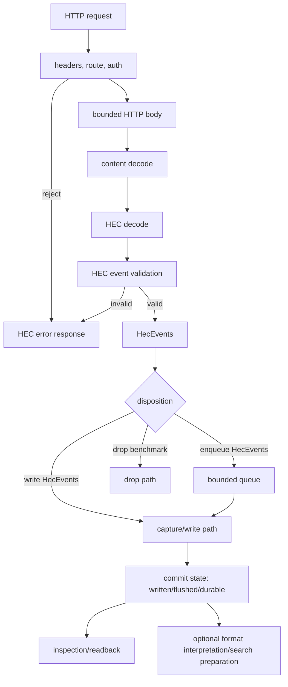

# HECpoc — Focused HEC Receiver Design

HECpoc is a focused Rust implementation of a small, testable HTTP Event Collector receiver. The first product is a local endpoint that accepts realistic Splunk HEC traffic, preserves accepted events, exposes enough inspection to assert what arrived, and makes compatibility differences explicit.

Mandate: own the product contract, HEC-visible behavior, staged architecture, and documentation authority for the project. The full documentation map and inclusion rules are maintained in Section 8.

The starting user is a developer or CI engineer who wants to test code that sends logs to Splunk HEC without running full Splunk for every run. The immediate benefit is practical: catch bad tokens, malformed payloads, missing metadata, gzip mistakes, raw endpoint surprises, retry behavior, and storage/inspection mismatches before production.

Scope is intentionally narrow: HEC ingest, local capture, inspection, validation, and measurement. Search, parser specialization, Sigma, retention, repair, TLS hardening, full ACK semantics, and performance-specific storage enter only after the HEC path proves correct enough to need them. This document defines the product contract, protocol behavior, high-level architecture, staged decisions, documentation map, and references for the HECpoc documentation set.

---

## 1. Scope, Wants, And Capability Bundles

The design starts from user wants and then derives feature bundles. It should not be organized around every Splunk feature that can be named.

### 1.1 User Wants And Benefits

The user wants to start a local endpoint, send events using ordinary HEC clients, see clear success or failure, inspect accepted events, compare selected behavior with Splunk, and repeat the same run in development and CI.

| Feature | Benefit |
|---------|---------|
| HEC JSON ingest | Applications and shippers use their real output path |
| Raw ingest | Raw endpoint users and line senders can be tested |
| Token auth | Bad-token and missing-auth failures are caught |
| Gzip decode | Common compressed client behavior is covered |
| Metadata capture | Tests assert time, host, source, sourcetype, and index |
| File capture sink | Accepted events are directly inspectable |
| Backpressure response | Overload becomes visible, not silently accepted |
| Local inspection | Tests assert stored output without reading internals |
| Bounded resource use | Bad inputs and slow sinks do not consume unbounded memory or runtime capacity |
| Resilient failure reporting | Users can distinguish rejected, accepted, written, flushed, durable, and failed-after-accept cases |

### 1.2 Capability Bundles

Group capabilities by functional bundle and likely sequence, not by requirement prefix.

| Bundle | Contents | Stage | Action |
|--------|----------|-------|--------|
| A. JSON, raw, files | `ING-HEC-JSON`, `ING-HEC-RAW`, `EVT-RAW`; visible file/capture evidence | First | keep protocol tests and capture readback passing |
| B. Backpressure | `ING-BACKPRESS`; explicit retryable failure under saturation | First | add bounded queue and deterministic queue-full response |
| C. Time and metadata | `EVT-TIME`, `EVT-HOST`, `EVT-SOURCE`, `EVT-SOURCETYPE`; event identity | First | verify storage fields and Splunk comparison cases |
| D. Auth and gzip | `ING-HEC-AUTH`, `ING-HEC-GZIP`; realistic client behavior | First | complete malformed/oversize/unsupported tests |
| E. Inspection | `SCH-TERM`, `SCH-TIME`, maybe `SCH-FIELDS`; assertion surface | Early | expose stable fixture readback before indexing |
| F. More sinks, index, metrics | `EVT-INDEX`, `OBS-METRICS`, durable sink work | Later | define Store interface and benchmark profiles first |
| G. ACK and capability metadata | `ING-HEC-ACK`, `PAR-CAP`; commit and parser capability semantics | Later | implement only after commit-boundary design is encoded |
| H. Resource and resilience controls | body limits, queue limits, slow-sink behavior, health degradation | First | make limits configurable and observable |

### 1.3 Design Detail Level

Capture concrete requirements, high-level architecture, event validation, sink/store boundaries, and only the low-level details that block implementation. Work decomposition should stay short and actionable. Validation is designed alongside code, not appended after it.

---

## 2. Protocol And Event Semantics

Protocol design is the first technical center of gravity. It defines the externally visible HEC behavior, the internal data units that survive request handling, and the states the receiver may truthfully report.

### 2.1 Definitive Data Path, States, And Entities

The active HECpoc data path is:

```text
transport stream
  -> HTTP request/framing
  -> HTTP headers and route
  -> auth and request metadata validation
  -> HTTP body
  -> content decode
  -> HEC decode
  -> HEC event validation
  -> HecEvents formation
  -> concrete disposition
  -> selected commit state
  -> optional format interpretation
  -> optional search preparation
```

Short form:

```text
receive HTTP request -> validate headers/auth -> read HTTP body -> content decode -> HEC decode -> validate events -> form HecEvents -> disposition -> commit state -> optional interpretation/search-prep
```

Request states used by implementation, tests, and reporting:

| State | Meaning | Failure/Response Implication |
|-------|---------|------------------------------|
| `authenticated` | HEC auth requirements passed | failures map to auth HEC errors before body-dependent work |
| `body_read` | bounded HTTP body was read under configured limits | failures map to body limit, timeout, or read errors |
| `decoded` | content encoding such as gzip was decoded | failures map to unsupported or malformed encoding outcomes |
| `hec_decoded` | `/event` JSON envelopes or `/raw` line units were decoded | failures map to endpoint/protocol parse outcomes |
| `validated` | HEC event requirements passed | failures map to missing/blank event, invalid fields, or configured index policy |
| `accepted` | valid `HecEvents` exist | success may claim only accepted unless a stronger disposition completed |
| `queued` | `HecEvents` entered a bounded queue | valid benchmark or ACK boundary only when configured |
| `written` | write call returned for the selected sink/store path | not crash durable |
| `flushed` | userspace flush returned | kernel/page-cache visible but not power-loss durable |
| `durable` | `fsync`, DB commit, or equivalent durable boundary completed | first production-grade ACK boundary |
| `search_ready` | search-prep structures exist for the evidence | query acceleration is available |

Core entities:

| Entity | Meaning | Owner |
|--------|---------|-------|
| `HecRequest` | Method, path, headers, body stream, route, peer facts when exposed | Stack/HEC receiver boundary |
| `HecCredential` | Parsed auth scheme and token class | HEC auth |
| `HecEnvelope` | One JSON object decoded from `/services/collector/event` | HEC decode |
| `RequestRaw` | Decoded `/raw` HTTP body before LF splitting | HEC raw endpoint |
| `RawEvents` | Non-empty raw events produced by LF splitting `RequestRaw` | HEC raw endpoint |
| `HecEvent` | One normalized accepted HEC event | HEC validation |
| `HecEvents` | Valid HEC events from one HTTP request after HEC decode and validation | HEC receiver; passed to queue/write path |
| `ParseBatch` | Optional group selected for format interpretation | Format/search preparation only |
| `WriteBlock` | Store/output aggregation unit selected for append/write efficiency | Store/write path |
| commit state | Strongest completed state visible to response, ACK, validation, and reporting | Sink/store policy |
| `InspectQuery` | Minimal read path over stored capture evidence | Inspection |

Appendix B records naming rationale and external terminology comparisons. It is not a competing definition of the data path.

### 2.2 Endpoint Behavior

Minimum surface:

- `/services/collector/event`: accept one or more stacked JSON `HecEnvelope` objects and JSON array batches observed from Splunk verification.
- `/services/collector/raw`: accept LF-framed raw events with documented CRLF behavior.
- `/services/collector/health`: report availability and lifecycle phase.
- `/services/collector/ack`: return a deliberate disabled/unsupported response until ACK commit semantics exist.
- Body encoding: identity and gzip, with explicit pre-decode and post-decode size policy.
- Resource gates: bounded HTTP body, decoded body, per-event raw size, event count, and bounded queue insertion when queue mode exists.

Route aliases such as `/services/collector/1.0/*` should wait for client evidence. Incorrect paths are protocol validation cases, not generic Axum 404 trivia.

### 2.3 Event Fields And Metadata

Initial field rules:

- `_raw`: preserve event text for comparison; raw byte preservation becomes a sink/store property before replay claims.
- `_time`: store parsed event time with explicit precision; choose microseconds or nanoseconds after Splunk comparison and sink format review.
- `host`, `source`, `sourcetype`: store payload values and make defaults visible.
- `index`: logical namespace first; default to `main`; validate against token-associated allowed indexes before physical partitioning exists.
- `fields`: accept an object with scalar, null, and direct array values; reject nested object values and non-object top-level `fields`.

Metadata extracted before store/write decisions includes endpoint, token/channel class, request id, event ordinal, HTTP body length, decoded length, content encoding, source query params, and validation outcome. Store/output grouping may split or coalesce events later, but it must retain request provenance.

### 2.4 Protocol Validation Surface

Protocol validation belongs here because it defines externally visible HEC behavior. Detailed HTTP status/code matrices and limit cases are in Appendix A.

| Group | Immediate Cases | Action |
|-------|-----------------|--------|
| Auth | missing, malformed, wrong scheme, empty token, invalid token, valid token | keep distinct enough for Splunk comparison and operator diagnosis |
| JSON | empty, malformed, stacked envelopes, later invalid envelope, missing/null/blank `event`, object/array/scalar event | reject whole request unless Splunk verification requires a different policy |
| Raw | empty body, trailing newline, CRLF, blank line, whitespace-only line, invalid UTF-8 if text output is used | define LF splitting and byte/text preservation before optimizing |
| Gzip and size | valid gzip, malformed gzip, empty decoded body, pre-decode limit, post-decode limit | enforce both advertised and decoded caps |
| Metadata | missing values, explicit empty strings, nested fields, non-scalar fields | store what is supported; reject or preserve unsupported forms deliberately |
| Backpressure | full queue, slow sink, write failure after accepted queue/write disposition | respond retryably; do not silently drop in correctness mode |
| ACK/channel | channel absent, channel empty, channel present with ACK disabled, ACK request before implementation | keep disabled behavior explicit until registry and commit boundary exist |

---

## 3. Architecture And High-Level Design

HECpoc is not just an Axum handler. It is a staged receiver with explicit protocol, resource, disposition, commit, inspection, and evidence boundaries. The first implementation can be small, but the boundaries must be stable enough that queueing, durable stores, and format interpretation can be added without rewriting the protocol core.

### 3.1 Component Responsibilities

| Component | Owns | Does Not Own | Current Direction |
|-----------|------|--------------|-------------------|
| Ingress stack | TCP/HTTP/Tokio/Axum/Hyper behavior, request body reading, content length, body timeouts, content encoding facts | log-format parsing, storage partitioning, durable claims | Axum/Tokio now; owned accept loop later if connection stats/culling require it |
| HEC protocol | endpoints, auth, HEC response codes, JSON/raw HEC decode, event validation, request outcome | database layout, search indexes, generic infrastructure services | concrete HEC code paths, not Tower middleware for protocol-critical checks |
| Event formation | `HecEnvelope`, `RequestRaw`, `RawEvents`, `HecEvent`, `HecEvents`, metadata attachment | store block sizing or parser batching | request provenance is preserved even when later stages regroup events |
| Resource policy | size limits, event count, body timeouts, queue full, busy/unhealthy/shutdown behavior | hidden magic defaults | typed config with validation and observable outcomes |
| Queue/write path | `enqueue HecEvents`, `write HecEvents`, commit states, failure-after-accept behavior | HEC syntax parsing | direct capture first, bounded queue next, durable commit later |
| Store/inspection | capture files, readback, `WriteBlock`, optional durable formats, eventual search-prep inputs | HTTP correctness | starts close to evidence; does not inherit shipper batch size as output granularity |
| Infrastructure | config, errors/outcomes/messages, reporting/logging, metrics, lifecycle, benchmark ledger | protocol-specific truth tables except where mapped | centralized services with precise call-site contracts |

### 3.2 Control And Data Flow



The main invariant is commit-state truthfulness: response, ACK, report, and benchmark output may not claim a state stronger than what actually completed.

### 3.3 Accepted Design Decisions

| Area | Decision | Reason | Revisit Trigger |
|------|----------|--------|-----------------|
| Runtime | Use Tokio and Axum initially | gets a real HEC server running while keeping protocol checks explicit | connection-level stats, header limits, culling, or accept-loop policy require Hyper/hyper-util direct control |
| Protocol checks | Implement auth/body/gzip/HEC response mapping in HEC-owned code | protocol-critical behavior must be testable and Splunk-comparable | a library feature proves identical behavior and better maintainability |
| JSON HEC batching | Support stacked JSON objects and JSON array batches for `/event` | local Splunk accepted both; clients may generate either shape | later Splunk version or shipper evidence contradicts current oracle |
| Output grouping | Use `WriteBlock` for store/output aggregation, not HEC request grouping | store/write granularity should match storage and benchmark needs | generalized Store interface chooses a better term |
| Queue policy | Correctness mode rejects newest or returns busy when full | HEC senders can retry; silent drop lies | telemetry profile explicitly chooses drop/spill behavior |
| Store partitioning | Preserve host/source/sourcetype/index metadata; do not make per-host/per-log DBs during ingest | avoids writer/schema/compaction explosion | measured workload proves partition-local writes or searches dominate |
| ACK | Defer ACK until registry and commit boundary exist | ACK without a truthful boundary is worse than unsupported | queue/durable store design is implemented and tested |
| Search preparation | Keep format parsing/tokenization replayable and optional after evidence capture | accepted input must not exist only in parser/index output | product bundle requires query-ready ingest |

### 3.4 Immediate Architecture Gaps

These are not open-ended questions; each names the next design or test artifact needed.

| Area | Needed Artifact | Blocks |
|------|-----------------|--------|
| Capture format | exact JSONL or length-delimited format with fields and escaping rules | reliable inspection, replay, malicious input tests |
| Queue topology | one bounded global queue spec with full/busy response mapping | `ING-BACKPRESS`, queue-full tests, health degradation |
| Write path | direct capture vs queued capture mode contract | performance claims and failure-after-accept behavior |
| Body/header policy | Axum-visible body limits plus documented Hyper/header gaps | slowloris/header-bloat validation and fallback decision |
| Raw framing | LF/CRLF/NUL/non-UTF policy with byte/text preservation decision | raw endpoint correctness and file replay claims |
| Config schema | file/env/CLI precedence and validation for all limits/policies | reproducible tests and safe defaults |
| Reporting | call-site contract for events, fields, outcomes, metrics, and console/log routing | useful failure diagnosis and benchmark ledgers |
| Splunk oracle | scripts and fixtures for selected ambiguous HEC cases | compatibility claims beyond docs |

---

## 4. Event Validation, Compatibility, And Measurement

Event and protocol validation should be grouped by externally visible behavior. Store durability, queue internals, and search preparation have their own sections and subject documents.

### 4.1 Compatibility Verification

Use Splunk documentation as the starting point, local Splunk Enterprise as the oracle for ambiguous cases, and Vector/Fluent Bit/OpenTelemetry behavior as shipper compatibility evidence. Appendix A lists HEC return values, status mappings, limit classes, and verification tasks.

Immediate verification targets:

1. Incorrect HEC paths and Axum/Hyper fallback behavior.
2. Missing/malformed/invalid auth response bodies and status codes.
3. Body too large before read, body too large while reading, and gzip expansion too large.
4. Stacked JSON object success and malformed-late-object failure.
5. JSON array success plus malformed-array edge cases.
6. Raw endpoint CRLF, blank line, trailing newline, NUL, and invalid UTF-8 behavior.
7. Health during stopping (`503/code23`) and later queue-full health degradation.

### 4.2 Metrics And Evidence Needed Per Run

Every validation or benchmark run should record enough context to be interpretable later:

| Evidence | Purpose |
|----------|---------|
| config snapshot with secrets redacted | proves limits, sink mode, runtime mode, and filters used |
| request corpus manifest | makes payload size/event-count comparisons possible |
| response ledger | maps each request to HTTP status, HEC code, response body, and outcome |
| stats snapshot before/after | computes receiver-side bytes/sec, events/sec, rejects, and body errors |
| process/system samples | separates load-generator limits from receiver limits |
| output/capture files | proves accepted events are inspectable and not merely counted |
| Splunk/Vector comparison notes | distinguishes documented behavior from local oracle behavior |

### 4.3 Test Upgrade Priorities

| Priority | Tests | Why |
|----------|-------|-----|
| P0 | protocol matrix for auth, JSON, raw, gzip, no-data, and oversize | locks externally visible behavior |
| P0 | health/stopping and incorrect-path responses | prevents framework defaults from defining product behavior accidentally |
| P0 | capture readback and response/counter agreement | proves accepted events are visible and counted coherently |
| P1 | queue-full with blocked write path | first true backpressure proof |
| P1 | slow body and malformed header probes | distinguishes Axum/Hyper behavior from HEC-owned checks |
| P1 | Splunk oracle scripts for ambiguous codes | prevents folklore-driven compatibility claims |
| P2 | hostile input corpus and fuzz/property tests | hardens parser and body handling after core behavior stabilizes |

---

## 5. Store, Sink, And Inspection Strategy

Sink choice is part of ingest correctness. The first implementation should prove accepted events are visible before it designs a database.

### 5.1 Sink And Store Order

Sort by usefulness and complexity:

1. Capture file sink: first correctness evidence.
2. In-memory assertion sink: useful once tests need direct event access.
3. Null sink: benchmark only, not correctness.
4. Raw chunk or structured file sink: later replay and corruption checks.
5. SQLite or queryable store: later durable local query; no early optimization.
6. External forwarding sink: defer; that is another product mode.

The first practical path is capture file plus simple inspection.

### 5.2 Inspection Path

Start close to stored evidence: write accepted events to a documented file format, provide a tiny inspection command or test helper, support term/time filters only after semantics are defined, and add indexing only when the simple path fails.

A sink trait is justified only when two concrete implementations need the same call sites and can be tested independently. Until then, a concrete capture sink is simpler than an abstraction display case.

### 5.3 Queue, Write, And Commit Boundaries

The core design choice is whether validated `HecEvents` are written synchronously in fixture mode or inserted into a bounded queue for later `WriteBlock` construction. The collector should not let request handlers perform long file or database work under load.

Initial rules:

- Request handlers may HEC-decode and validate small bounded bodies, but they should not perform long blocking writes.
- The chosen disposition must be visible in validation: `write HecEvents`, `enqueue HecEvents`, `drop HecEvents`, `forward HecEvents`, or `reject request`.
- Queue depth, max request bytes, max decoded bytes, max raw event bytes, and max events per request should be configurable or at least named constants.
- Slow write behavior should be tested by a deliberately blocking or failing sink/store path.
- Capture files should use buffered writes, but flush semantics must be tied to explicit validation expectations.
- Crash resilience is limited at first: file capture should be append-only and inspectable after process exit, but not advertised as durable ACK storage.

---

## 6. Implementation Sequence

This sequence is intentionally short. Detailed implementation infrastructure belongs in `InfraHEC.md`; ingress mechanics belong in `Stack.md`; store mechanics belong in `Store.md`.

| Step | Work | Acceptance Signal |
|------|------|-------------------|
| 1 | Typed configuration, validation, startup, shutdown | invalid config fails early; startup logs/reporting are stable |
| 2 | Central HEC outcomes, request error mapping, public message text | every handler error maps to one response, metric, and report fact |
| 3 | Protocol fixtures for auth, body, gzip, JSON, raw, no-data, oversize | protocol matrix passes in unit and handler tests |
| 4 | Capture sink format and readback helper | accepted events can be inspected without internal knowledge |
| 5 | Benchmark/validation ledger | runs record config, corpus, stats, system samples, and output paths |
| 6 | Bounded queue between `HecEvents` and write path | deterministic queue-full response and health/counter behavior |
| 7 | Splunk and shipper comparison scripts | selected edge cases verified against local Splunk and Vector |
| 8 | Store/write profile expansion | durable and search-prep claims tied to measured commit states |

First target:

```text
merge config -> validate -> bind -> accept HEC JSON/raw -> classify errors -> capture event -> inspect capture -> record run evidence
```

---

## 7. Decision Register

Decision rows are grouped by expected validity. Revisit only when the trigger occurs; do not carry every uncertainty as a blocking question.

| Class | Decision | Current Position | Revisit Trigger |
|-------|----------|------------------|-----------------|
| Contract | HEC JSON/raw endpoints and response shape | compare with Splunk for selected edge cases | Splunk/shipper comparison contradicts current behavior |
| Contract | Metadata preservation | preserve `time`, `host`, `source`, `sourcetype`, `index`, `fields` where supported | supported client emits a case we mishandle |
| Implementation stage | Direct capture before bounded queue | acceptable fixture phase | queue/backpressure bundle starts |
| Implementation stage | All-or-nothing JSON request parsing | default until Splunk oracle says otherwise | Splunk accepts partial success for a target case |
| Benchmark profile | Drop/null sink numbers | HTTP/parser upper bound only | result is cited as durable ingest capacity |
| Deferred | ACK commit boundary | unsupported until registry and commit policy exist | bounded queue plus durable store is implemented |
| Deferred | Parser capability metadata and aliases | design in Formats/Store before code claims | field/search/Sigma work starts |

---

## 8. Documentation Architecture And Inclusion Rules

This section is the HECpoc documentation map. Subject-specific documents should not repeat this map or carry generic file-purpose lists. Each file states only its own scope and the technical subject it owns.

| File | Focus | Includes | Excludes |
|---|---|---|---|
| `HECpoc.md` | product and protocol control plane | user goals, capability bundles, HEC request/event contract, staged decisions, acceptance gates, documentation map | deep parser grammars, OS/socket mechanics, implementation infrastructure internals |
| `InfraHEC.md` | cross-cutting service infrastructure | configuration, validation, errors, public text, reporting/logging/observability, metrics, lifecycle policy, security posture, validation and benchmark ledger schemas | product protocol matrices, log-format grammars, queue/store algorithms, socket syscall details |
| `Stack.md` | ingress and operating-system stack | TCP/HTTP/Tokio/Axum/Hyper, HTTP framing, body streaming, content-encoding mechanics, body/time limits, kernel socket buffers, page cache notes, system calls, connection accounting, network-layer backpressure | HEC auth semantics, HEC status/code mapping, log-line grammars, token/index layout, store retirement policy |
| `Formats.md` | log and record structure | source format origins, examples, version splits, parser choices, field extraction, field aliases, malformed record cases, format-specific parser validation | generic OS buffering, HEC status mapping, queue topology, durable store layout |
| `Store.md` | application pipeline and stored evidence | `HecEvents` disposition, queue topology, `ParseBatch` policy, `WriteBlock` construction, commit states, durable commit, intermediate store, token/index construction, production/benchmark profile differences | kernel/socket mechanics, detailed log-format syntax, generic reporting infrastructure |

Inclusion rules:

1. A topic belongs where its primary design variable lives, not where it was first discussed.
2. Validation belongs with the subsystem whose behavior is being proven. Protocol response validation belongs here; socket/header timeout validation belongs in `Stack.md`; parser correctness validation belongs in `Formats.md`; queue/store/durability validation belongs in `Store.md`; report/config validation belongs in `InfraHEC.md`.
3. References should be specific evidence for the local subject. Avoid empty mentions of another project document just to say it exists.
4. Stable requirements and justified recommendations stay in reference sections. Work tracking and status tables are kept short and only when they control the next implementation step.
5. External or historical code can influence HECpoc only after restating the current requirement, naming the implementation target, adding validation cases, and recording why the approach remains suitable.

Boundary-straddling cases:

| Case | Primary Owner | Supporting Owner | Delineation |
|------|---------------|------------------|-------------|
| Configuration system | `InfraHEC.md` | subject document owning the setting | Infra defines precedence, validation, redaction, and test obligations; HECpoc/Stack/Store/Formats define their own setting semantics and authoritative parameter lists. |
| HEC response to body-size limits | `HECpoc.md` | `Stack.md`, `InfraHEC.md` | Stack explains when size limits fire and whether Hyper or handler sees the request; HECpoc defines status/body/code; Infra defines how the limit is configured and validated. |
| Gzip | `Stack.md` | `HECpoc.md`, `InfraHEC.md` | Stack owns content-encoding detection, decode mechanics, buffer sizing, and expansion limits; HECpoc owns client-visible outcome; Infra owns config/reporting mechanics. |
| Auth token settings | `HECpoc.md` | `InfraHEC.md` | HECpoc owns token semantics, Basic/Splunk/query-token behavior, default index, and allowed-index policy; Infra owns secret redaction, loading, validation style, and error/reporting infrastructure. |
| Runtime/Tokio worker policy | `Stack.md` | `InfraHEC.md` | Stack owns I/O/CPU scheduling design and when to split runtimes; Infra owns startup/runtime configuration machinery and lifecycle integration. |
| Queue/backpressure | `Store.md` | `HECpoc.md`, `Stack.md`, `InfraHEC.md` | Store owns queue unit, capacity, disposition, and commit truth; HECpoc owns external HEC response; Stack owns network symptoms; Infra owns metrics/reporting/config pattern. |
| Raw line handling | `HECpoc.md` until accepted, then `Formats.md` for deeper interpretation | `Stack.md`, `Store.md` | HECpoc owns raw endpoint line/event formation and response; Formats owns later source-format parsing; Stack owns byte/body mechanics; Store owns evidence preservation. |
| Validation runs | subsystem being proven | `HECpoc.md` for protocol matrix | Keep tests and evidence with the behavior under proof: protocol in HECpoc, mechanics in Stack, config/reporting in Infra, storage in Store, parser correctness in Formats. |

---

## 9. References

References here are external comparison points. The documentation map above is the source for project-document placement.

1. [Splunk: Format events for HTTP Event Collector](https://docs.splunk.com/Documentation/Splunk/latest/Data/FormateventsforHTTPEventCollector) — JSON envelope and metadata examples.
2. [Splunk: Troubleshoot HTTP Event Collector](https://docs.splunk.com/Documentation/Splunk/latest/Data/TroubleshootHTTPEventCollector) — error/status behavior.
3. [Vector `splunk_hec_logs` sink](https://vector.dev/docs/reference/configuration/sinks/splunk_hec_logs/) — real HEC client behavior, batching, ACK, retry, TLS.
4. [Fluent Bit Splunk output](https://docs.fluentbit.io/manual/data-pipeline/outputs/splunk) — common shipper configuration vocabulary.
5. OpenTelemetry Collector contrib `splunkhecreceiver` — server-side implementation reference.
6. Local Splunk Enterprise — ground truth for selected edge cases when docs and clients disagree.

---

## Appendix A — HEC Return Values, Limits, And Constraints

This appendix is the background ledger for tightening HEC compatibility, upgrading tests, and deciding where Spank should intentionally diverge from Splunk. It cross-checks the current receiver implementation against Splunk's published HEC format and troubleshooting pages, then enumerates present bounds and unaddressed edge cases.

Primary external references:

1. [Splunk: Troubleshoot HTTP Event Collector](https://help.splunk.com/?resourceId=SplunkCloud_Data_TroubleshootHTTPEventCollector) — current HEC status-code table, HEC metrics fields, and performance notes.
2. [Splunk: Format events for HTTP Event Collector](https://help.splunk.com/?resourceId=SplunkCloud_Data_FormateventsforHTTPEventCollector) — authentication forms, channel header, event metadata, batch formats, and raw parsing behavior.

Current implementation anchors:

1. `/Users/walter/Work/Spank/HECpoc/src/hec_receiver/outcome.rs` — HEC response body and HTTP status mapping.
2. `/Users/walter/Work/Spank/HECpoc/src/hec_receiver/protocol.rs` — configurable HEC response code defaults.
3. `/Users/walter/Work/Spank/HECpoc/src/hec_receiver/config.rs` — CLI/env/TOML/default limits and validation.
4. `/Users/walter/Work/Spank/HECpoc/src/hec_receiver/body.rs` — advertised length, HTTP body, timeout, and gzip limit handling.
5. `/Users/walter/Work/Spank/HECpoc/src/hec_receiver/parse_event.rs` — `/services/collector/event` JSON envelope parsing.
6. `/Users/walter/Work/Spank/HECpoc/src/hec_receiver/parse_raw.rs` — `/services/collector/raw` line splitting and lossy text conversion.
7. `/Users/walter/Work/Spank/HECpoc/src/hec_receiver/hec_request.rs` — route adapters, HEC request processing, health response, and current request-level tests.

### A.1 Splunk HTTP Status Cross-Check

Splunk's current troubleshooting table assigns particular meaning to HEC response-code/status pairs. The current receiver produces a smaller but not identical HTTP status set.

| HTTP status | Splunk HEC meaning | Current receiver behavior | Gap or action |
|-------------|--------------------|---------------------------|---------------|
| `200 OK` | code `0` success; code `17` healthy; codes `24`/`25` approaching queue/ACK capacity | success uses `200`/code `0`; health uses `200`/code `17` when serving | success path exists; health is minimal; queue/ACK warning statuses not implemented |
| `400 Bad Request` | codes `5`, `6`, `7`, `10`, `11`, `12`, `13`, `14`, `15`, `16`, `21`, `22` | no data, invalid JSON/data, incorrect index, missing/blank event, ACK disabled, indexed-field handling, and query-token-disabled use `400` | implemented HEC cases have unit coverage; channel and token-management codes remain future work |
| `401 Unauthorized` | code `2` token required; code `3` invalid authorization | implemented for absent/blank auth, malformed auth, unsupported auth schemes, and Splunk-incompatible `Bearer` | covered by auth and handler tests |
| `403 Forbidden` | code `1` token disabled; code `4` invalid token | invalid token implemented; disabled token absent | token store has no disabled-token state; add if token metadata appears |
| `500 Internal Error` | code `8` internal server error | no explicit HEC internal-error outcome | add only when real sink/runtime failures need conversion to HEC JSON rather than process failure |
| `503 Service Unavailable` | code `9` server busy; codes `18`/`19`/`20` unhealthy; code `23` shutting down | server busy is used for health admission failure, event-count limit, and sink failure; health unhealthy returns `503` with code `18` | split busy, queue-full, shutting-down, and ACK-unavailable when those states exist |
| `429 Too Many Requests` | code `26` queue at capacity; code `27` ACK channel at capacity | not generated | preferred future mapping for hard queue saturation, instead of overloading `503`/code `9` |
| `408 Request Timeout` | not listed in Splunk HEC table | body idle/total timeout maps to `408`/code `9` | defensible HTTP, but Splunk-incompatible unless local Splunk proves similar behavior; add slow-client tests and decide |
| `413 Payload Too Large` | Splunk local oracle returns generic HTML, not HEC JSON | advertised or actual over-limit body maps to `413` with Splunk-style generic HTML | HEC code remains internal/reporting only, not serialized |
| `415 Unsupported Media Type` | Splunk local oracle returns generic HTML, not HEC JSON | unsupported `Content-Encoding` maps to `415` with Splunk-style generic HTML | HEC code remains internal/reporting only, not serialized |
| `404 Not Found` | incorrect path | fallback returns measured Splunk-style JSON body with code `404` | add metric/counter if incorrect-URL reporting becomes necessary |

Important conclusion: the current receiver follows the measured Splunk body-shape split for key controlled cases: HEC protocol failures return HEC JSON, while unsupported encoding and body-size failures return generic HTML. Remaining gray areas include timeout, malformed HTTP headers rejected by Hyper before the handler, unhealthy health subcauses, and ACK/channel behavior.

### A.2 HEC Return Code Coverage

The current Splunk table lists HEC codes `0` through `27`, with some gaps in feature coverage rather than just missing tests. Current receiver protocol defaults expose codes `0`, `2`, `3`, `4`, `5`, `6`, `7`, `9`, `12`, `13`, `14`, `15`, `16`, `17`, `18`, and `23`.

| HEC code | Splunk status/message | Current implementation | Current test/validation coverage | Gap or action |
|----------|-----------------------|------------------------|----------------------------------|---------------|
| `0` | `200 Success` | `HecResponse::success` | handler unit tests assert raw success, Basic auth success, and JSON array success; validation run observed successful requests | covered for current success paths |
| `1` | `403 Token disabled` | absent | none | add only with token metadata/disabled state |
| `2` | `401 Token is required` | `HecError::TokenRequired` | handler unit test asserts `401` body with code `2`; validation covers missing auth | covered; add blank-header handler test if desired |
| `3` | `401 Invalid authorization` | `HecError::InvalidAuthorization` | auth unit tests cover parser errors; handler tests cover malformed auth and `Bearer` rejection | covered for current auth parser paths |
| `4` | `403 Invalid token` | `HecError::InvalidToken` | auth unit test covers token-store error; handler test asserts invalid-token response body | covered |
| `5` | `400 No data` | `HecError::NoData` | raw unit covers blank-only and whitespace-only body; handler tests assert blank and whitespace raw body responses | add event empty-body handler test |
| `6` | `400 Invalid data format` | malformed JSON/body stream/gzip decode; top-level `fields` non-object maps here; unsupported encoding/body-too-large keep internal code `6` for reporting but serialize generic HTML like Splunk | parser unit covers trailing garbage and fields-array rejection; handler tests assert malformed JSON, top-level fields-array, unsupported encoding HTML, and body-too-large HTML responses | add raw socket tests for malformed HTTP headers that never reach HEC code |
| `7` | `400 Incorrect index` | `index` syntax/length validation and token-associated allowed-index validation implemented; compile default is `main` | parser and handler tests cover invalid syntax, configured length, allowed index, and disallowed index | query-string `index` remains postponed |
| `8` | `500 Internal server error` | absent | none | define when sink/runtime failures should become code `8` instead of `9` |
| `9` | `503 Server is busy` | max-event limit, health not admitting work, sink failure, timeout uses code `9` | parser unit and handler test cover event-count limit; timeout not covered; handler sink/health busy not covered | add slow-body tests; add health busy and sink-failure response tests; reconsider mapping of max-events and timeout |
| `10` | `400 Data channel is missing` | absent | none | needed when ACK/channel semantics implemented |
| `11` | `400 Invalid data channel` | absent | none | needed when ACK/channel semantics implemented |
| `12` | `400 Event field is required` | missing or `null` `event` | parser unit and handler unit cover missing event; parser unit covers null event | covered for JSON endpoint |
| `13` | `400 Event field cannot be blank` | empty string event | parser unit and handler test cover blank event | covered |
| `14` | `400 ACK is disabled` | `/services/collector/ack` and `/services/collector/ack/1.0` authenticate first, then return ACK-disabled response | handler tests cover authenticated ACK-disabled response and unauthenticated token-required precedence | verify exact Splunk behavior for method, body shape, and ACK-disabled token state |
| `15` | `400 Error in handling indexed fields` | `fields` absent ok; `fields` must be object; nested object values rejected; array values accepted to match Splunk oracle | parser and handler tests cover nested object; parser and handler tests cover array value acceptance and top-level array as code `6` | decide later whether arrays containing objects need a separate compatibility test |
| `16` | `400 Query string authorization is not enabled` | query parameter named `token` is detected before auth/body work and rejected | handler test and local verifier cover `?token=` with and without authorization header | optional query-token acceptance is postponed; default remains disabled for Splunk compatibility |
| `17` | `200 HEC is healthy` | health endpoint uses configured healthy code | handler tests cover healthy response | covered for serving phase |
| `18` | `503 HEC unhealthy, queues full` | health endpoint uses configured unhealthy code for starting/non-ready phase | handler tests cover starting/unhealthy response | refine into queue-full once bounded queue state exists |
| `19` | `503 HEC unhealthy, ACK unavailable` | absent | none | add only with ACK service |
| `20` | `503 HEC unhealthy, queues full and ACK unavailable` | absent | none | add only with queue + ACK state composition |
| `21` | `400 Invalid token` | absent as a separate endpoint/config-token-management code | none | probably token-management endpoint specific; do not implement until endpoint exists |
| `22` | `400 Token disabled` | absent as a separate endpoint/config-token-management code | none | probably token-management endpoint specific; do not implement until endpoint exists |
| `23` | `503 Server is shutting down` | `Phase::Stopping` maps health and ingest admission to code `23` | handler tests cover health and ingest request while stopping | covered for explicit phase; still needs graceful-drain system test |
| `24` | `200 HEC queue approaching capacity` | absent | none | add only after queue occupancy thresholds exist |
| `25` | `200 HEC ACK approaching capacity` | absent | none | ACK-specific |
| `26` | `429 HEC queue at capacity` | absent | none | better future hard-backpressure mapping than current event-count `503` overload |
| `27` | `429 HEC ACK channel at capacity` | absent | none | ACK-specific; earlier local notes associating `27` with request-size behavior must be retired or verified against local Splunk before reuse |

Actionable distinction:

- Implemented and handler-tested now: `0`, `2`, `3`, `4`, `5`, `6`, `7`, `9`, `12`, `13`, `14`, `15`, `16`, and Splunk-style unknown-route/wrong-method JSON bodies.
- Implemented and unit/validation-covered but not fully handler-body-covered for every subcase: body stream errors, gzip decode failure, and raw malformed-header cases.
- Implemented and handler-tested: health codes `17`, `18`, and shutdown code `23`.
- Present as code paths but weakly invokable or untested at handler level: timeout, health unhealthy, sink failure, and malformed wire-header behavior.
- Not addressed by design yet: disabled-token state, ACK registry/channel status, optional query-token acceptance, queue capacity states, internal-error state, incorrect-path metrics.

### A.3 Size, Transfer, And Buffer Bounds

Current configured values and constraints:

| Bound | Default | Validation | Current enforcement |
|-------|---------|------------|---------------------|
| `hec.addr` | `127.0.0.1:18088` | valid socket address; port must be greater than zero | listener bind at startup |
| `hec.token` | `dev-token` | non-empty; no ASCII control characters | exact token membership in `TokenRegistry` |
| `hec.default_index` | `main` | if present, same syntax and length policy as event `index`; must be listed in `hec.allowed_indexes` when allow-list exists | applied to event/raw input when the HEC input omits `index` |
| `hec.allowed_indexes` | `["main"]` | each value follows index syntax/length policy | token-associated allow-list for event `index` values; empty list currently means no allow-list and should become an explicit policy choice before production use |
| `hec.capture` | none | if present, cannot be empty | file sink path when capture sink is wired |
| `limits.max_bytes` | `1_000_000` | must be greater than zero | maximum advertised `Content-Length` and maximum received HTTP body bytes |
| `limits.max_decoded_bytes` | `4_000_000` | must be at least `max_bytes` | maximum identity body after receipt and maximum gzip-expanded body |
| `limits.max_events` | `100_000` | must be greater than zero | maximum parsed events per request for raw and event endpoints |
| `limits.max_index_len` | `128` | must be greater than zero | maximum HEC event `index` byte length |
| `limits.idle_timeout` | `5s` | must be greater than zero | maximum wait for next body frame |
| `limits.total_timeout` | `30s` | must be at least idle timeout | maximum complete body-read duration |
| `limits.gzip_buffer_bytes` | `8_192` | `512..=1_048_576` | scratch buffer used by gzip decoder |
| `observe.level` | component target expression | must parse as `tracing_subscriber` targets | tracing filter expression |
| `observe.format` | `compact` | one of `compact`, `json` | tracing formatter selection |
| `observe.redaction_mode` | `redact` | one of `redact`, `passthrough` | config rendering redaction |
| `observe.redaction_text` | `<redacted>` | non-empty | config rendering substitute |
| `observe.tracing` | `true` | boolean | tracing output enabled/disabled |
| `observe.console` | `false` | boolean | console report output enabled/disabled |
| `observe.stats` | `true` | boolean | stats counter updates enabled/disabled |

Current hard or implicit limits:

- Partial HTTP headers do not reach HEC code and therefore do not use `limits.idle_timeout` or `limits.total_timeout`; header timeout/header-size policy requires owned Hyper/hyper-util serving or a front proxy.
- No independent per-line maximum exists for raw input; a single raw line may consume almost the whole decoded body cap.
- No independent JSON nesting, string length, field count, metadata length, token length maximum, or source/sourcetype length maximum exists.
- No accepted-connection count, concurrent-request count, per-peer byte rate, or per-peer failure-rate limit exists yet.
- No configured queue capacity exists yet because enqueue/dequeue is not wired as the core path from `HecEvents` to write path.
- No explicit read buffer size is exposed beyond Axum/Hyper/Tokio internals and the gzip scratch buffer.
- No filesystem flush, `fsync`, rotation, capture-file size, or disk-available bound exists for capture mode.

Immediate upgrade candidates:

1. Add explicit body-limit compatibility decisions for `413` versus Splunk table mappings.
2. Add independent raw-line length and JSON-depth/field-count limits before accepting adversarial production traffic.
3. Add connection/request concurrency and per-source accounting before meaningful DoS-resilience claims.
4. Add sink/capture bounds: max file size, flush policy, sync policy, write timeout, and failure mapping.

### A.4 Syntax, Punctuation, Separators, And Endpoint Shape

Current accepted request and payload syntax:

| Area | Current behavior | Splunk comparison | Gap or action |
|------|------------------|-------------------|---------------|
| Authorization header | accepts `Splunk <token>` and rejects unsupported schemes, including `Bearer`, with code `3` | Splunk documents `Authorization: Splunk <hec_token>` plus basic auth and query-string auth | current behavior follows local Splunk oracle for `Bearer` rejection |
| Basic auth | accepts token as Basic password | Splunk accepts token as password in basic auth form | covered by handler test and local verifier |
| Query-string auth | detects query parameter `token` and rejects with code `16` | Splunk returned `400/code16` when query-string auth is disabled, even with a valid Authorization header | optional query-token support is postponed and disabled by default |
| Channel header/query | ignored | required for raw requests when ACK is enabled | safe while ACK is absent; must become explicit once ACK appears |
| Content-Encoding | accepts absent, empty, `identity`, `gzip`; rejects other values | Splunk behavior must be tested for unsupported encodings | add local Splunk comparison for `br`, mixed encodings, and malformed header bytes |
| Content-Length | malformed value returns invalid-data; over-limit advertised length returns body-too-large before body read | Splunk status mapping uncertain from docs | add local Splunk comparison |
| JSON event endpoint | accepts concatenated JSON objects and JSON arrays of objects; missing/null `event` rejected; empty string `event` rejected | local Splunk oracle accepted both stacked objects and JSON array batches | keep both forms unless later Splunk version or client evidence contradicts |
| Event value type | string stored directly; non-string JSON converted with `to_string()` | Splunk says event data can be string, number, object, and so on | acceptable for initial capture; downstream store may need original JSON type preservation |
| `fields` value | must be object; nested object values rejected; direct array values accepted; scalar and null values accepted | Splunk oracle accepted array field values, rejected nested objects with code `15`, and rejected top-level `fields` array with code `6` | add a later test for arrays containing objects if a shipper produces them |
| Raw endpoint splitting | splits on LF, strips one trailing CR, skips blank and ASCII-whitespace-only lines | Splunk returned no-data for blank/space-only raw input and accepts final line without LF | current behavior is simpler than Splunk and not source-type aware |
| Incorrect HEC paths | fallback returns Splunk-style JSON `404` with text `The requested URL was not found on this server.` | local Splunk oracle returned that body for `/services/collector/not-a-real-endpoint` | add incorrect-path metric if compatibility/observability requires it |

Punctuation and separators currently have narrow meaning:

- LF (`\n`) is the only raw event separator.
- A single CR before LF is stripped; interior CR is preserved.
- NUL (`\0`) is preserved inside raw event strings and escaped by JSON serialization in capture/output.
- Quotes, braces, brackets, parentheses, and commas have no meaning on raw endpoint.
- JSON endpoint punctuation is entirely governed by `serde_json`; malformed, unterminated, or trailing non-whitespace input produces invalid-data at the relevant zero-based event index.

### A.5 Character Set, Encoding, And Escaping

Current character handling:

| Stage | Current behavior | Consequence |
|-------|------------------|-------------|
| HTTP headers | `HeaderValue::to_str()` requires valid visible header text; non-text auth or encoding headers are rejected | good guard against malformed header bytes; not tolerant of arbitrary byte tokens |
| HTTP body | collected as bytes; no charset header is interpreted | HEC payload policy is endpoint-specific rather than HTTP charset-specific |
| Gzip body | decoded using `flate2::read::GzDecoder` with output cap | malformed gzip maps to invalid-data; gzip bombs capped by decoded-byte limit |
| JSON event body | `serde_json::Deserializer::from_slice` requires valid JSON bytes, effectively UTF-8 JSON text | invalid UTF-8 in JSON endpoint is invalid data |
| Raw body | each line uses `String::from_utf8_lossy` | invalid UTF-8 is accepted with replacement characters; exact input bytes are not replayable from stored raw string |
| Capture output | JSON serialization escapes control characters as needed | NUL/control characters should not crash output, but byte-for-byte replay is not guaranteed |

Open policy decisions:

1. Raw endpoint should choose one of three explicit modes: strict UTF-8 reject, lossy text accept, or byte-preserving accept with separate display conversion.
2. JSON endpoint should stay strict JSON unless compatibility tests prove Splunk accepts non-standard encodings.
3. Header token policy should decide whether tokens are strictly visible text or arbitrary opaque bytes.
4. Capture output should state whether it preserves semantic event text, JSON value, or exact source bytes.

### A.6 Incomplete Entries, Quotes, Brackets, And Request Boundaries

Current incomplete-input behavior:

| Input condition | Current outcome |
|-----------------|-----------------|
| Empty body | no data, code `5` |
| Raw body with only blank LF/CRLF lines | no data, code `5` |
| Raw final line without trailing LF | accepted as one event |
| Raw line with unmatched quote/brace/parenthesis | accepted; raw endpoint does not parse structure |
| Raw record split across two HTTP requests | treated as two independent requests/events; no cross-request assembly |
| Event JSON with unterminated string/object/array | invalid data, code `6`, with zero-based `invalid-event-number` |
| Event JSON with one good object then trailing garbage | invalid data, code `6`, `invalid-event-number` points at the failed next item |
| Event JSON array batch | accepted when the array contains valid HEC envelope objects | add malformed-array and mixed-array tests |
| Malformed gzip or truncated gzip | invalid data, code `6` |
| Slow or stalled body | timeout maps to HTTP `408`, HEC code `9` |
| Partial HTTP headers | handled before HEC handler by Axum/Hyper/OS behavior; no HEC-configured timeout yet |

Key compatibility issue: Splunk explicitly says raw events must be contained within a single HTTP request and cannot span multiple requests. The current receiver matches that boundary, but not Splunk's sourcetype-driven line-breaking sophistication.

### A.7 Event Granularity, Sections, Attributes, And Alignment

Current event granularity:

- `/services/collector/event`: one JSON envelope becomes one internal `Event`; concatenated envelopes become multiple `Event` values.
- `/services/collector/raw`: each non-empty LF-delimited line becomes one internal `Event`.
- Capture mode writes one JSON record per internal `Event`.
- Metadata fields `time`, `host`, `source`, `sourcetype`, `index`, and `fields` attach to the corresponding event envelope or raw-derived event.
- Raw endpoint request-level metadata through query string is not implemented.
- No carry-forward metadata state exists between event envelopes.
- No binary or memory alignment guarantee exists at the event API boundary; storage layout optimization is deferred to the queue/store design.

Splunk comparison:

- Splunk documents optional metadata keys and says omitted values fall back to token/platform defaults.
- Splunk documents `fields` as flat indexed fields only for the event endpoint.
- Splunk documents concatenated JSON object batches; local Splunk also accepted a JSON array of event objects.
- Splunk raw parsing can use timestamp and sourcetype rules rather than simple LF splitting.

Implementation implications:

1. Keep concatenated-object and JSON-array batch tests as event-endpoint compatibility proof.
2. Add malformed-array, mixed-array, empty-array, and later-invalid-array cases.
3. Decide whether raw query parameters (`host`, `source`, `sourcetype`, `index`, `channel`) become request metadata.
4. Preserve original endpoint and original field names while storing canonical internal names.
5. Keep queue/store alignment decisions out of HEC parsing until the internal event batch representation is designed.

### A.8 Numeric, Datetime, Sequence, And Code Representation

Current numeric handling:

| Value | Current representation | Constraint or gap |
|-------|------------------------|-------------------|
| `time` metadata | JSON number or string parsed to `f64`; other types become `None` | no range check; no precision policy; invalid value is silently dropped rather than rejected |
| `raw_bytes_len` | `usize` from original line/string length depending on endpoint | raw invalid UTF-8 preserves original byte length; JSON string length is UTF-8 byte length after JSON parsing |
| HEC response `code` | `u16`, configurable for implemented protocol fields | no validation that configured code belongs to Splunk table or matches HTTP status |
| `ackId` | optional `u64` field in response type | not assigned; ACK not implemented |
| `invalid-event-number` | zero-based `usize` | parser tests depend on zero-based index; compare local Splunk if exact behavior matters |
| stats counters | atomic unsigned counters | no reason-label taxonomy beyond current fields |
| durations/latency | nanoseconds in stats totals/max | current external benchmark interpretation needs wall-clock delta and explicit units |

Datetime decisions to make:

1. Keep `time` as floating seconds for Splunk compatibility at the HEC boundary.
2. Convert to internal integer nanoseconds or microseconds only after defining precision, rounding, and out-of-range behavior.
3. Reject invalid `time` only if local Splunk does; otherwise record a parser warning/fact while accepting the event.

Protocol-code decisions to make:

1. Validate configured protocol codes against the Splunk table, or explicitly allow compatibility overrides.
2. Stop using code `17` for unhealthy health responses.
3. Stop overloading code `9` for unrelated conditions once queue, timeout, shutdown, and sink-failure states are separated.

ACK design decisions already settled enough to guide implementation:

- ACK is scoped to the HTTP request/HEC batch, not to each row/event/line.
- A request containing many raw lines or stacked JSON event objects should receive at most one `ackId`.
- ACK boundary should be configurable for explicit modes such as `enqueue`, `write`, `flush`, `fsync`/`db_commit`, and later `indexed`.
- `enqueue` is acceptable for benchmark/load-test mode only when labeled as such; production ACK should wait for a real durable boundary.
- ACK registry is required before implementing `/services/collector/ack`: channel map, per-channel IDs, pending status table, capacity limits, idle cleanup, and consumed status removal.
- Current `/services/collector/ack` support is deliberately only ACK-disabled compatibility. It does not parse ACK query bodies or maintain channel state.

### A.8 Server State And Status Mapping

Current and planned outcomes should be described by server state first, then mapped to HTTP/HEC status. This avoids treating all failures as arbitrary numeric codes.

| State or condition | Detection point | Current external response | Internal reporting/logging | Mitigation or next refinement |
|--------------------|-----------------|---------------------------|----------------------------|-------------------------------|
| accepted request reaches current sink boundary | after parse and `Sink::submit_events` returns | `200/code0 Success` | `REQUEST_SUCCEEDED`, `SINK_COMPLETED`, event/drop/write counts | make commit-state explicit before durable or ACK claims |
| missing authorization | header/auth validation before body read | `401/code2 Token is required` | `AUTH_TOKEN_REQUIRED`, `REQUEST_FAILED` | covered; add blank-header handler test if desired |
| malformed authorization | header/auth validation before body read | `401/code3 Invalid authorization` | `AUTH_INVALID_AUTHORIZATION`, `REQUEST_FAILED` | handler tests cover malformed scheme and `Bearer` rejection |
| unknown token | token lookup before body read | `403/code4 Invalid token` | `AUTH_TOKEN_INVALID`, `REQUEST_FAILED` | handler test covers response body |
| disabled token | future token lookup with token state | not implemented | future `AUTH_TOKEN_DISABLED`, disabled-token counter | add enabled/disabled token metadata before response mapping |
| no data | empty event body or raw body with no nonblank/whitespace-only lines | `400/code5 No data` | `PARSE_FAILED` for raw blank/no-data path only where currently wired; `REQUEST_FAILED` | raw handler tests cover blank and whitespace-only; add event-empty test |
| malformed JSON or bad HEC event body | event decode/validation | `400/code6 Invalid data format` with invalid event number where applicable | `PARSE_FAILED`, `REQUEST_FAILED` | covered by parser tests; add handler matrix |
| malformed or unsupported body/header encoding | content/header/body/decode stage | malformed content length may be rejected by HTTP stack before HEC code; unsupported encoding returns `415` generic HTML; too large returns `413` generic HTML | `BODY_READ_FAILED`, `BODY_TOO_LARGE`, `GZIP_FAILED` where matched; unsupported encoding lacks a dedicated fact | add `BODY_UNSUPPORTED_ENCODING`; add raw socket tests for malformed header cases |
| incorrect index | HEC event metadata validation and startup config validation | `400/code7 Incorrect index` for invalid event syntax, reserved `kvstore`, leading `_`/`-`, empty, over configured length, or outside token-associated allow-list; configured `hec.default_index` is rejected at startup if invalid or outside configured allow-list | `REQUEST_FAILED`; currently parse failure fact does not distinguish index reason | add `EVENT_INDEX_INVALID` and query-string index policy later |
| internal server error | future invariant/config/runtime fault class | not implemented | future sanitized internal-error fact and counter | reserve code `8` for non-policy, non-capacity failures |
| transient server capacity/dependency pressure | phase not accepting, sink transient failure, future bounded wait/resource pressure | current `503/code9 Server is busy`; timeout currently `408/code9`; max-events currently also `503/code9` | `REQUEST_FAILED`; `SINK_FAILED` for sink path; timeout fact where body timeout occurs | keep code `9` for transient retryable server pressure; move max-events to a policy error after verification |
| too many events in one request | event/raw parser reaches configured `max_events_per_request` | current `503/code9` | parser-level test only; generic request failure at handler | split from true busy: candidate `400/code6`, `413/code6`, or future `429/code26` policy |
| slow or stalled request body | body idle or total timeout | current `408/code9` | `BODY_TIMEOUT`, `REQUEST_FAILED` | add slow-body handler test; verify Splunk response, keep timeout logs distinct from busy |
| ACK endpoint while ACK is disabled | `/services/collector/ack` after successful auth | `400/code14 ACK is disabled` | `REQUEST_FAILED` with endpoint `ack` | implemented compatibility stub; no ACK registry yet |
| health serving | health phase `Serving` or currently `Degraded` | `200/code17 HEC is healthy` | no request report yet | report health checks only as stats/debug unless unhealthy |
| health starting/unhealthy | health phase `Starting` | `503/code18 HEC is unhealthy` | no request report yet | later split queue-full and ACK-unavailable subcauses |
| shutdown | health/ingest while phase `Stopping` | `503/code23 Server is shutting down` | `REQUEST_FAILED` for ingest; no health report | add real graceful-shutdown system test |
| queue approaching/full | future queue occupancy thresholds | not implemented; planned `200/code24` or `429/code26` depending condition | future queue occupancy metrics, capacity events | requires bounded queue and policy |
| ACK channel approaching/full | future ACK registry thresholds | not implemented; planned `200/code25` or `429/code27` | future ACK registry metrics/events | requires ACK registry |
| unknown HEC-looking path or wrong method | current route fallback or explicit method fallback | Splunk-style JSON body with `404` code; wrong method uses HTTP `405` | none | add incorrect-url/method counters if compatibility/observability requires them |
| unknown non-HEC path | current Axum route miss | default `404` | none | keep separate from HEC incorrect-url accounting |

### A.9 Test Upgrade Plan From This Appendix

Focused tests to add next:

| Test group | Cases |
|------------|-------|
| Handler response matrix | event success; event empty body; unsupported encoding HTML; body too large HTML; timeout; health busy; sink failure; incorrect path |
| Splunk compatibility probes | local Splunk response for oversized body, unsupported encoding, timeout/slow body, JSON array edge cases, raw blank lines, basic auth, query auth disabled, missing channel with ACK disabled/enabled |
| JSON parser edges | concatenated-object batch, JSON-array batch, scalar top-level, fields top-level non-object, fields null/scalar/object/array values, invalid UTF-8 JSON, huge strings, nesting depth |
| Raw parser edges | final line no LF, CR-only separators, interior CR, NUL, other C0 controls, invalid UTF-8, very long line, blank-line policy |
| Limit enforcement | advertised length over cap, actual body over cap without content length, gzip expansion over cap, gzip buffer min/max config, event-count cap raw/event |
| Config/protocol safety | invalid protocol code/status pairing if validation added; token length/control; source filter syntax; redaction passthrough |
| Metrics/reporting | each HEC outcome increments an expected bounded counter or reason field; unknown paths counted if explicit 404 handler added |

Implementation priorities implied by this review:

1. Expand tests before changing response mappings; the receiver needs a stable compatibility baseline.
2. Compare the same matrix against local Splunk Enterprise before deciding whether `408` and malformed wire-header behavior need additional mimicry.
3. Preserve concatenated-object batches and health-code split because they are direct Splunk-documented behavior and low conceptual risk.
4. Postpone ACK/channel codes until the ACK feature is real; avoid fake compatibility.
5. Add raw-byte policy and per-line limits before claiming production resilience.

### A.10 Splunk Verification Harness And Development Blockers

This section separates developer decisions from facts that must be discovered against a live Splunk HEC endpoint. It also records what is blocked by missing subsystems rather than by uncertainty.

#### Verify Against Splunk

Run `/Users/walter/Work/Spank/HECpoc/scripts/verify_splunk_hec.sh` with a local Splunk HEC token:

```sh
cd /Users/walter/Work/Spank/HECpoc
SPLUNK_HEC_TOKEN='<token>' \
SPLUNK_HEC_URL='https://127.0.0.1:8088' \
SPLUNK_HEC_INSECURE=1 \
./scripts/verify_splunk_hec.sh
```

The script writes a timestamped result directory under `/Users/walter/Work/Spank/HECpoc/results/` with payloads, response bodies, response headers, curl errors, and `summary.tsv`. It does not assert expected results; Splunk is the oracle for vaguely documented behavior.

Immediate Splunk verification cases:

| Category | Cases | Why now |
|----------|-------|---------|
| Basic event/raw success | normal event, raw lines, final raw line without LF | confirms baseline endpoint and token configuration |
| Documented stacked JSON | `{"event":"one"}{"event":"two"}` | confirms current parser's batch shape matches Splunk |
| Malformed JSON | missing closing brace, missing closing quote, trailing garbage | determines exact code/text/index behavior for parser failures |
| Event required/blank | missing `event`, blank string `event` | validates codes `12` and `13` |
| Indexed `fields` | flat scalar object, nested object, array value, top-level array | determines code `15` boundaries and whether scalar/null values are accepted |
| Raw blank behavior | empty/blank raw body | determines whether Splunk indexes zero events or returns `No data` |
| Oversize/encoding | advertised oversize, unsupported `Content-Encoding`, malformed content length | verifies generic HTML for `413`/`415` and distinguishes handler-owned errors from HTTP parser rejection |
| Incorrect HEC path | wrong HEC-looking `/services/collector/...` URL | determines plain Axum-style `404` versus HEC JSON or metric behavior |
| Auth variants | missing auth, wrong token, `Bearer`, Basic, query-string token | verifies status/code split for compatibility-sensitive auth behavior |
| Index variants | `main`, unknown valid index, invalid syntax, reserved/private-looking index | verifies token/index policy and error numbering |

Postponed Splunk verification cases:

| Case | Reason for postponement |
|------|-------------------------|
| JSON array edge cases | Basic array batches are now accepted; malformed arrays, mixed arrays, empty arrays, and arrays containing invalid later events still need more compatibility checks. |
| Health unhealthy | A healthy local Splunk endpoint is easy to test, but forcing queue-full/ACK-unavailable/shutdown states requires Splunk admin setup and may not be stable across versions. |
| ACK channel states | ACK is explicitly not implemented; missing/invalid channel behavior matters when ACK design starts. |
| Query-string auth enabled mode | Disabled mode is implemented as code `16`; accepting query tokens is postponed until a concrete client requires it and security policy is defined. |

#### `fields` Test Selection

Immediate local tests:

| Shape | Expected current behavior | Reason |
|-------|---------------------------|--------|
| `fields` flat object with string/number/bool/null values | accept | minimum useful indexed-field compatibility |
| nested object value | reject code `15` | Splunk documents flat indexed fields; nested values create ambiguous indexing semantics |
| array value | accept | local Splunk oracle accepted direct array values |
| top-level `fields` array/string/null | reject code `6` | local Splunk oracle rejected non-object `fields` as invalid data |

Postponed `fields` tests:

| Shape | Reason |
|-------|--------|
| raw endpoint `fields` query/body behavior | raw endpoint metadata parsing is not implemented yet |
| index-time verification inside Splunk search results | requires waiting for indexing and SPL search, not just HEC response matching |
| duplicate/colliding field names | requires a canonical field and alias policy |
| extremely many fields or huge field names | belongs with resource-limit and DoS policy after field-count/name-length bounds exist |

#### Conditions And Codes Requiring Future Subsystems

| Code | Condition to detect | Blocking subsystem | First test once available |
|------|---------------------|--------------------|---------------------------|
| `7` incorrect index | event names an invalid index or an index outside token allow-list | implemented for event-body index; query-string index postponed | add reporting reason and query-string index policy |
| `23` shutting down | request arrives after shutdown begins and intake is closed | graceful shutdown orchestration around existing `Phase::Stopping` behavior | begin shutdown, send request during drain, expect `503/code23` or documented alternate |
| `26` queue at capacity | bounded ingest queue cannot accept more work | bounded queue, queue policy, and source/request capacity counters | fill queue with blocked write path, send one more request, expect `429/code26` or chosen busy mapping |
| `27` ACK channel at capacity | ACK-enabled request/HEC batch needs a channel but channel capacity is exhausted | ACK channel registry and capacity policy | create max channels, send new channel, expect `429/code27` or Splunk-matched response |
| `18`/`19`/`20` health subcauses | queue full, ACK unavailable, or both | queue health and ACK health exposed separately | health endpoint under forced queue/ACK conditions |

Current `23` behavior: implemented at the handler/lifecycle-phase level. `Phase::Stopping` now returns `503/code23` for `/services/collector/health` and for new ingest requests. What remains is a system-level graceful-shutdown test that starts the real server, initiates shutdown, proves new work is rejected with code `23`, and proves already accepted work reaches the selected commit boundary.

#### Backpressure Before Queue Full

Backpressure cannot be validated as queue-full until a bounded queue exists. Interim tests can still exercise earlier admission layers:

1. advertised body too large;
2. actual body too large without `Content-Length`;
3. gzip expansion too large;
4. max events per request;
5. slow body timeout;
6. concurrent request smoke runs with stats deltas.

These prove bounded request processing, not end-to-end queue backpressure. The first real queue-full test should use a bounded queue of size `1`, a write path deliberately blocked on a test latch, and one extra request that must receive a deterministic retryable response.

#### Development Dependencies

| Area | Current State | What is blocked | Next concrete step |
|------|--------|-----------------|--------------------|
| Splunk response gray areas | partly resolved | final mapping for `408`, ACK/channel states, malformed wire headers, and health subconditions | extend `scripts/verify_splunk_hec.sh` with slow-body and raw-socket probes |
| Raw policy | open | replay-grade ingest and binary safety claims | decide strict UTF-8, lossy text, or byte-preserving raw event representation |
| Observability | partially implemented | complete failure reason accounting and benchmark ledger | add bounded reason fields for every `REQUEST_FAILED` path |
| Lifecycle | handler-level `Phase::Stopping` implemented | graceful drain semantics, shutdown request behavior, accepted-work completion | add graceful-shutdown system test harness |
| Index policy | syntax/length implemented; token default index applied; token-associated allow-list implemented with compile default `main` | disabled token state, query-string index policy, richer token lifecycle | add enabled state and token lifecycle metadata |
| ACK | ACK-disabled endpoint implemented; full ACK postponed and request/HEC batch scoped | codes `10`, `11`, `19`, `20`, `25`, `27`, `ackId` registry and commit-boundary semantics | implement only after `ack.boundary` and registry design are encoded in config/tests |
| Queue/backpressure | not implemented | code `26`, health queue-full state, source capacity policy | add bounded queue and blocked-write-path test |
| Axum accept visibility | deferred | connection counts, peer culling, header timeout tuning, socket backlog/buffers | add task for owned accept loop using `TcpSocket` + Hyper/hyper-util after current HEC matrix stabilizes |

---

## Appendix B — Naming, Data-Path Terminology, And Design Choices

Purpose: maintain naming choices, design justifications, and terminology comparisons that would otherwise clutter the main design. The main text is authoritative for the selected data path and entities; this appendix provides the supporting vocabulary, crosswalks, and enforcement rules.

### B.1 Request, Frame, Body, Line, Event, Record, Batch

Use these terms with exact scope:

| Term | Definition | Data | Metadata |
|------|------------|------|----------|
| transport stream | TCP/Tokio/Hyper receive path below the current handler-visible layer | not directly visible in current Axum handler | peer address and connection facts only when exposed by the server stack |
| HTTP request | an HTTP method/path/header/body exchange after HTTP parsing has produced request semantics | headers plus body stream | method, path, query, headers, route match, peer if available |
| HTTP framing | HTTP syntax and transfer structure, not application data | method, URI, headers, chunked/content-length body framing | header parse errors, length hints, keep-alive state |
| HTTP headers | request metadata parsed before body read | header map | authorization, content encoding, content length, HEC channel, source metadata in query params |
| HTTP body | bounded body read before content decoding | body stream chunks accumulated under limits | advertised length, actual read length, body read timing |
| decoded body | HTTP body after content decoding such as gzip | decoded body buffer | decoded length, content encoding, decode errors |
| raw line | one LF-delimited unit from `/services/collector/raw` after raw endpoint line splitting | bytes or text, depending mode | line number, byte offset/length, blank/invalid flags |
| HEC event | one HEC event object or one raw endpoint event candidate | event payload plus HEC metadata | `time`, `host`, `source`, `sourcetype`, `index`, `fields`, token/channel/request id |
| log record | application log structure inside an event, such as syslog, Apache, auditd, JSON Lines, or logfmt | event text or structured event value | parser family, parser variant, parse status/reason |
| `HecEvents` | valid HEC events produced from one HEC HTTP request after endpoint-specific decoding and validation | event vector plus raw references | request id, token/channel, endpoint, event count, body lengths, selected commit state |

Do not use `slice` for project planning or implementation partitioning. In this project, `slice` is reserved for the Rust data-view concept, such as `&[u8]` or `&str`. For planning, use `implementation phase`, `feature bundle`, `component`, `stage`, or `minimal feature increment`, depending on the actual scope.

`request` means the HTTP request after HTTP processing, not raw `recv()` data. Current Axum/Hyper code does not expose raw `recv()` bytes at the handler layer. If discussing lower-level receive behavior, say `transport stream`; if discussing data visible to HEC code, say `HTTP body`.

`line` exists only where a format or endpoint defines it. HEC `/raw` uses line splitting. HEC `/event` uses JSON envelope boundaries, not newline boundaries. Syslog, Apache, and other file formats may be line-oriented, but multiline parsers can combine several physical lines into one log record.

### B.2 HEC Token And Index Entity Terms

Use `HEC token secret` for the opaque credential string received in the `Authorization` header. Use `HEC token record` for the configured entity that owns the secret plus token-scoped settings such as enabled/disabled state, default index, ACK policy, and allowed indexes. Use `TokenRegistry` for the immutable in-process lookup structure built from configured token records at startup.

Current implementation status:

- one configured HEC token secret is loaded from `hec.token`;
- `TokenRegistry` is immutable for the duration of the current process run;
- `hec.default_index` is stored as token metadata for that configured token;
- event-envelope `index` overrides token default index;
- raw endpoint events receive token default index when configured;
- enabled/disabled state, allowed indexes, token IDs, and runtime token reload are postponed.

### B.3 Main Data Path Reference

The definitive data path, state sequence, and core entities are in Section 2.1. This appendix does not restate them as a competing source of truth. It only records terminology nuances, external comparisons, and naming rules that support the main design.

### B.4 Stage Fact Vocabulary

| Stage | Function | Input | Output | Extracted / Attached Facts |
|-------|----------|-------|--------|-----------------------------|
| HTTP request/framing | convert transport stream into HTTP request semantics | transport stream below handler | method/path/headers/body stream | peer if exposed, method, path, query, headers, content length, route alias |
| header/auth validation | validate HEC-visible request metadata before reading the full body when possible | HTTP headers and query | accepted request metadata or HEC error | auth scheme/token, channel, content encoding, content length, source query params, route alias |
| body read | enforce HTTP body length and time bounds | HTTP body stream | bounded HTTP body | advertised length, actual read length, idle/total timing, body read error |
| content decode | decode content encoding after enough HTTP body data exists | HTTP body | decoded body | content encoding, decoded length, gzip error, expansion-limit reason |
| HEC decode | decode HEC protocol body | decoded body | HEC event candidates | endpoint kind, raw line number or JSON object number, envelope metadata |
| HEC event validation | validate HEC-visible event requirements | HEC event candidates | valid HEC events or HEC error | missing/blank event, invalid fields, invalid index when configured, invalid event number |
| HecEvents formation | collect valid HEC events produced by one HTTP request | valid HEC events | `HecEvents` | request id, token/channel, endpoint, event count, HTTP body length, decoded length, event payload lengths |
| disposition | choose concrete next action | `HecEvents` | queued/written/dropped/rejected result | disposition kind, queue name if any, write target if any, overflow/busy reason |
| commit state | record strongest completed state | disposition result | response/ACK/reporting state | accepted, queued, written, flushed, durable, indexed |
| format interpretation | parse log-record structure inside events | raw/event payload | parsed record fields | parser family/variant/version, parse status/reason, field aliases |
| search preparation | build search-oriented structures | parsed records or replayable raw events | tokens/columns/index metadata | token counts, field stats, postings/segments when implemented |

### B.5 Decode, Parse, Normalize, Tokenize

Use `decode` for protocol and representation conversion:

- `content decode`: gzip or other content encoding to decoded bytes.
- `HEC decode`: decoded HEC bytes to HEC event candidates.

Gzip content decode requires HTTP body data. It cannot complete before the relevant body bytes are available. Header validation can reject unsupported `Content-Encoding` before reading the body, but actual gzip validation and expansion-limit enforcement occur while reading/decoding the body.

Use `parse` for log-record structure inside an event:

- syslog prefix and message parse;
- Apache/Nginx access or error parse;
- auditd key/value parse;
- JSON Lines or logfmt parse.

Use `normalize` for canonical field/value mapping after parsing:

- field aliases such as `clientip` to `client_ip`;
- timestamps into one time representation;
- IP/port/status-code typed values.

Use `tokenize` for search-preparation terms:

- field-aware terms;
- URI/path terms;
- position/proximity terms if enabled.

### B.6 Splunk Functional Stages And Queues

Splunk's public data-pipeline model is `Input -> Parsing -> Indexing -> Search`. Splunk documentation states that the parsing function actually consists of parsing, merging, and typing pipelines. Operational queue names expose buffers between these functions.

| Splunk Queue / Pipeline | Between What And What | Typical Function | HECpoc Interpretation |
|-------------------------|-----------------------|------------------|-----------------------|
| input segment | source acquisition before parsing queue | consume external data, split into blocks, annotate source-level metadata | HTTP request/framing and body read |
| `parsingQueue` | input processors -> parsing pipeline | UTF-8/encoding, line breaker, data-header recognition | content decode and endpoint-specific event boundary work |
| parsing pipeline | consumes `parsingQueue` | line breaking and data-header processing | HEC decode for HEC input; raw line splitting for `/raw` |
| `aggQueue` | parsing pipeline -> merging/aggregation pipeline | queue before aggregator/line-merging work | relevant to multiline file/TCP input, less central to HEC `/event` |
| merging / aggregation pipeline | consumes `aggQueue` | line merging, timestamp extraction, event boundary refinement | future multiline/event breaker work for file/TCP inputs |
| `typingQueue` | merging pipeline -> typing pipeline | queue before regex/typing work | future format interpretation and metadata transforms |
| typing pipeline | consumes `typingQueue` | regex replacements, annotations such as `punct`, metadata transforms | format parse/normalize stage if implemented before storage |
| `indexQueue` | typing pipeline -> indexing pipeline | parsed events waiting to be indexed | queue before durable write/search-prep |
| indexing pipeline | consumes `indexQueue` | output routing, index file/rawdata write, metrics | store write, durable commit, optional search-prep |

`aggQueue` is a real Splunk operational queue name, not just a conceptual drawing. For HECpoc, do not copy the four queues mechanically. Copy the functional lesson: put buffers only where they express a measured control boundary or a required guarantee.

Splunk `header` in this context is data-header recognition during parsing, not HTTP header parsing. HECpoc HTTP headers belong to `HTTP request/framing` and `header/auth validation`.

### B.7 Splunk-Compatible Metrics To Consider

Current HECpoc metrics should eventually map to Splunk-compatible or Splunk-comparable counters where useful:

| Splunk-Compatible Area | Candidate HECpoc Metric |
|------------------------|-------------------------|
| requests received | `hec.requests_total{endpoint,status,outcome}` |
| incorrect URL | `hec.requests_incorrect_url_total` |
| auth failures | `hec.auth_failures_total{reason}` for missing token, malformed auth, invalid token, disabled token |
| HTTP body received | `hec.http_body_bytes_total{endpoint}` |
| decoded body | `hec.decoded_body_bytes_total{encoding}` and `hec.decode_errors_total{reason}` |
| events received | `hec.events_total{endpoint,outcome}` |
| HEC decode errors | `hec.hec_decode_errors_total{reason}` |
| format parse errors | `hec.format_parse_errors_total{family,reason}` |
| queue pressure | `hec.queue_depth`, `hec.queue_full_total`, `hec.queue_wait_seconds` |
| blocked pipeline | `hec.pipeline_blocked_total{stage}` or `hec.pipeline_blocked_seconds{stage}` once real queues exist |
| ACK state | `hec.ack_missing_channel_total`, `hec.ack_invalid_channel_total`, `hec.ack_pending`, `hec.ack_capacity_total`, `hec.ack_poll_total{result}` |
| output/store errors | `hec.store_write_errors_total`, `hec.store_flush_errors_total`, `hec.store_commit_errors_total` |
| throughput by metadata | `hec.events_by_metadata_total{host,source,sourcetype,index}` only if cardinality policy permits |

`num_of_requests_to_incorrect_url` is a Splunk-documented HEC introspection counter. Use our own metric name, but preserve the concept.

Additional non-Splunk-specific HECpoc metrics:

| Area | Candidate HECpoc Metric |
|------|-------------------------|
| body timeouts | `hec.body_idle_timeouts_total`, `hec.body_total_timeouts_total` |
| body limits | `hec.http_body_too_large_total`, `hec.decoded_body_too_large_total` |
| gzip expansion | `hec.gzip_expansion_ratio` summary/histogram |
| HEC event grouping | `hec.hec_events_count` and `hec.hec_events_decoded_body_bytes` histograms |
| latency by stage | `hec.stage_duration_seconds{stage}` |
| response mapping | `hec.responses_total{http_status,hec_code}` |
| commit state | `hec.commit_state_total{state}` |
| current concurrency | `hec.requests_in_flight`, later `hec.connections_current` when the accept loop is visible |

### B.8 Vector Architecture Terms And Code Signals

Vector's public architecture is component based:

```text
source -> transform(s) -> sink
```

Vector does not fully describe every internal scheduling and queue boundary in the public architecture documents. The local source shows useful implementation concepts:

| Vector Term / Code Signal | Meaning | HECpoc Lesson |
|---------------------------|---------|---------------|
| source | component that receives data | comparable to HEC receiver, file input, TCP/UDP receiver |
| transform | component that mutates, parses, filters, routes, or enriches events | comparable to format interpretation and search-prep stages |
| sink | component that delivers events to an output | use `sink` for file/capture/drop/transmit/DB output components |
| buffer | sink-side or component-side staging with `when_full` policy | distinguish byte buffers from bounded queues |
| `when_full` | `block`, `drop_newest`, or overflow-style behavior | make full-policy explicit, not implicit |
| batch config | sink batching by event count, byte size, and timeout | define HECpoc batch policy by source request first, then sink coalescing if needed |
| acknowledgements | delivery status flows back to source when enabled | do not claim ACK success before the configured commit state |

Vector both processes individual events and forms outbound batches. Its Splunk HEC source decodes incoming request bodies into individual `Event` values. Its Splunk HEC sink maps input events, partitions where needed, batches by timeout/byte-size/event-count settings, then builds outbound HEC HTTP requests. Local code anchors:

- `/Users/walter/Work/Spank/sOSS/vector/src/sources/splunk_hec/mod.rs` — `EventIterator` yields individual `Event` values from HEC input.
- `/Users/walter/Work/Spank/sOSS/vector/src/sinks/splunk_hec/logs/sink.rs` — `.batched_partitioned(...)` creates outbound sink batches.
- `/Users/walter/Work/Spank/sOSS/vector/src/sinks/splunk_hec/logs/encoder.rs` — encodes `Vec<HecProcessedEvent>` into an outbound HEC body.

HECpoc should not copy Vector's exact batch defaults. The useful lesson is that inbound HEC request grouping and outbound/store aggregation are separate mechanisms.

### B.9 HECpoc HEC Events And Aggregation Terms

Approved naming direction:

- Use `HecEnvelope` for one decoded JSON object from `/services/collector/event`.
- Use `HecEvents` for valid HEC events after HEC decode and HEC validation.
- Use `RequestRaw` for the decoded `/services/collector/raw` HTTP body before raw line splitting.
- Use `RawEvents` for raw endpoint events after LF splitting.
- Use `Batch` only to describe the HEC HTTP input structure or explicit HEC sender batching, where Splunk already uses the term.
- Use `ParseBatch` only if format parsing is actually performed on a grouped set of events. Otherwise parse events individually.
- Use `WriteBlock` for store/output aggregation for now, because output granularity should not inherit whatever grouping the shipper happened to send. Revisit this name when designing a generalized `Store` interface that must cover append-only files, segment files, SQLite/DuckDB-style databases, and future search-prep storage.

| Term | Formation Rule | Use |
|------|----------------|-----|
| `HecEnvelope` | one JSON object decoded from `/services/collector/event` | HEC event endpoint input structure |
| `HecBatch` | multiple `HecEnvelope` objects stacked in one HEC HTTP request | Splunk-compatible HEC batch terminology only |
| `RequestRaw` | decoded `/raw` HTTP body before LF splitting | raw endpoint input structure |
| `RawEvents` | non-empty raw events produced by LF splitting `RequestRaw` | HEC events for raw endpoint |
| `HecEvents` | valid HEC events from either `HecEnvelope` or `RawEvents` | common post-validation representation |
| `ParseBatch` | explicit group selected for format parsing | only if parser design groups events for CPU/cache behavior |
| `WriteBlock` | store/output aggregation unit selected for append/write efficiency | current preferred term for file/store output grouping |
| `Segment` | durable/search-prep storage unit with metadata | later store/search layout |
| `Chunk` | byte-range subdivision inside a file or segment | low-level storage/corruption/replay unit |
| `Transaction` | database commit group | DB-backed sink/store only |
| `FlushGroup` | group whose buffered writer flush is tracked together | file-output buffering only |

Initial rule: keep request provenance, not request granularity. Later write/store/parse stages may coalesce or split events independently of the original HEC request, but must retain request id, event ordinal, endpoint, token/channel, source metadata, and original body/reference information.

Format parsing should start event-by-event unless a parser or benchmark demonstrates a benefit from `ParseBatch`. If grouped parsing is introduced, `ParseBatch` must name its policy: by sourcetype, byte range, event count, time window, store segment, or CPU/cache partition.

### B.10 Disposition And Capacity Terms

Avoid vague `admission decision` and `handoff`. Name the concrete disposition:

| Disposition | Meaning |
|-------------|---------|
| reject request | no valid `HecEvents` unit is produced; HEC response reports the reason |
| enqueue HecEvents | `HecEvents` entered a bounded queue |
| write HecEvents | `HecEvents` was written by the configured sink path |
| drop HecEvents | `HecEvents` intentionally discarded in explicit drop/benchmark mode |
| forward HecEvents | `HecEvents` sent to an external destination |
| busy | temporary inability to accept work because a dependent resource is saturated or unavailable |
| full | a specific bounded queue/buffer/capacity limit is reached |

Use `full` for the measured condition and `busy` for the client-facing or aggregate state. Example: `ingest_queue_full` may map to HEC `server busy`.

### B.11 Commit-State Requirement

Truthful commit reporting means: the response, ACK, metric, and log may not claim a state stronger than what actually completed.

| State | Completed Work | Allowed Claim |
|-------|----------------|---------------|
| accepted | HEC event validation passed | accepted only; not queued, written, or durable |
| queued | bounded queue insert succeeded | queued |
| written | write call returned | written; not durable |
| flushed | userspace flush returned | flushed; not crash durable |
| durable | `fsync`, database commit, or equivalent durable boundary completed | durable |
| indexed | durable evidence and search-prep structures completed | query-ready/indexed |

This is separate from Splunk conformance. Splunk compatibility asks whether the selected external behavior matches Splunk. Commit-state truthfulness asks whether HECpoc's own reported state is technically true.

### B.12 Enforcement Rules

Apply these rules across active documents and new code:

1. Use function names before component names: `HEC decode`, `HecEvents formation`, `enqueue HecEvents`, `write HecEvents`, `format interpretation`, `search preparation`.
2. Avoid generic `worker` or `processor` in design names unless the implementation is truly about scheduling rather than function.
3. Replace `admission decision`, `handoff`, and `sink boundary principle` with concrete terms from this appendix.
4. Use `decode` for content/HEC representation conversion and `parse` for log-format interpretation.
5. Use `Batch` only for HEC HTTP input batching or `ParseBatch`; use `WriteBlock` for store/output aggregation until a generalized `Store` interface design chooses a more precise term.
6. Use `full` for a specific capacity and `busy` for the external or aggregate condition.
7. Do not introduce `sealed block` into common terminology until store block layout exists.
8. Every success, ACK, stored, or committed claim must name the commit state it actually reached.

### B.13 Visual Reference Candidates

Use visuals to reduce repeated prose, not to create another status layer. Suggested reference artifacts:

| Visual | Purpose | Location |
|--------|---------|----------|
| Stage flow diagram | Show `HTTP request` through `HecEvents`, disposition, commit state, and optional interpretation/search preparation | `viz/stage_flow.mmd` |
| Terminology crosswalk | Compare Splunk, Vector, and HECpoc terms without forcing identical architecture | `HECpoc.md` Appendix B |
| Commit-state ladder | Prove which response/ACK/log claims are allowed at accepted, queued, written, flushed, durable, and search-ready states | `Store.md` or `HECpoc.md` Appendix B |
| `HecBatch` vs `WriteBlock` diagram | Show why HTTP input grouping and store/output grouping are different | `viz/hec_batch_writeblock.mmd` |
| Buffer/queue pressure map | Place kernel buffers, Hyper body stream, HEC body limits, queues, and write buffers in order | `Stack.md` |
| Validation matrix | Tie each protocol condition to HTTP status, HEC code, metric, log/report fact, and test fixture | `HECpoc.md` Appendix C |

---

## Appendix C — Validation And Benchmark Evidence

This appendix records concrete validation and benchmark evidence: what was mapped, what was run, what broke, what was fixed, and what remains open.

### C.1 Reporter Component Map

Reporter component/source mapping is now part of the stack design and code path.

| Reporter component | Tracing target | Processing origin | Typical facts |
|--------------------|----------------|-------------------|---------------|
| `Component::Hec` | `hec.receiver` | route, endpoint, request completion | `hec.request.received`, `hec.request.succeeded`, `hec.request.failed` |
| `Component::Auth` | `hec.auth` | authorization header and token checks | `hec.auth.token_required`, `hec.auth.invalid_authorization`, `hec.auth.token_invalid` |
| `Component::Body` | `hec.body` | content length, body read, gzip decode | `hec.body.too_large`, `hec.body.timeout`, `hec.body.gzip_request`, `hec.body.gzip_failed` |
| `Component::Parser` | `hec.parser` | event/raw interpretation | `hec.parser.failed`, `hec.parser.events_parsed` |
| `Component::Sink` | `hec.sink` | `HecEvents` disposition and capture/drop output path | `hec.sink.failed`, `hec.sink.completed` |

Important implementation detail: `tracing` callsite targets must be literals, not dynamic strings. The implementation therefore branches on `Component` and emits through literal targets such as `target: "hec.auth"`. This is mildly repetitive but keeps target-level filtering fast and compatible with `tracing-subscriber::EnvFilter`.

Current filter example:

```sh
HEC_OBSERVE_LEVEL='debug,hec.receiver=debug,hec.auth=debug,hec.body=debug,hec.parser=debug,hec.sink=debug'
```

Convenience TOML such as `[observe.sources] hec.auth = "debug"` is still a design target, not implemented. The currently implemented control is the global `observe.level` filter expression.

### C.2 Input Coverage Run

Run directory: `/Users/walter/Work/Spank/HECpoc/results/validation-20260505T002004Z`.

Receiver configuration used:

- release binary;
- capture sink enabled;
- max HTTP body bytes `30_000_000`;
- max decoded bytes `60_000_000`;
- max events `1_000_000`;
- JSON tracing enabled;
- console output enabled;
- all component targets set to debug.

Inputs exercised:

| Input | Source path | Endpoint | Expected result | Observed |
|-------|-------------|----------|-----------------|----------|
| syslog sample | `/Users/walter/Work/Spank/Logs/spLogs/laz24_20260310_233030/syslog` first 200 KB | raw | accepted as raw lines | `200` |
| auth sample | `/Users/walter/Work/Spank/Logs/spLogs/laz24_20260310_233030/auth.log` first 200 KB | raw | accepted as raw lines | `200` |
| Apache LogHub | `/Users/walter/Work/Spank/Logs/loghub/Apache_2k.log` | raw | accepted as raw lines | `200` |
| OpenSSH LogHub | `/Users/walter/Work/Spank/Logs/loghub/OpenSSH_2k.log` | raw | accepted as raw lines | `200` |
| Windows LogHub | `/Users/walter/Work/Spank/Logs/loghub/Windows_2k.log` | raw | accepted as raw lines | `200` |
| Vector NDJSON | `/Users/walter/Work/Spank/Logs/vector/vector_log.ndjson` | raw | accepted as raw text lines | `200` |
| Wazuh NDJSON | `/Users/walter/Work/Spank/Logs/wazuh/state.ndjson` | raw | accepted as raw text lines | `200` |
| CSV | `/Users/walter/Work/Spank/Logs/prices.csv` | raw | accepted as raw text lines | `200` |
| CRLF | generated `one\r\ntwo\r\nthree\n` | raw | accepted; CR stripped | `200` |
| embedded NUL | generated `a\0b\n` | raw | accepted; preserved in JSON string escaping | `200` |
| invalid UTF-8 | generated `0xff 0xfe \n valid\n` | raw | accepted through lossy text conversion | `200` |
| blank only | generated LF/CRLF blanks | raw | no data | `400`, `{"text":"No data","code":5}` |
| gzip syslog | gzip of syslog sample | raw | accepted after decode | `200` |
| valid HEC JSON | generated envelope | event | accepted | `200` |
| concatenated HEC JSON | generated two envelopes | event | accepted | `200` |
| missing event | generated JSON without `event` | event | event field required | `400`, code `12` |
| syslog to event endpoint | syslog bytes | event | invalid data format | `400`, code `6` |
| missing auth | generated raw | raw | token required | `401`, code `2` |
| bad token | generated raw | raw | invalid token | `403`, code `4` |
| malformed auth | generated raw | raw | invalid authorization | `401`, code `3` |
| unsupported encoding | generated raw with `Content-Encoding: br` | raw | unsupported media | `415`, generic HTML body |
| advertised oversize | generated raw with huge `Content-Length` | raw | request too large | `413`, generic HTML body |
| parallel Apache | 32 concurrent requests, 8-way client parallelism | raw | all accepted | all `200` |

Summary stats from `/Users/walter/Work/Spank/HECpoc/results/validation-20260505T002004Z/stats.json`:

```json
{"requests_total":54,"requests_ok":46,"requests_failed":8,"auth_failures":3,"body_too_large":1,"timeouts":0,"gzip_requests":1,"gzip_failures":0,"parse_failures":3,"http_body_bytes":6805324,"decoded_bytes":6986001,"events_observed":73813,"events_dropped":0,"events_written":73813,"sink_failures":0,"latency_nanos_total":9151439000,"latency_nanos_max":327345000}
```

Capture file readback:

- `/Users/walter/Work/Spank/HECpoc/results/validation-20260505T002004Z/capture.jsonl` contains `73_813` records.
- The capture count matches `events_written`.
- The run produced target-separated tracing records: `hec.receiver`, `hec.auth`, `hec.body`, and `hec.parser` were all observed.

### C.3 Output, Reporting, Record, Benchmark, And Profile Permutations

Output permutations exercised in this pass:

| Mode | Configuration | Purpose | Outcome |
|------|---------------|---------|---------|
| JSON tracing + console + stats + capture | validation run | verify report fan-out and target mapping under real inputs | worked; component targets observed |
| tracing off + console off + stats on + drop sink | benchmark run | isolate request/raw parsing and stats from output/capture overhead | worked; no request failures from `ab` |
| redacted show-config | config validation | verify configured redaction text | worked |
| passthrough show-config | config validation | verify explicit secret passthrough mode | worked |

Benchmark/profile run directory: `/Users/walter/Work/Spank/HECpoc/results/bench-profile-20260505T002232Z`.

Payload:

- `/Users/walter/Work/Spank/Logs/loghub/Apache_2k.log`;
- `171_239` bytes;
- `1_999` lines/events per request.

`ab` results:

| Run | Complete | Failed | Requests/sec | Mean request time | Notes |
|-----|----------|--------|--------------|-------------------|-------|
| `ab -n 500 -c 1` | 500 | 0 | `3250.11` | `0.308 ms` | client-side `ab` summary |
| `ab -n 2000 -c 16` | 2000 | 0 | `14930.83` | `1.072 ms` | client-side `ab` summary |

Receiver stats after benchmark:

```json
{"requests_total":2505,"requests_ok":2500,"requests_failed":5,"auth_failures":0,"body_too_large":0,"timeouts":0,"gzip_requests":0,"gzip_failures":0,"parse_failures":0,"http_body_bytes":428097500,"decoded_bytes":428097500,"events_observed":5000000,"events_dropped":5000000,"events_written":0,"sink_failures":0,"latency_nanos_total":1077444000,"latency_nanos_max":2370000}
```

Interpretation limits:

- These are smoke benchmarks, not capacity claims.
- `ab` reports response throughput, not submitted payload throughput, so byte/sec must be computed from receiver stats and elapsed wall time if needed.
- The run used drop sink and output disabled except stats; capture-file results are intentionally separate.
- The `requests_failed = 5` counter in the benchmark run is unexplained because `ab` reported zero failed requests and detailed error counters remained zero. This needs a focused repro with tracing enabled and stats snapshots before and after warmup/readiness.
- macOS `sample` captured a process report at `/Users/walter/Work/Spank/HECpoc/results/bench-profile-20260505T002232Z/sample-c16.txt`; the run was too short for deep attribution, but it records a physical footprint around 25.5 MB during the sampled interval.

### C.4 Bugs Fixed During This Pass

| Issue | Symptom | Fix | Regression coverage |
|-------|---------|-----|---------------------|
| Splunk oracle body shape for `413`/`415` | HECpoc returned HEC JSON for unsupported encoding and body-too-large, while local Splunk returned generic HTML | changed `UnsupportedEncoding` and `BodyTooLarge` outcomes to serialize Splunk-style HTML bodies while preserving status and internal reporting facts | `hec_request::unsupported_encoding_returns_splunk_style_html`, `hec_request::advertised_oversize_increments_body_too_large_counter` |
| Splunk oracle `fields` semantics | local Splunk accepted direct array values in `fields`, rejected nested object values as code `15`, and rejected top-level `fields` array as code `6` | changed field validation to accept direct arrays, reject nested object values with indexed-fields error, and map non-object `fields` to invalid-data | `parse_event::accepts_array_field_values`, `parse_event::rejects_fields_that_are_not_an_object_as_invalid_data`, `hec_request::array_indexed_field_value_is_accepted`, `hec_request::fields_array_returns_invalid_data_format_code_6` |
| Unknown HEC route body mismatch | local Splunk returned JSON `404` body for `/services/collector/not-a-real-endpoint`; Axum default did not produce the Splunk body | added route fallback returning `{"text":"The requested URL was not found on this server.","code":404}` | `hec_request::unknown_route_returns_splunk_style_json_404` |
| Raw byte length after lossy UTF-8 | invalid UTF-8 raw lines stored `raw_bytes_len` after replacement-character expansion, not original byte length | added `Event::from_raw_line_with_len` and passed original byte count from raw parser | `parse_raw::lossy_decodes_non_utf8_without_panic` now checks original byte length |
| Advertised oversize counter missing | huge `Content-Length` returned 413 but `body_too_large` stayed zero | routed advertised oversize through `report_body_error` | `hec_request::advertised_oversize_increments_body_too_large_counter` |
| Component target design mismatch | docs described per-component filter targets but Reporter emitted all tracing under one target | branched Reporter tracing emission by component with literal targets | validation run observed `hec.auth`, `hec.body`, `hec.parser`, and `hec.receiver` targets |

### C.5 Obvious Inefficiencies And Poor Implementation Areas

These are observed or strongly suspected from code inspection and the validation runs.

| Area | Current implementation | Risk | Improvement direction |
|------|------------------------|------|-----------------------|
| Raw parser allocation | creates a `String` and full `Event` per line immediately | high allocation rate for large raw batches | introduce `RawEventRef`/batch representation or bytes-backed event until sink/store boundary |
| Raw byte preservation | raw endpoint stores lossy text plus byte length, not original bytes | cannot replay exact binary/log input | add optional raw byte capture or escaped byte field before claiming byte-preserving ingest |
| Capture sink | opens and flushes file per HEC request group under a mutex | poor high-concurrency write behavior | persistent buffered writer or write path with explicit flush policy |
| Reporter field serialization | dynamic fields are collapsed into JSON string for tracing | less useful structured filtering/querying in tracing backend | static fields for hot/common fields or custom `valuable`/JSON layer later |
| Counter labels | counters are flat atomics without reason labels | loses distinction between rejection causes beyond a few coarse counters | introduce bounded reason enums or structured stats snapshot |
| Request failure accounting | benchmark run showed 5 request failures with no detailed counters | possible unclassified failure path or warmup artifact | add `REQUEST_FAILED` reason field and trace failed responses during benchmark repro |
| Benchmark method | `ab` client metrics omit submitted bytes/sec and server CPU | misleading throughput interpretation | compute receiver-side bytes/sec/events/sec from stats deltas and wall time; add `time`, `ps`, `sample`, and later `dtrace`/Instruments recipes |
| Component source config | `observe.level` can express target filters but TOML `[observe.sources]` is not implemented | operator-facing config is less readable | map `[observe.sources]` to an `EnvFilter` directive string during config load |

### C.6 Methodology Outcomes

Useful method choices from this pass:

- Use result directories under `/Users/walter/Work/Spank/HECpoc/results/` with `summary.tsv`, response bodies, server logs, stats, and manifests.
- Keep real-log raw acceptance separate from HEC JSON event compatibility.
- Verify counters against response matrix; the advertised-oversize bug was visible only because response and stats were compared.
- Run output-heavy validation separately from output-light benchmark/profiling.
- Treat each benchmark as evidence for one configuration, not as a general performance claim.

Method problems to fix:

- The first benchmark script accidentally used bare `wait`, which waited on the server process and required manual cleanup. Future scripts should wait only on explicit short-lived child process IDs.
- Benchmarks should snapshot stats before and after each run, not only at the end.
- Benchmark manifests should record binary hash, git status, command line, payload bytes, payload line count, CPU model, OS, and power mode.
- Validation scripts should become checked-in scripts only after their names, outputs, and failure semantics are stable.

### C.7 Follow-Up Validations And Decisions

### C.7.1 Splunk Oracle Run 2026-05-12

Local Splunk Enterprise HEC was verified by `/Users/walter/Work/Spank/HECpoc/scripts/verify_splunk_hec.sh` with results under `/Users/walter/Work/Spank/HECpoc/results/splunk-verify-20260512T082128Z`.
After code updates, the same script was run against HECpoc with results under `/Users/walter/Work/Spank/HECpoc/results/spank-verify-20260512T084259Z`.
Additional oracle and local comparison runs captured auth, method, JSON-array, health, and index behavior under `/Users/walter/Work/Spank/HECpoc/results/splunk-verify-20260512T084632Z`, `/Users/walter/Work/Spank/HECpoc/results/splunk-extra-20260512T084834Z`, `/Users/walter/Work/Spank/HECpoc/results/splunk-index-20260512T085059Z`, `/Users/walter/Work/Spank/HECpoc/results/spank-verify-20260512T092550Z`, and `/Users/walter/Work/Spank/HECpoc/results/spank-extra-20260512T092625Z`.

| Case | Splunk result | Implementation status |
|------|---------------|-----------------------|
| event baseline | `200`, `{"text":"Success","code":0}` | matched |
| stacked JSON objects | `200/code0` | matched |
| JSON array batch | `200/code0` | fixed to match |
| missing `event` | `400/code12`, invalid event `0` | matched |
| blank `event` | `400/code13`, invalid event `0` | matched |
| malformed JSON object/string | `400/code6`, invalid event `0` | matched |
| trailing garbage after one event | `400/code6`, invalid event `1` | matched by parser test |
| nested object in `fields` | `400/code15`, invalid event `0` | matched |
| direct array value in `fields` | `200/code0` | fixed to match |
| top-level `fields` array | `400/code6`, invalid event `0` | fixed to match |
| raw lines | `200/code0` | matched |
| blank raw body | `400/code5` | matched |
| raw final line without LF | `200/code0` | matched |
| raw whitespace-only body | `400/code5` | fixed to match |
| ACK query when ACK disabled | `400/code14` | matched |
| unknown HEC path | `404`, `{"text":"The requested URL was not found on this server.","code":404}` | fixed to match body/status |
| wrong method on known route | `405` with same JSON body/code `404` | fixed to match body/status |
| `Bearer` auth scheme | `401/code3` | fixed to reject |
| Basic auth password token | `200/code0` | fixed to accept |
| query-string token disabled | `400/code16` | fixed to reject before auth/body work |
| event index `main` | `200/code0` | fixed by compile defaults and allow-list |
| unknown or invalid event index | `400/code7`, invalid event `1` | fixed for event-body index cases |
| unsupported content encoding | `415` HTML body | fixed to match generic HTML body |
| huge/conflicting `Content-Length` | `413` HTML body; script case is not a true malformed-header test | advertised oversize fixed to generic HTML; malformed `Content-Length` is still rejected by Hyper before HEC handler with empty `400` |

| Area | Current Interpretation | Required Action |
|------|------------------------|-----------------|
| Splunk oracle replay | one local run now gives concrete behavior for fields, stacked JSON, raw blank/final-line, ACK-disabled, unknown path, 413, and 415 | keep result directory; rerun after changing body-limit/encoding response policy |
| benchmark failure accounting | five unexplained request failures make performance counters untrustworthy | rerun with `hec.receiver=debug`, stats before/after each `ab` stage, and response capture for non-200s |
| unsupported encoding response | Splunk returns generic HTML `415`; HECpoc now does too for handler-owned unsupported encoding | add reason-specific reporting fact if needed |
| body-too-large response | Splunk returns generic HTML `413`; HECpoc now does too for handler-owned body-too-large | add raw socket tests for malformed header cases |
| raw invalid UTF-8 | lossy acceptance is useful but not replay-grade | document raw text policy and add byte-preserving mode before replay claims |
| blank raw lines | Splunk returned no-data for blank and whitespace-only raw bodies | current behavior matches for tested cases |
| direct file success | written, flushed, and durable are different claims | define direct-file commit state and make response/reporting use that state |
| per-component filters | `EnvFilter` handles tracing but not every output | implement TOML-to-EnvFilter first; add Reporter filters only when another output needs them |

### C.8 Pending And Future Work Decomposition

Near-term implementation tasks:

1. Add a validation script that reproduces `/Users/walter/Work/Spank/HECpoc/results/validation-20260505T002004Z` without ad hoc shell editing.
2. Add a benchmark script with explicit stats-before/stats-after snapshots and no bare `wait`.
3. Add `[observe.sources]` TOML support that composes into `observe.level`/`EnvFilter` directives.
4. Add failure reason fields to `REQUEST_FAILED` and counters where coarse counters hide cause.
5. Add `BODY_UNSUPPORTED_ENCODING` reporting or an explicit decode/body reason field.
6. Add capture sink mode with persistent buffered writer and configurable flush policy.
7. Add raw-byte preservation design and tests before claiming replay-grade raw ingest.

Validation tasks:

1. Extend raw-socket verification for malformed `Content-Length`, partial headers, partial body, and slow headers that never reach Axum handlers.
2. Send with Vector as HEC client into this receiver and inspect request shapes.
3. Run full-size syslog and auth.log with raised limits and record bytes/sec/events/sec.
4. Add gzip expansion tests using both valid high-ratio gzip and malformed gzip.
5. Add slow-body tests to exercise idle and total body timeouts.
6. Add no-auth/malformed-auth/bad-token load tests to validate auth rejection cost and logging volume.

Design tasks:

1. Decide raw text versus raw bytes as an explicit product policy.
2. Decide HEC response compatibility for timeout, malformed wire headers, ACK channel states, and raw blank-line edge cases not covered by the current oracle run.
3. Define sink commit states for drop, capture, flushed, and durable modes.
4. Define stats schema with bounded reason labels before Prometheus or external metrics.
5. Decide whether Reporter should own output routing only, or also a source/fact runtime filter table for non-tracing outputs.

### C.9 Performance Comparison — Current HECpoc, Earlier Rust Work, And Vendor Signals

The current HECpoc numbers measure a localhost HTTP receiver using Axum/Tokio/Hyper, bounded body read, raw line splitting, and the drop sink. They do not include durable file or database commit, indexing, ACK, TLS, remote network, or Splunk-compatible storage/search costs.

| Source | Workload | Result | Interpretation |
|--------|----------|--------|----------------|
| HECpoc current regular run | Apache raw payload, `171_239` bytes and `1_999` events/request, drop sink, `ab -n 500 -c 1` | about `3,000 req/s`; receiver delta about `6.0M events/s`, `489 MiB/s` | HTTP/request overhead visible; very high event rate only because each request carries many raw lines and sink is drop-only |
| HECpoc current regular run | same payload, `ab -n 2000 -c 16` | about `17,011 req/s`; receiver delta about `33.9M events/s`, `2.7 GiB/s`; one extra body-read failure from AB tail behavior | useful upper smoke signal for in-memory raw splitting, not production ingest capacity |
| HECpoc earlier small-body run | tiny raw body, drop sink, `ab -n 1000 -c 1` | about `11,998 req/s`; `0` server failures | measures request overhead with tiny payload, not parsing throughput |
| HECpoc earlier small-body run | tiny raw body, drop sink, `ab -n 5000 -c 50` | about `38,735 req/s`; `0` server failures | shows the server can answer many tiny local HTTP requests when body work is trivial |
| SpankMax focused parser harness | generated Apache, `100_000` rows, `memchr`, simple tokenizer, null store | about `2.78M events/s`, `362 MiB/s` | cleaner CPU parser/tokenizer/store-null measurement; no HTTP, Axum, auth, body limits, or sink durability |
| SpankMax focused parser harness | real Apache-ish input, `13_628` rows, `memchr`, simple tokenizer, null store | about `1.49M events/s`, `444 MiB/s` | parser harness remains the better place to study parser/tokenizer layout |
| SpankMax focused parser harness | syslog, `9_148` rows, simple tokenizer, null store | about `680k events/s`, `125 MiB/s` | syslog/tokenization path is materially heavier than raw-line HEC splitting |
| Earlier integrated `spank-hec` crate | Axum `Bytes` extractor, mpsc queue, file sender | no comparable retained benchmark artifact found | code is useful design history but not a current performance baseline; it reads whole bodies before HEC-owned limits and uses a different queue/file path |

External vendor signals are not apples-to-apples, but they set order-of-magnitude expectations:

- Splunk Stream HEC HTTP raw tests report `streamfwd` sender rates from `13` to `11,437 events/sec` in a 100K-response HTTP test across 8 Mbps to 10 Gbps, and up to `22,411 events/sec` in a 25K-response HTTP test before drop rates appear at higher rates. Source: [Splunk Independent streamfwd HEC HTTP raw tests](https://help.splunk.com/en/splunk-enterprise/collect-stream-data/install-and-configure-splunk-stream/8.0/splunk-stream-performance-tests-and-considerations/independent-streamfwd-hec-tests---http-raw-events).
- Splunk HEC troubleshooting/performance guidance emphasizes batching, HTTP versus HTTPS, keep-alive, Monitoring Console dashboards, and persistent queue cost rather than a single universal throughput number. Source: [Splunk HEC troubleshooting](https://docs.splunk.com/Documentation/Splunk/9.4.2/Data/TroubleshootHTTPEventCollector).
- Vector sizing guidance estimates unstructured logs at about `10 MiB/s/vCPU` and structured logs at about `25 MiB/s/vCPU`, explicitly as conservative sizing starting points that vary by workload. Source: [Vector sizing and capacity planning](https://vector.dev/docs/setup/going-to-prod/sizing/).
- Vector's public positioning says it is high-performance and claims up to `10x` faster than alternatives, but that is vendor positioning, not a replacement for our local apples-to-apples HEC receiver tests. Source: [Vector GitHub README](https://github.com/vectordotdev/vector).

Current conclusion: HECpoc is already fast enough that the next bottlenecks should be correctness, measurement reliability, and sink/queue design rather than raw Axum/Tokio viability. The parser harness still beats the HEC server as a controlled microbench because it removes HTTP and request lifecycle overhead. Vendor numbers reinforce that batching dominates event/sec comparisons; request/sec without payload size is nearly meaningless.

### C.10 Five-Failure Diagnosis And Benchmark Tooling

The previous `requests_failed = 5` anomaly was reproduced as the same class with a smaller count: AB completed the configured request count successfully, while the server observed one or more extra tail requests that failed during body read with HEC code `6`. After adding `body_read_errors`, the regular run recorded `requests_ok = 2500`, `requests_failed = 1`, and `body_read_errors = 1`; AB still reported `0` failed requests.

Likely interpretation: ApacheBench can leave extra/incomplete POST attempts near the end of a concurrent run. Hyper delivers those as body read errors after the HEC handler has accepted the route and auth context. These should not be mixed into the measured successful-request throughput; they should be reported separately as client/tool tail behavior unless reproduced with another client.

Instrumentation added:

| Script or field | Path | Purpose |
|-----------------|------|---------|
| `bench_hec_ab.sh` | `/Users/walter/Work/Spank/HECpoc/scripts/bench_hec_ab.sh` | builds release binary, starts HEC receiver, runs AB single/concurrent stages, captures stats before/after, starts system monitor, writes `summary.json` |
| `capture_system_stats.sh` | `/Users/walter/Work/Spank/HECpoc/scripts/capture_system_stats.sh` | samples process CPU, memory, thread count, descriptor count, top output, VM stats, netstat, iostat, and thread listing |
| `analyze_bench_run.py` | `/Users/walter/Work/Spank/HECpoc/scripts/analyze_bench_run.py` | parses AB output and HEC stats deltas into receiver requests/sec, MiB/sec, events/sec, and failure counters |
| `body_read_errors` | `/Users/walter/Work/Spank/HECpoc/src/hec_receiver/stats.rs` | separates malformed/incomplete body stream failures from parser/auth/timeout failures |
| `failure_reason` | `/Users/walter/Work/Spank/HECpoc/src/hec_receiver/report.rs` | includes the HEC response text in failed request reports |

Default benchmark invocation:

```bash
cd /Users/walter/Work/Spank/HECpoc
scripts/bench_hec_ab.sh
```

Useful overrides:

```bash
PAYLOAD=/Users/walter/Work/Spank/Logs/spLogs/laz24_20260310_233030/syslog C1_REQUESTS=1000 CN_REQUESTS=10000 CONCURRENCY=32 PORT=18450 MONITOR_INTERVAL=2 scripts/bench_hec_ab.sh
```

Long-run policy:

1. Always keep `stats-before.json`, stage stats, AB output, `summary.json`, server logs, and `system/` samples together under one result directory.
2. Compare AB-reported failures with HEC `requests_failed` and reason counters.
3. Treat `body_read_errors` during AB as a benchmark-tool artifact until reproduced with `oha`, `wrk`, Vector, or a raw socket harness.
4. Report both request/sec and event/sec, plus payload bytes/sec. Request/sec alone is misleading when one request can contain one line or two thousand lines.
5. Use drop sink, capture sink, queue sink, and durable sink as separate benchmark modes; never blend them into one headline number.


---
