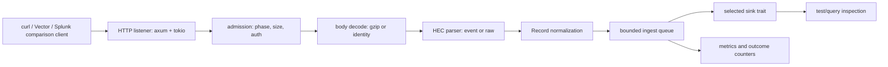

# HECpoc — Focused HEC Proof Of Concept Starting Point

Focus: plan. This document is a workbench control document for arriving at a solid Rust HEC PoC from the current Spank material. It coordinates requirements, architecture, detailed design, implementation sequencing, sink selection, and validation. It does not replace the protocol reference in `spank-rs/docs/HECst.md §1`, the product capsule definitions in `spank-rs/perf/Capsules.md §2`, or the validation lab in `spank-rs/perf/Tools.md §7` through `§13`.

Update this document when the HEC PoC scope, gate criteria, sink priority, or code review findings change. Resolved protocol facts should graduate to `spank-rs/docs/HECst.md`; product requirements should graduate to `spank-rs/perf/Features.md` and `spank-rs/perf/Features.csv`; repeatable third-party tool procedures should graduate to `spank-rs/perf/Tools.md`.

---

## Table of Contents

1. Purpose And Non-Repetition Rule
2. Starting Diagnosis
3. Existing Material To Reuse
4. PoC Definition
5. Review Gates Before More Code
6. Requirements Baseline
7. Architecture Boundary
8. Sink Review And Priority
9. Detailed Design Decisions To Confirm
10. Rust Layout And Naming Review
11. Library And Crate Audit
12. Implementation Sequence
13. Validation Strategy
14. Acceptance Criteria
15. Open Decisions
16. First Useful Work Package
17. References
Appendix A — Crosswalk To Current Code
Appendix B — Review Checklist
Appendix C — Proposed HECpoc Directory Contents

---

## 1. Purpose And Non-Repetition Rule

The purpose is to stop treating the current Rust code as either discarded prototype or unquestioned foundation. The PoC should be derived from requirements, checked against existing design notes, and then implemented by accepting, revising, or replacing code intentionally.

The non-repetition rule is strict: this file cites existing documents for protocol details, product rationale, performance research, tool commands, and historical Python design. It restates only the conclusions needed to make the next implementation decision.

The immediate output is not a finished HEC product. It is a defended starting point where the codebase has known seams, tests exercise those seams, and the next expansion is obvious.

## 2. Starting Diagnosis

The current state has useful material, but the order of confidence is inverted. Some code exists before the requirements, architecture, detailed design, and validation gates have been confirmed.

The main risks are concrete:

| Risk | Current symptom | Consequence | PoC response |
|------|-----------------|-------------|--------------|
| Existing code overtrusted | `spank-hec` already has route, parser, auth, queue, and file sender code | Hidden mismatch between Splunk compatibility and current behavior | Treat code as candidate implementation, not spec |
| Scope too broad | HEC, TCP, API, store, observability, lifecycle, config, and perf docs all touch ingest | Work diffuses before HEC acceptance is stable | Make HEC JSON ingest the lead slice |
| Sink not chosen | `FileSender`, SQLite store traits, raw chunk ideas, and external shippers coexist | Ingest success cannot be asserted cleanly | Prioritize a testable sink stack |
| Protocol detail mixed with status | `HECst.md` contains protocol facts and deferred implementation items | Reference doc can become a plan | Keep PoC status here until decisions stabilize |
| Rust crate usage unconfirmed | `tokio`, `axum`, `serde_json`, `flate2`, `parking_lot`, `arc-swap`, `rusqlite`, and `figment` are already present | Dependencies may encode architecture prematurely | Audit each crate against PoC need and replacement cost |
| Validation not yet ledgered | `Tools.md` describes tool flows, but PoC pass/fail criteria are not bound to code gates | Manual experiments can masquerade as validation | Convert each tool flow into a repeatable run class |

The corrective principle is: HEC PoC first, but HEC PoC includes enough sink and query assertion to prove that accepted events were preserved and can be inspected.

## 3. Existing Material To Reuse

The current documents are inputs with different authority levels. The PoC should cite them by topic instead of copying their contents.

| Source | What it contributes here | How to use it |
|--------|--------------------------|---------------|
| `/Users/walter/Work/Spank/spank-rs/perf/Orient.md §5` | Course of action: control set, lead capsule, acceptance tests, engine path discipline | Use for sequencing decisions |
| `/Users/walter/Work/Spank/spank-rs/perf/Capsules.md §2` | HEC CI Fixture user, promise, required capabilities, acceptance tests | Use as product boundary for PoC |
| `/Users/walter/Work/Spank/spank-rs/perf/Features.md §8.1` and `§8.2` | Ingest and event requirements behind the matrix rows | Use as requirements vocabulary |
| `/Users/walter/Work/Spank/spank-rs/perf/Features.csv` | Requirement IDs such as `ING-HEC-JSON`, `ING-HEC-AUTH`, `ING-BACKPRESS`, `EVT-RAW`, `EVT-TIME` | Use in tests, commits, issue names, and validation ledger |
| `/Users/walter/Work/Spank/spank-rs/docs/HECst.md §1` | HEC wire protocol: endpoints, auth, JSON, raw, health, ACK, channel, error codes | Use as protocol reference |
| `/Users/walter/Work/Spank/spank-rs/docs/HECst.md §3` | Current spank-rs HEC design decisions | Use as candidate decisions to confirm |
| `/Users/walter/Work/Spank/spank-rs/docs/HECst.md §4` | Current module map and request pipeline | Use as candidate implementation map |
| `/Users/walter/Work/Spank/spank-rs/perf/Tools.md §7` through `§13` | Splunk, Vector, curl, corpora, run classes, validation ledger | Use for validation harness design |
| `/Users/walter/Work/Spank/spank-rs/perf/SpankMax.md §2` and `§3.0` | Engine principles: separate ingestion from search prep, scalar correctness path, borrowed parser slices, bounded staging | Use when choosing sinks and parse boundaries |
| `/Users/walter/Work/Spank/spank-rs/perf/Redoc.md §16` and `§18` | Do not expand SpankMax prematurely; capability matrix should drive implementation | Use to prevent architecture sprawl |
| `/Users/walter/Work/Spank/spank-py/HEC.md §5` through `§7` | Prior HEC requirements, architecture, parser boundary, backpressure, ACK design | Use as historical input, not direct spec |
| `/Users/walter/Work/Spank/spank-py/Testing.md §13` through `§15` | Operational test commands, benchmark tools, real-log probes | Mine for test patterns after Rust acceptance is defined |
| `/Users/walter/Work/Spank/spank-py/Logs.md §10` and `§11` | Parser priority and real corpus findings | Use after basic HEC JSON/raw preservation passes |

The important adjustment is authority: `HECst.md` owns protocol facts; `Features.csv` owns requirement IDs; `Tools.md` owns lab procedures; this document owns the PoC route through them.

## 4. PoC Definition

The focused PoC is a Rust-only HEC receiver that accepts real HEC client traffic, stores enough event data to assert correctness, exposes enough inspection to verify accepted events, and reports overload or invalid input explicitly.

The PoC includes:

1. `/services/collector/event` JSON ingest with Splunk-style token auth.
2. Gzip request body decoding.
3. Basic `/services/collector/raw` support sufficient for Vector and curl compatibility checks.
4. Health endpoint with load-balancer-usable status.
5. Backpressure through bounded queues and explicit retryable response.
6. Deterministic capture sink for tests.
7. Durable local sink for acceptance runs.
8. Minimal query/assertion path over `_raw`, `_time`, `host`, `source`, `sourcetype`, `index`, and selected `fields`.
9. Metrics counters for requests, bytes, outcomes, queue full, accepted rows, committed rows, and sink failures.

The PoC excludes:

1. Full HEC ACK lifecycle.
2. TLS hardening.
3. Constant-time token hardening unless production deployment becomes the target.
4. Full SPL search.
5. Universal Forwarder ingestion as a HEC sender.
6. Parser-rich Sigma validation beyond smoke fixtures.
7. Custom unsafe parser or custom async runtime work.

The acceptance identity is: a user can run curl and Vector against Spank, compare behavior with Splunk Enterprise for the selected cases, and inspect stored rows without reading implementation internals.

## 5. Review Gates Before More Code

The PoC should pass through five gates. The gates are intentionally small, but each requires an artifact.

| Gate | Question | Required artifact | Exit criterion |
|------|----------|-------------------|----------------|
| G1 Requirements | What exact compatibility is required? | Requirement subset table in this document and matching test names | Every PoC test maps to a feature row |
| G2 Architecture | Where does HEC stop and storage/search begin? | Boundary diagram and sink priority | No handler writes directly to product storage without a sink trait |
| G3 Detailed design | What are the exact wire and internal semantics? | Decision table for auth, time, raw splitting, metadata, size, gzip, queue full | No behavior exists only in code comments |
| G4 Implementation review | Which existing modules survive? | Code crosswalk in Appendix A | Each module is accepted, revised, split, or deferred |
| G5 Validation | What proves it works? | Automated tests plus tool run ledger | curl, Vector, and local corpus runs produce inspectable evidence |

This is not waterfall ceremony. The gates prevent repeated restarts by forcing the same five questions to be answered before each expansion.

## 6. Requirements Baseline

The PoC requirement subset should be selected from the existing matrix rather than invented locally. These are the minimum rows that make HEC ingest meaningful.

| Requirement ID | PoC meaning | First validation |
|----------------|-------------|------------------|
| `ING-HEC-JSON` | Accept one or more JSON HEC envelopes at `/services/collector/event` | curl sends string and object event; stored `_raw` matches expected |
| `ING-HEC-AUTH` | Accept configured token; reject missing, malformed, and invalid credentials distinctly where Splunk compatibility requires it | curl auth matrix returns expected HTTP/code pairs |
| `ING-HEC-GZIP` | Decode gzip body before JSON/raw parsing | curl or Vector compressed request stores original event |
| `ING-HEC-RAW` | Accept raw endpoint line framing with documented newline behavior | curl raw body stores expected event count and bytes/text |
| `ING-BACKPRESS` | Use bounded queue admission and return retryable server-busy under saturation | forced depth-one queue test returns HTTP 503/code 9 |
| `EVT-RAW` | Preserve received event payload as `_raw` | assertion sink compares exact text for JSON string and raw line cases |
| `EVT-TIME` | Normalize event time to nanoseconds while preserving server fallback semantics | fixed `time` requests query into expected range |
| `EVT-HOST` | Store explicit host and documented fallback | JSON request with host is inspectable |
| `EVT-SOURCE` | Store explicit source and raw endpoint source derivation | JSON and raw requests produce expected source |
| `EVT-SOURCETYPE` | Store explicit sourcetype and default profile | JSON defaults to `_json`; raw defaults to `_raw` unless query metadata changes this |
| `EVT-INDEX` | Store explicit index and enforce or record token index constraints according to chosen PoC scope | JSON request with index round-trips |
| `OBS-METRICS` | Expose counters that explain protocol and sink outcomes | Prometheus metrics include request, code, bytes, queue full, accepted, committed |

Two rows are deliberately deferred even though HEC users care about them:

| Requirement ID | Deferral reason | Re-entry condition |
|----------------|-----------------|--------------------|
| `ING-HEC-ACK` | ACK requires a durable commit model and per-channel ack tracking; adding it before sink semantics stabilize creates false conformance | Raw durable sink or SQLite commit boundary is selected and tested |
| `PAR-CAP` | Parser capability metadata matters for Sigma and schema evolution, but it is not needed to prove HEC event preservation | Parser/Sigma capsule becomes active |

## 7. Architecture Boundary

The PoC architecture has one inbound protocol boundary and one sink boundary. Everything else is replaceable.



The handler side owns protocol admission and returns HEC wire outcomes. The sink side owns durability, batching, and inspection. The queue is the seam between network-facing behavior and storage-facing behavior.

The architecture should keep three boundaries explicit:

1. `HecRequest` to `Rows`: pure protocol interpretation where unit tests can run without a server.
2. `Rows` to `SinkBatch`: sink normalization where storage-specific choices begin.
3. `SinkCommit` to inspection/query: validation path where accepted data becomes observable.

The current `spank-hec` shape already approximates this split, but the sink side is not yet aligned with the durable/queryable PoC objective.

## 8. Sink Review And Priority

Because the focus is ingest, sink choice is not secondary. The sink determines what an accepted event means and what can be validated.

| Priority | Sink | Purpose | Strength | Weakness | PoC decision |
|----------|------|---------|----------|----------|--------------|
| 1 | In-memory assertion sink | Unit and integration tests | Fast, deterministic, exact assertions | Not durable; not representative of deployment | Add or formalize first |
| 2 | JSONL capture sink | Human-readable evidence and fixture capture | Easy to inspect, diff, archive | Poor query semantics; weak performance model | Keep for bring-up and run ledgers |
| 3 | SQLite event sink | Local durable acceptance store | Queryable, familiar, already scaffolded | Can hide engine needs behind SQL; write tuning matters | Use as first durable PoC sink if wired through trait |
| 4 | Raw chunk sink | Durable raw preservation and replay | Best long-term ingest foundation | Needs chunk format, CRC, manifest, replay tools | Design now, implement after PoC JSON path |
| 5 | Null/blackhole sink | Throughput baseline | Separates protocol cost from storage cost | Cannot validate correctness alone | Use only in benchmarks |
| 6 | External HEC forwarding sink | Relay to Splunk/another backend | Useful compatibility bridge | Changes product identity from receiver/store to forwarder | Defer until shipper capsule exists |
| 7 | TCP/S2S-like sink | Compatibility with Splunk forwarder assumptions | Useful later for Splunk ecosystem adjacency | Universal Forwarder is not an HEC sender | Out of HEC PoC |

The recommended first stack is: in-memory assertion sink for tests, JSONL capture for human evidence, SQLite event sink for durable acceptance. Raw chunk design remains documented but not blocking.

A sink trait for the PoC should be narrow:

```rust
trait HecSink: Send + Sync + 'static {
    fn submit(&self, batch: HecBatch) -> spank_core::Result<HecCommit>;
    fn flush(&self, tag: &str) -> spank_core::Result<()>;
}
```

The current `Sender` trait in `spank-hec` is close, but its name is ambiguous: in Splunk and Vector contexts a sender usually emits data outward. For ingest PoC clarity, use `Sink` or `EventSink` for inbound storage and reserve `Sender` or `Shipper` for outbound forwarding.

## 9. Detailed Design Decisions To Confirm

The PoC should freeze selected behaviors and explicitly mark the rest as deferred. The table below is the working decision set.

| Area | Candidate behavior | Current signal | PoC decision needed |
|------|--------------------|----------------|---------------------|
| Endpoint paths | Support `/services/collector/event`, `/raw`, `/health`; possibly `/services/collector/1.0/event` aliases | `HECst.md §1.1` lists variants; current routes cover base paths | Include aliases only if Vector/Splunk SDK tests require them |
| Auth schemes | `Authorization: Splunk <token>` primary, `Bearer` tolerated if documented | Current extractor accepts both | Confirm missing vs malformed vs invalid response codes |
| Token storage | Configured tokens with id and allowed indexes | `spank-cfg` has `HecToken` | Keep config token store for PoC; defer management API |
| Token comparison | Direct string lookup now; constant-time later | `HECst.md §3.7` identifies production gap | Defer hardening, but document threat boundary |
| Body size | Reject before decode or after decode | Current check is pre-decode length | Decide whether max applies compressed or decoded size for PoC tests |
| Gzip | Decode when `Content-Encoding: gzip` | Current `decode_body` supports gzip | Keep and add malformed gzip tests |
| JSON framing | Accept concatenated JSON envelopes | Current parser streams deserializer | Keep and test multi-envelope acceptance and all-or-reject behavior |
| Event null | Map absent and null to code 12; empty string to 13 | `HECst.md §3.1`; current code follows code but old comments disagree | Confirm and fix doc/comment drift when editing code |
| Time | Accept number and decimal string; store nanoseconds | Current `TimeField` supports both and falls back on invalid | Confirm invalid time fallback vs rejection |
| Fields | Flatten string and scalar fields; reject or stringify nested values | Current code stringifies non-string fields | Decide because indexed fields affect search and Sigma later |
| Raw splitting | Split on newline; CRLF trimming and whitespace-only behavior must be specified | Current code only filters empty byte slices | Define exact byte/text preservation and test it |
| Metadata carry-forward | Splunk can carry metadata across envelopes in some clients | `HECst.md §2.11` identifies issue | Defer unless real clients require it |
| Channel | Header preferred, empty header ignored, token id fallback | Current code does this | Keep for non-ACK mode |
| ACK | Stub or disabled response | Current route returns 501 code 14 | Choose compatibility response for disabled ACK before Vector test |
| Backpressure | `try_send`; full queue returns HTTP 503/code 9 | Current receiver does this | Keep, but force-test saturation |
| Sink failure | Handler accepts once queued; consumer logs sink failure | Current consumer logs only | For PoC, decide whether sink failure should trip phase/degraded status |

The most important not-yet-settled behaviors for a reliable PoC are raw endpoint metadata, sink failure semantics, and inspect/query path.

## 10. Rust Layout And Naming Review

The current crate layout is plausible, but it should be reviewed for naming and ownership before expansion.

Current useful separation:

```text
crates/spank-hec/src/
  authenticator.rs
  token_store.rs
  processor.rs
  outcome.rs
  receiver.rs
  sender.rs
```

Recommended PoC naming direction:

```text
crates/spank-hec/src/
  auth.rs              HEC credential extraction and token authentication
  body.rs              gzip/identity body decode and size policy
  event.rs             HEC JSON envelope parsing and event semantics
  raw.rs               raw endpoint parsing and metadata policy
  outcome.rs           HEC wire outcomes and code/status mapping
  receiver.rs          axum routes, admission, queue handoff
  sink.rs              inbound sink trait only if kept in spank-hec
```

Recommended cross-crate direction:

```text
crates/spank-core/src/
  record.rs            canonical event record
  error.rs             structured project error and recovery class

crates/spank-store/src/
  hec_capture.rs       in-memory/assertion sink, if test-only possibly under tests
  jsonl.rs             capture sink
  sqlite.rs            durable acceptance sink
  traits.rs            product sink/store traits
```

Do not rename files just for aesthetic regularity. Rename only when the name prevents correct architecture. The strongest candidate is `sender.rs`, because inbound ingest storage is semantically a sink, not a sender.

Coding convention questions to settle before large edits:

1. Are HEC-specific types named `Hec...` even inside the `spank-hec` crate, or only at public boundaries?
2. Are wire-protocol outcomes kept separate from internal `SpankError` everywhere?
3. Are parser functions pure and testable without `axum`?
4. Are test fixtures kept close to crates, or centralized under a future validation tree?
5. Are feature IDs used in test names or only in comments and validation ledger rows?

## 11. Library And Crate Audit

The current dependency set is reasonable for a first Rust HEC PoC, but each dependency should be tied to a decision.

| Crate | Current role | Keep for PoC? | Review note |
|-------|--------------|---------------|-------------|
| `tokio` | Async runtime, signals, channels, task spawning | Yes | Use for network I/O; keep CPU-heavy parsing out of ordinary async tasks when that work grows |
| `axum` | HTTP routing and handlers | Yes | Good fit for HTTP PoC; route aliases and request limits need explicit tests |
| `hyper` | HTTP substrate via axum | Yes, indirect | Avoid direct hyper unless axum blocks required behavior |
| `tower` / `tower-http` | Middleware and tracing | Maybe | Keep only if actually used in PoC routes; otherwise avoid hidden middleware behavior |
| `serde` / `serde_json` | HEC JSON envelope parse | Yes | Streaming deserializer is appropriate; preserve absent/null distinction deliberately |
| `flate2` | gzip decode | Yes | Confirm decompressed size policy and malformed gzip behavior |
| `metrics` / `metrics-exporter-prometheus` | Counters and Prometheus endpoint | Yes | Metrics are part of PoC acceptance, not decoration |
| `tracing` / `tracing-subscriber` | Structured events | Yes | Keep logs structured enough to support validation ledger |
| `figment` | Config layering | Yes for now | Confirm env naming and defaults; avoid config magic hiding test setup |
| `clap` | CLI config and subcommands | Yes | HEC PoC should prefer config file plus env overrides over many CLI flags |
| `parking_lot` | Locks in token store and file sink | Accept temporarily | Revisit if standard locks are sufficient; do not optimize locks prematurely |
| `arc-swap` | Shared phase state | Accept temporarily | Useful if phase changes without locking; keep if health/admission use it clearly |
| `rusqlite` | SQLite store | Yes if selected durable sink | Use as acceptance sink; avoid letting SQLite schema become final engine design |
| `tokio-util` | CancellationToken | Yes | Keep lifecycle cancellation explicit |
| `anyhow` | Binary-level error aggregation | Yes only in `crates/spank` | Library crates should continue returning structured errors |
| `thiserror` | Structured library errors | Yes | Keep internal errors matchable and testable |

Possible additions should be resisted until a gate requires them. Candidate future crates include `subtle` for constant-time comparison, `tempfile` for tests, `reqwest` or `hyper` test clients for integration tests, and `criterion` for benchmarks. None are required to define the starting point.

## 12. Implementation Sequence

The implementation sequence should be short and evidence-producing. Each step should leave a runnable state.

| Step | Work | Files likely touched | Validation |
|------|------|----------------------|------------|
| 1 | Add HEC protocol unit tests for parser/outcome edge cases | `crates/spank-hec/src/processor.rs`, maybe `outcome.rs` | `cargo test -p spank-hec` |
| 2 | Add receiver integration tests with in-memory sink | `crates/spank-hec/src/receiver.rs`, new test support module | POST valid, bad auth, malformed JSON, gzip, queue full |
| 3 | Clarify sink trait naming and add assertion sink | `crates/spank-hec/src/sink.rs` or `sender.rs`; tests | Accepted rows are inspectable without file I/O |
| 4 | Wire durable SQLite or JSONL acceptance sink behind same trait | `crates/spank-store`, `crates/spank/src/main.rs` | Run server; curl events; inspect store/capture |
| 5 | Normalize raw endpoint policy | `crates/spank-hec/src/processor.rs` or `raw.rs` | CRLF, empty, whitespace, metadata tests |
| 6 | Add Vector compatibility run | config under future `HECpoc/config/`; results under future `HECpoc/results/` | Vector sends to Spank; accepted rows match expected count |
| 7 | Add Splunk Enterprise comparison run | manual ledger from `Tools.md §10` | Selected requests compared for status/code/body |
| 8 | Freeze PoC acceptance report | this document or separate results markdown | Clear pass/fail table and next capsule decision |

Do not implement parser optimization, raw chunk format, ACK, or full search until Step 4 produces durable inspectable accepted events.

## 13. Validation Strategy

Validation should be layered from deterministic to realistic. The PoC is not accepted by a successful server start.

| Layer | Tool | Purpose | Evidence |
|-------|------|---------|----------|
| Unit | Rust tests | Parser, outcome, auth, raw split, gzip decode | test names tied to feature IDs |
| Handler | axum integration tests | HTTP status/body, headers, queue full, phase admission | captured response matrix |
| Process | `spank serve` plus curl | End-to-end local path through config, runtime, routes, sink | shell transcript and captured sink rows |
| Shipper | Vector | Real HEC client compatibility | Vector config, Vector logs, Spank metrics, stored rows |
| Reference | Splunk Enterprise | Behavior comparison for selected protocol cases | request/response diff table |
| Corpus | tutorial logs and local logs | volume, line shape, raw preservation | counts, parse misses, latency/throughput notes |
| Benchmark | null/capture/SQLite sinks | identify bottleneck class | rows/sec, bytes/sec, p50/p95/p99 latency, CPU |

Minimum local inputs:

1. `/Users/walter/Work/Spank/Logs/tutorialdata/www1/access.log` for Apache-like line volume.
2. `/Users/walter/Work/Spank/Logs/tutorialdata/www1/secure.log` for auth/syslog-like line volume.
3. `/Users/walter/Work/Spank/Logs` production and tool logs after tutorial fixtures pass.
4. Vector-generated events and Wazuh/Vector NDJSON after raw and JSON preservation are stable.

The validation ledger should record command, config, input corpus, expected rows, accepted rows, rejected rows, outcome codes, sink path, metrics snapshot, and comparison target.

## 14. Acceptance Criteria

HEC PoC acceptance requires all of the following:

1. `cargo test -p spank-hec` passes parser and receiver tests for selected requirements.
2. `cargo test -p spank-store` passes the selected sink tests if SQLite is used.
3. A local `spank serve` run accepts curl JSON, gzip JSON, raw, and bad-auth cases with expected wire outcomes.
4. A Vector source-to-HEC run sends tutorial log lines into Spank and stored row count matches the input event count after documented filtering.
5. A Splunk Enterprise comparison run has a table for the same curl requests, with each difference classified as match, intentional divergence, or bug.
6. Metrics explain the run: request count, bytes in, outcome code counts, queue full count, accepted rows, committed rows, sink failures.
7. The selected sink lets a reader inspect `_raw`, `_time`, `host`, `source`, `sourcetype`, `index`, and fields for representative events.
8. Backpressure is not theoretical: a forced small-queue test returns retryable/server-busy and increments the queue-full metric.
9. All deferred behaviors are named and have re-entry conditions.

A run that accepts traffic but cannot prove what was stored is not accepted.

## 15. Open Decisions

These decisions block a clean starting point if left implicit:

| ID | Decision | Options | Recommended default |
|----|----------|---------|---------------------|
| HECPOC-D1 | First durable sink | JSONL, SQLite, raw chunk | SQLite for queryable acceptance, JSONL for evidence |
| HECPOC-D2 | Sink trait home | `spank-hec`, `spank-store`, `spank-core` | Define product trait in `spank-store`; keep HEC adapter narrow |
| HECPOC-D3 | Raw CRLF policy | Preserve CR, trim CR, normalize newline | Normalize line ending for event text but preserve raw bytes later in raw chunk design |
| HECPOC-D4 | Body size policy | compressed size, decoded size, both | Enforce request size pre-decode and decoded size before parse |
| HECPOC-D5 | ACK disabled response | 400/code 14, 501/code 14, omit route | Match Splunk-compatible disabled response if verified; otherwise document intentional 501 for PoC |
| HECPOC-D6 | Indexed fields policy | stringify all, accept scalars only, reject nested | Accept strings/scalars; reject or ignore nested with metric before Sigma work |
| HECPOC-D7 | Store schema | single events table, raw chunks plus sidecars, EAV/segments | single events table for PoC; raw chunks/segments later |
| HECPOC-D8 | Test artifact home | crate tests only, `/HECpoc`, `spank-rs/perf` | crate tests for automation; `/HECpoc` for configs/results until docs graduate |

## 16. First Useful Work Package

The next coding work should be one bounded package:

1. Write a HEC PoC test matrix using feature IDs from `Features.csv`.
2. Add missing tests around existing `spank-hec` parser and receiver behavior.
3. Add an in-memory assertion sink or test harness that observes accepted rows.
4. Fix only the bugs revealed by those tests in the JSON/gzip/auth/backpressure path.
5. Produce one curl run and one Vector run using tutorial logs.

Expected immediate findings:

1. `sender.rs` naming and responsibility will likely need adjustment.
2. Raw endpoint policy will need code changes or explicit deferral.
3. ACK route status/code will need compatibility confirmation.
4. Sink failure behavior will need phase/degraded semantics before production claims.
5. SQLite can be used for acceptance, but should not be mistaken for the final performance engine.

The starting point is solid when the HEC handler can be changed with confidence because unit tests, handler tests, process tests, and external client tests all check the same requirement IDs.

---

## 17. References

1. `/Users/walter/Work/Spank/spank-rs/docs/HECst.md §1` — HEC wire protocol and endpoint behavior.
2. `/Users/walter/Work/Spank/spank-rs/docs/HECst.md §3` — current spank-rs HEC design decisions.
3. `/Users/walter/Work/Spank/spank-rs/docs/HECst.md §4` — current HEC module map and request pipeline.
4. `/Users/walter/Work/Spank/spank-rs/perf/Orient.md §5` — product-capability course of action.
5. `/Users/walter/Work/Spank/spank-rs/perf/Capsules.md §2` — HEC CI Fixture capsule.
6. `/Users/walter/Work/Spank/spank-rs/perf/Features.md §8` and `/Users/walter/Work/Spank/spank-rs/perf/Features.csv` — requirement groups and row IDs.
7. `/Users/walter/Work/Spank/spank-rs/perf/Tools.md §7` through `§13` — HEC validation targets, curl, Vector, Splunk, run classes, and ledger fields.
8. `/Users/walter/Work/Spank/spank-rs/perf/SpankMax.md §2` and `§3.0` — performance harness principles and future engine layout.
9. `/Users/walter/Work/Spank/spank-rs/perf/Redoc.md §16` and `§18` — SpankMax split decision and documentation rework sequence.
10. `/Users/walter/Work/Spank/spank-py/HEC.md §5` through `§7` — historical Python HEC requirements, architecture, and detailed design.
11. `/Users/walter/Work/Spank/spank-py/Testing.md §13` through `§15` — historical validation commands and benchmark tools.
12. `/Users/walter/Work/Spank/spank-py/Logs.md §10` and `§11` — parser format priorities and corpus validation findings.

---

## Appendix A — Crosswalk To Current Code

This appendix records how the existing code should be treated during the PoC review. It is not a final code audit.

| Current file | Current role | PoC disposition |
|--------------|--------------|-----------------|
| `/Users/walter/Work/Spank/spank-rs/crates/spank-hec/src/lib.rs` | Exports HEC modules and public types | Keep module facade; update exports if sink naming changes |
| `/Users/walter/Work/Spank/spank-rs/crates/spank-hec/src/outcome.rs` | HEC wire response body and HTTP status | Keep; add exact code/status tests and missing outcomes if needed |
| `/Users/walter/Work/Spank/spank-rs/crates/spank-hec/src/processor.rs` | gzip decode, JSON event parser, raw parser | Keep as correctness core; likely split later into `body`, `event`, `raw` |
| `/Users/walter/Work/Spank/spank-rs/crates/spank-hec/src/receiver.rs` | axum routes, admission, auth dispatch, queue handoff, consumer | Keep but add integration tests and route alias decision |
| `/Users/walter/Work/Spank/spank-rs/crates/spank-hec/src/authenticator.rs` | credential-to-principal trait and token authenticator | Keep; review timing and malformed auth semantics |
| `/Users/walter/Work/Spank/spank-rs/crates/spank-hec/src/token_store.rs` | concurrent token registry | Keep for config-based PoC; management API deferred |
| `/Users/walter/Work/Spank/spank-rs/crates/spank-hec/src/sender.rs` | inbound rows to file writer via `Sender` trait | Rename or wrap conceptually as sink before adding more sinks |
| `/Users/walter/Work/Spank/spank-rs/crates/spank-core/src/record.rs` | canonical `Record` and `Rows` | Keep as PoC event model; verify fields against `EVT-*` rows |
| `/Users/walter/Work/Spank/spank-rs/crates/spank-core/src/error.rs` | structured project error and recovery classes | Keep; ensure sink/queue failures map to recovery classes |
| `/Users/walter/Work/Spank/spank-rs/crates/spank-store/src/traits.rs` | bucket writer/reader/partition manager traits | Use for durable acceptance if not too broad for HEC sink |
| `/Users/walter/Work/Spank/spank-rs/crates/spank-store/src/sqlite.rs` | SQLite bucket implementation | Candidate durable PoC sink; needs HEC wiring and assertion path |
| `/Users/walter/Work/Spank/spank-rs/crates/spank/src/main.rs` | binary composition and runtime | Keep as process integration target; avoid adding too much HEC policy here |
| `/Users/walter/Work/Spank/spank-rs/crates/spank-cfg/src/lib.rs` | config defaults, env layering, HEC token config | Keep; add PoC config examples before more CLI flags |

Known high-value review points:

1. Current raw parser splits on `\n` and filters only zero-length slices; CRLF and whitespace-only behavior need tests.
2. Current body length check occurs before gzip decode; decoded-size limit needs a decision.
3. Current route set does not include `/services/collector/1.0/*` aliases.
4. Current ACK route returns HTTP 501/code 14; compatibility response needs verification.
5. Current consumer logs sink failure after the handler already returned success; phase/degraded semantics need design.
6. Current `FileSender` groups by `source`, not request tag; this may surprise HEC validation that expects channel/token grouping.
7. Current parser tests exist, but receiver-level tests and sink-level acceptance are thin or absent.

## Appendix B — Review Checklist

Use this checklist before approving HEC PoC implementation changes.

### B.1 Requirements

1. Does every test map to a `Features.csv` row?
2. Does each row have one executable validation path?
3. Are deferred rows named with re-entry conditions?
4. Are differences from Splunk behavior marked intentional or bug?

### B.2 Architecture

1. Does handler code stop at queue/sink handoff?
2. Is protocol outcome logic separated from internal storage errors?
3. Can parser logic be tested without an HTTP server?
4. Can sink logic be tested without a network listener?
5. Is backpressure observable at the wire and metric layers?

### B.3 Detailed Design

1. Are auth missing, malformed, and invalid cases distinct if the protocol requires it?
2. Is body size policy explicit before and after gzip decode?
3. Are absent, null, empty, scalar, object, and array event values tested?
4. Are raw newline, CRLF, empty-line, and whitespace-line cases tested?
5. Is timestamp fallback behavior accepted deliberately?
6. Are `fields` flattening and nested-value behavior documented?
7. Is channel/tag derivation tested with present, empty, and absent headers?

### B.4 Implementation

1. Are crate names and file names aligned with direction of data flow?
2. Are public types minimal and named for domain concepts?
3. Are dependencies used directly by the PoC or merely inherited?
4. Are long-running CPU tasks kept out of ordinary async handler execution?
5. Are lock scopes small and absent from hot parsing loops?
6. Are panics excluded from normal bad-input paths?

### B.5 Validation

1. Do unit tests pass before process tests run?
2. Does curl prove protocol edge cases?
3. Does Vector prove real client compatibility?
4. Does Splunk Enterprise comparison classify differences?
5. Does the sink make stored rows inspectable?
6. Do metrics explain both success and rejection paths?
7. Are result artifacts named by date, git revision, config, input corpus, and requirement set?

## Appendix C — Proposed HECpoc Directory Contents

Only this file exists initially. If the PoC workbench grows, use a minimal structure:

```text
/Users/walter/Work/Spank/HECpoc/
  HECpoc.md              control document
  configs/               Splunk, Vector, and Spank sample configs
  requests/              curl request bodies and expected response matrices
  fixtures/              copied or generated tiny fixtures, not large corpora
  results/               dated validation ledgers and response captures
  scripts/               thin wrappers around documented commands
```

Large logs should remain under `/Users/walter/Work/Spank/Logs`. Repository code should remain under `/Users/walter/Work/Spank/spank-rs`. This workbench should hold coordination artifacts, not become another product tree.
