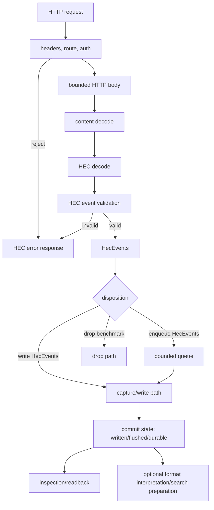

# HECpoc — Focused HEC Receiver Design

HECpoc is a focused Rust implementation of a small, testable HTTP Event Collector receiver. The first product is a local endpoint that accepts realistic Splunk HEC traffic, preserves accepted events, exposes enough inspection to assert what arrived, and makes compatibility differences explicit.

Mandate: own the product contract, HEC-visible behavior, staged architecture, and documentation authority for the project. The full documentation map and inclusion rules are maintained in Section 8.

The starting user is a developer or CI engineer who wants to test code that sends logs to Splunk HEC without running full Splunk for every run. The immediate benefit is practical: catch bad tokens, malformed payloads, missing metadata, gzip mistakes, raw endpoint surprises, retry behavior, and storage/inspection mismatches before production.

Scope is intentionally narrow: HEC ingest, local capture, inspection, validation, and measurement. Search, parser specialization, Sigma, retention, repair, TLS hardening, full ACK semantics, and performance-specific storage enter only after the HEC path proves correct enough to need them. This document defines the product contract, protocol behavior, high-level architecture, staged decisions, documentation map, and references for the HECpoc documentation set.

---

## 1. Scope, Wants, And Capability Bundles

The design starts from user wants and then derives feature bundles. It should not be organized around every Splunk feature that can be named.

### 1.1 User Wants And Benefits

The user wants to start a local endpoint, send events using ordinary HEC clients, see clear success or failure, inspect accepted events, compare selected behavior with Splunk, and repeat the same run in development and CI.

| Feature | Benefit |
|---------|---------|
| HEC JSON ingest | Applications and shippers use their real output path |
| Raw ingest | Raw endpoint users and line senders can be tested |
| Token auth | Bad-token and missing-auth failures are caught |
| Gzip decode | Common compressed client behavior is covered |
| Metadata capture | Tests assert time, host, source, sourcetype, and index |
| File capture sink | Accepted events are directly inspectable |
| Backpressure response | Overload becomes visible, not silently accepted |
| Local inspection | Tests assert stored output without reading internals |
| Bounded resource use | Bad inputs and slow sinks do not consume unbounded memory or runtime capacity |
| Resilient failure reporting | Users can distinguish rejected, accepted, written, flushed, durable, and failed-after-accept cases |

### 1.2 Capability Bundles

Group capabilities by functional bundle and likely sequence, not by requirement prefix.

| Bundle | Contents | Stage | Action |
|--------|----------|-------|--------|
| A. JSON, raw, files | `ING-HEC-JSON`, `ING-HEC-RAW`, `EVT-RAW`; visible file/capture evidence | First | keep protocol tests and capture readback passing |
| B. Backpressure | `ING-BACKPRESS`; explicit retryable failure under saturation | First | add bounded queue and deterministic queue-full response |
| C. Time and metadata | `EVT-TIME`, `EVT-HOST`, `EVT-SOURCE`, `EVT-SOURCETYPE`; event identity | First | verify storage fields and Splunk comparison cases |
| D. Auth and gzip | `ING-HEC-AUTH`, `ING-HEC-GZIP`; realistic client behavior | First | complete malformed/oversize/unsupported tests |
| E. Inspection | `SCH-TERM`, `SCH-TIME`, maybe `SCH-FIELDS`; assertion surface | Early | expose stable fixture readback before indexing |
| F. More sinks, index, metrics | `EVT-INDEX`, `OBS-METRICS`, durable sink work | Later | define Store interface and benchmark profiles first |
| G. ACK and capability metadata | `ING-HEC-ACK`, `PAR-CAP`; commit and parser capability semantics | Later | implement only after commit-boundary design is encoded |
| H. Resource and resilience controls | body limits, queue limits, slow-sink behavior, health degradation | First | make limits configurable and observable |

### 1.3 Design Detail Level

Capture concrete requirements, high-level architecture, event validation, sink/store boundaries, and only the low-level details that block implementation. Work decomposition should stay short and actionable. Validation is designed alongside code, not appended after it.

---

## 2. Protocol And Event Semantics

Protocol design is the first technical center of gravity. It defines the externally visible HEC behavior, the internal data units that survive request handling, and the states the receiver may truthfully report.

### 2.1 Definitive Data Path, States, And Entities

The active HECpoc data path is:

```text
transport stream
  -> HTTP request/framing
  -> HTTP headers and route
  -> auth and request metadata validation
  -> HTTP body
  -> content decode
  -> HEC decode
  -> HEC event validation
  -> HecEvents formation
  -> concrete disposition
  -> selected commit state
  -> optional format interpretation
  -> optional search preparation
```

Short form:

```text
receive HTTP request -> validate headers/auth -> read HTTP body -> content decode -> HEC decode -> validate events -> form HecEvents -> disposition -> commit state -> optional interpretation/search-prep
```

Request states used by implementation, tests, and reporting:

| State | Meaning | Failure/Response Implication |
|-------|---------|------------------------------|
| `authenticated` | HEC auth requirements passed | failures map to auth HEC errors before body-dependent work |
| `body_read` | bounded HTTP body was read under configured limits | failures map to body limit, timeout, or read errors |
| `decoded` | content encoding such as gzip was decoded | failures map to unsupported or malformed encoding outcomes |
| `hec_decoded` | `/event` JSON envelopes or `/raw` line units were decoded | failures map to endpoint/protocol parse outcomes |
| `validated` | HEC event requirements passed | failures map to missing/blank event, invalid fields, or configured index policy |
| `accepted` | valid `HecEvents` exist | success may claim only accepted unless a stronger disposition completed |
| `queued` | `HecEvents` entered a bounded queue | valid benchmark or ACK boundary only when configured |
| `written` | write call returned for the selected sink/store path | not crash durable |
| `flushed` | userspace flush returned | kernel/page-cache visible but not power-loss durable |
| `durable` | `fsync`, DB commit, or equivalent durable boundary completed | first production-grade ACK boundary |
| `search_ready` | search-prep structures exist for the evidence | query acceleration is available |

Core entities:

| Entity | Meaning | Owner |
|--------|---------|-------|
| `HecRequest` | Method, path, headers, body stream, route, peer facts when exposed | Stack/HEC receiver boundary |
| `HecCredential` | Parsed auth scheme and token class | HEC auth |
| `HecEnvelope` | One JSON object decoded from `/services/collector/event` | HEC decode |
| `RequestRaw` | Decoded `/raw` HTTP body before LF splitting | HEC raw endpoint |
| `RawEvents` | Non-empty raw events produced by LF splitting `RequestRaw` | HEC raw endpoint |
| `HecEvent` | One normalized accepted HEC event | HEC validation |
| `HecEvents` | Valid HEC events from one HTTP request after HEC decode and validation | HEC receiver; passed to queue/write path |
| `ParseBatch` | Optional group selected for format interpretation | Format/search preparation only |
| `WriteBlock` | Store/output aggregation unit selected for append/write efficiency | Store/write path |
| commit state | Strongest completed state visible to response, ACK, validation, and reporting | Sink/store policy |
| `InspectQuery` | Minimal read path over stored capture evidence | Inspection |

Appendix B records naming rationale and external terminology comparisons. It is not a competing definition of the data path.

### 2.2 Endpoint Behavior

Minimum surface:

- `/services/collector/event`: accept one or more stacked JSON `HecEnvelope` objects and JSON array batches observed from Splunk verification.
- `/services/collector/raw`: accept LF-framed raw events with documented CRLF behavior.
- `/services/collector/health`: report availability and lifecycle phase.
- `/services/collector/ack`: return a deliberate disabled/unsupported response until ACK commit semantics exist.
- Body encoding: identity and gzip, with explicit pre-decode and post-decode size policy.
- Resource gates: bounded HTTP body, decoded body, per-event raw size, event count, and bounded queue insertion when queue mode exists.

Route aliases such as `/services/collector/1.0/*` should wait for client evidence. Incorrect paths are protocol validation cases, not generic Axum 404 trivia.

### 2.3 Event Fields And Metadata

Initial field rules:

- `_raw`: preserve event text for comparison; raw byte preservation becomes a sink/store property before replay claims.
- `_time`: store parsed event time with explicit precision; choose microseconds or nanoseconds after Splunk comparison and sink format review.
- `host`, `source`, `sourcetype`: store payload values and make defaults visible.
- `index`: logical namespace first; default to `main`; validate against token-associated allowed indexes before physical partitioning exists.
- `fields`: accept an object with scalar, null, and direct array values; reject nested object values and non-object top-level `fields`.

Metadata extracted before store/write decisions includes endpoint, token/channel class, request id, event ordinal, HTTP body length, decoded length, content encoding, source query params, and validation outcome. Store/output grouping may split or coalesce events later, but it must retain request provenance.

### 2.4 Protocol Validation Surface

Protocol validation belongs here because it defines externally visible HEC behavior. Detailed HTTP status/code matrices and limit cases are in Appendix A.

| Group | Immediate Cases | Action |
|-------|-----------------|--------|
| Auth | missing, malformed, wrong scheme, empty token, invalid token, valid token | keep distinct enough for Splunk comparison and operator diagnosis |
| JSON | empty, malformed, stacked envelopes, later invalid envelope, missing/null/blank `event`, object/array/scalar event | reject whole request unless Splunk verification requires a different policy |
| Raw | empty body, trailing newline, CRLF, blank line, whitespace-only line, invalid UTF-8 if text output is used | define LF splitting and byte/text preservation before optimizing |
| Gzip and size | valid gzip, malformed gzip, empty decoded body, pre-decode limit, post-decode limit | enforce both advertised and decoded caps |
| Metadata | missing values, explicit empty strings, nested fields, non-scalar fields | store what is supported; reject or preserve unsupported forms deliberately |
| Backpressure | full queue, slow sink, write failure after accepted queue/write disposition | respond retryably; do not silently drop in correctness mode |
| ACK/channel | channel absent, channel empty, channel present with ACK disabled, ACK request before implementation | keep disabled behavior explicit until registry and commit boundary exist |

---

## 3. Architecture And High-Level Design

HECpoc is not just an Axum handler. It is a staged receiver with explicit protocol, resource, disposition, commit, inspection, and evidence boundaries. The first implementation can be small, but the boundaries must be stable enough that queueing, durable stores, and format interpretation can be added without rewriting the protocol core.

### 3.1 Component Responsibilities

| Component | Owns | Does Not Own | Current Direction |
|-----------|------|--------------|-------------------|
| Ingress stack | TCP/HTTP/Tokio/Axum/Hyper behavior, request body reading, content length, body timeouts, content encoding facts | log-format parsing, storage partitioning, durable claims | Axum/Tokio now; owned accept loop later if connection stats/culling require it |
| HEC protocol | endpoints, auth, HEC response codes, JSON/raw HEC decode, event validation, request outcome | database layout, search indexes, generic infrastructure services | concrete HEC code paths, not Tower middleware for protocol-critical checks |
| Event formation | `HecEnvelope`, `RequestRaw`, `RawEvents`, `HecEvent`, `HecEvents`, metadata attachment | store block sizing or parser batching | request provenance is preserved even when later stages regroup events |
| Resource policy | size limits, event count, body timeouts, queue full, busy/unhealthy/shutdown behavior | hidden magic defaults | typed config with validation and observable outcomes |
| Queue/write path | `enqueue HecEvents`, `write HecEvents`, commit states, failure-after-accept behavior | HEC syntax parsing | direct capture first, bounded queue next, durable commit later |
| Store/inspection | capture files, readback, `WriteBlock`, optional durable formats, eventual search-prep inputs | HTTP correctness | starts close to evidence; does not inherit shipper batch size as output granularity |
| Infrastructure | config, errors/outcomes/messages, reporting/logging, metrics, lifecycle, benchmark ledger | protocol-specific truth tables except where mapped | centralized services with precise call-site contracts |

### 3.2 Control And Data Flow



The main invariant is commit-state truthfulness: response, ACK, report, and benchmark output may not claim a state stronger than what actually completed.

### 3.3 Accepted Design Decisions

| Area | Decision | Reason | Revisit Trigger |
|------|----------|--------|-----------------|
| Runtime | Use Tokio and Axum initially | gets a real HEC server running while keeping protocol checks explicit | connection-level stats, header limits, culling, or accept-loop policy require Hyper/hyper-util direct control |
| Protocol checks | Implement auth/body/gzip/HEC response mapping in HEC-owned code | protocol-critical behavior must be testable and Splunk-comparable | a library feature proves identical behavior and better maintainability |
| JSON HEC batching | Support stacked JSON objects and JSON array batches for `/event` | local Splunk accepted both; clients may generate either shape | later Splunk version or shipper evidence contradicts current oracle |
| Output grouping | Use `WriteBlock` for store/output aggregation, not HEC request grouping | store/write granularity should match storage and benchmark needs | generalized Store interface chooses a better term |
| Queue policy | Correctness mode rejects newest or returns busy when full | HEC senders can retry; silent drop lies | telemetry profile explicitly chooses drop/spill behavior |
| Store partitioning | Preserve host/source/sourcetype/index metadata; do not make per-host/per-log DBs during ingest | avoids writer/schema/compaction explosion | measured workload proves partition-local writes or searches dominate |
| ACK | Defer ACK until registry and commit boundary exist | ACK without a truthful boundary is worse than unsupported | queue/durable store design is implemented and tested |
| Search preparation | Keep format parsing/tokenization replayable and optional after evidence capture | accepted input must not exist only in parser/index output | product bundle requires query-ready ingest |

### 3.4 Immediate Architecture Gaps

These are not open-ended questions; each names the next design or test artifact needed.

| Area | Needed Artifact | Blocks |
|------|-----------------|--------|
| Capture format | exact JSONL or length-delimited format with fields and escaping rules | reliable inspection, replay, malicious input tests |
| Queue topology | one bounded global queue spec with full/busy response mapping | `ING-BACKPRESS`, queue-full tests, health degradation |
| Write path | direct capture vs queued capture mode contract | performance claims and failure-after-accept behavior |
| Body/header policy | Axum-visible body limits plus documented Hyper/header gaps | slowloris/header-bloat validation and fallback decision |
| Raw framing | LF/CRLF/NUL/non-UTF policy with byte/text preservation decision | raw endpoint correctness and file replay claims |
| Config schema | file/env/CLI precedence and validation for all limits/policies | reproducible tests and safe defaults |
| Reporting | call-site contract for events, fields, outcomes, metrics, and console/log routing | useful failure diagnosis and benchmark ledgers |
| Splunk oracle | scripts and fixtures for selected ambiguous HEC cases | compatibility claims beyond docs |

---

## 4. Event Validation, Compatibility, And Measurement

Event and protocol validation should be grouped by externally visible behavior. Store durability, queue internals, and search preparation have their own sections and subject documents.

### 4.1 Compatibility Verification

Use Splunk documentation as the starting point, local Splunk Enterprise as the oracle for ambiguous cases, and Vector/Fluent Bit/OpenTelemetry behavior as shipper compatibility evidence. Appendix A lists HEC return values, status mappings, limit classes, and verification tasks.

Immediate verification targets:

1. Incorrect HEC paths and Axum/Hyper fallback behavior.
2. Missing/malformed/invalid auth response bodies and status codes.
3. Body too large before read, body too large while reading, and gzip expansion too large.
4. Stacked JSON object success and malformed-late-object failure.
5. JSON array success plus malformed-array edge cases.
6. Raw endpoint CRLF, blank line, trailing newline, NUL, and invalid UTF-8 behavior.
7. Health during stopping (`503/code23`) and later queue-full health degradation.

### 4.2 Metrics And Evidence Needed Per Run

Every validation or benchmark run should record enough context to be interpretable later:

| Evidence | Purpose |
|----------|---------|
| config snapshot with secrets redacted | proves limits, sink mode, runtime mode, and filters used |
| request corpus manifest | makes payload size/event-count comparisons possible |
| response ledger | maps each request to HTTP status, HEC code, response body, and outcome |
| stats snapshot before/after | computes receiver-side bytes/sec, events/sec, rejects, and body errors |
| process/system samples | separates load-generator limits from receiver limits |
| output/capture files | proves accepted events are inspectable and not merely counted |
| Splunk/Vector comparison notes | distinguishes documented behavior from local oracle behavior |

### 4.3 Test Upgrade Priorities

| Priority | Tests | Why |
|----------|-------|-----|
| P0 | protocol matrix for auth, JSON, raw, gzip, no-data, and oversize | locks externally visible behavior |
| P0 | health/stopping and incorrect-path responses | prevents framework defaults from defining product behavior accidentally |
| P0 | capture readback and response/counter agreement | proves accepted events are visible and counted coherently |
| P1 | queue-full with blocked write path | first true backpressure proof |
| P1 | slow body and malformed header probes | distinguishes Axum/Hyper behavior from HEC-owned checks |
| P1 | Splunk oracle scripts for ambiguous codes | prevents folklore-driven compatibility claims |
| P2 | hostile input corpus and fuzz/property tests | hardens parser and body handling after core behavior stabilizes |

---

## 5. Store, Sink, And Inspection Strategy

Sink choice is part of ingest correctness. The first implementation should prove accepted events are visible before it designs a database.

### 5.1 Sink And Store Order

Sort by usefulness and complexity:

1. Capture file sink: first correctness evidence.
2. In-memory assertion sink: useful once tests need direct event access.
3. Null sink: benchmark only, not correctness.
4. Raw chunk or structured file sink: later replay and corruption checks.
5. SQLite or queryable store: later durable local query; no early optimization.
6. External forwarding sink: defer; that is another product mode.

The first practical path is capture file plus simple inspection.

### 5.2 Inspection Path

Start close to stored evidence: write accepted events to a documented file format, provide a tiny inspection command or test helper, support term/time filters only after semantics are defined, and add indexing only when the simple path fails.

A sink trait is justified only when two concrete implementations need the same call sites and can be tested independently. Until then, a concrete capture sink is simpler than an abstraction display case.

### 5.3 Queue, Write, And Commit Boundaries

The core design choice is whether validated `HecEvents` are written synchronously in fixture mode or inserted into a bounded queue for later `WriteBlock` construction. The collector should not let request handlers perform long file or database work under load.

Initial rules:

- Request handlers may HEC-decode and validate small bounded bodies, but they should not perform long blocking writes.
- The chosen disposition must be visible in validation: `write HecEvents`, `enqueue HecEvents`, `drop HecEvents`, `forward HecEvents`, or `reject request`.
- Queue depth, max request bytes, max decoded bytes, max raw event bytes, and max events per request should be configurable or at least named constants.
- Slow write behavior should be tested by a deliberately blocking or failing sink/store path.
- Capture files should use buffered writes, but flush semantics must be tied to explicit validation expectations.
- Crash resilience is limited at first: file capture should be append-only and inspectable after process exit, but not advertised as durable ACK storage.

---

## 6. Implementation Sequence

This sequence is intentionally short. Detailed implementation infrastructure belongs in `InfraHEC.md`; ingress mechanics belong in `Stack.md`; store mechanics belong in `Store.md`.

| Step | Work | Acceptance Signal |
|------|------|-------------------|
| 1 | Typed configuration, validation, startup, shutdown | invalid config fails early; startup logs/reporting are stable |
| 2 | Central HEC outcomes, request error mapping, public message text | every handler error maps to one response, metric, and report fact |
| 3 | Protocol fixtures for auth, body, gzip, JSON, raw, no-data, oversize | protocol matrix passes in unit and handler tests |
| 4 | Capture sink format and readback helper | accepted events can be inspected without internal knowledge |
| 5 | Benchmark/validation ledger | runs record config, corpus, stats, system samples, and output paths |
| 6 | Bounded queue between `HecEvents` and write path | deterministic queue-full response and health/counter behavior |
| 7 | Splunk and shipper comparison scripts | selected edge cases verified against local Splunk and Vector |
| 8 | Store/write profile expansion | durable and search-prep claims tied to measured commit states |

First target:

```text
merge config -> validate -> bind -> accept HEC JSON/raw -> classify errors -> capture event -> inspect capture -> record run evidence
```

---

## 7. Decision Register

Decision rows are grouped by expected validity. Revisit only when the trigger occurs; do not carry every uncertainty as a blocking question.

| Class | Decision | Current Position | Revisit Trigger |
|-------|----------|------------------|-----------------|
| Contract | HEC JSON/raw endpoints and response shape | compare with Splunk for selected edge cases | Splunk/shipper comparison contradicts current behavior |
| Contract | Metadata preservation | preserve `time`, `host`, `source`, `sourcetype`, `index`, `fields` where supported | supported client emits a case we mishandle |
| Implementation stage | Direct capture before bounded queue | acceptable fixture phase | queue/backpressure bundle starts |
| Implementation stage | All-or-nothing JSON request parsing | default until Splunk oracle says otherwise | Splunk accepts partial success for a target case |
| Benchmark profile | Drop/null sink numbers | HTTP/parser upper bound only | result is cited as durable ingest capacity |
| Deferred | ACK commit boundary | unsupported until registry and commit policy exist | bounded queue plus durable store is implemented |
| Deferred | Parser capability metadata and aliases | design in Formats/Store before code claims | field/search/Sigma work starts |

---

## 8. Documentation Architecture And Inclusion Rules

This section is the HECpoc documentation map. Subject-specific documents should not repeat this map or carry generic file-purpose lists. Each file states only its own scope and the technical subject it owns.

| File | Focus | Includes | Excludes |
|---|---|---|---|
| `HECpoc.md` | product and protocol control plane | user goals, capability bundles, HEC request/event contract, staged decisions, acceptance gates, documentation map | deep parser grammars, OS/socket mechanics, implementation infrastructure internals |
| `InfraHEC.md` | cross-cutting service infrastructure | configuration, validation, errors, public text, reporting/logging/observability, metrics, lifecycle policy, security posture, validation and benchmark ledger schemas | product protocol matrices, log-format grammars, queue/store algorithms, socket syscall details |
| `Stack.md` | ingress and operating-system stack | TCP/HTTP/Tokio/Axum/Hyper, HTTP framing, body streaming, content-encoding mechanics, body/time limits, kernel socket buffers, page cache notes, system calls, connection accounting, network-layer backpressure | HEC auth semantics, HEC status/code mapping, log-line grammars, token/index layout, store retirement policy |
| `Formats.md` | log and record structure | source format origins, examples, version splits, parser choices, field extraction, field aliases, malformed record cases, format-specific parser validation | generic OS buffering, HEC status mapping, queue topology, durable store layout |
| `Store.md` | application pipeline and stored evidence | `HecEvents` disposition, queue topology, `ParseBatch` policy, `WriteBlock` construction, commit states, durable commit, intermediate store, token/index construction, production/benchmark profile differences | kernel/socket mechanics, detailed log-format syntax, generic reporting infrastructure |

Inclusion rules:

1. A topic belongs where its primary design variable lives, not where it was first discussed.
2. Validation belongs with the subsystem whose behavior is being proven. Protocol response validation belongs here; socket/header timeout validation belongs in `Stack.md`; parser correctness validation belongs in `Formats.md`; queue/store/durability validation belongs in `Store.md`; report/config validation belongs in `InfraHEC.md`.
3. References should be specific evidence for the local subject. Avoid empty mentions of another project document just to say it exists.
4. Stable requirements and justified recommendations stay in reference sections. Work tracking and status tables are kept short and only when they control the next implementation step.
5. External or historical code can influence HECpoc only after restating the current requirement, naming the implementation target, adding validation cases, and recording why the approach remains suitable.

Boundary-straddling cases:

| Case | Primary Owner | Supporting Owner | Delineation |
|------|---------------|------------------|-------------|
| Configuration system | `InfraHEC.md` | subject document owning the setting | Infra defines precedence, validation, redaction, and test obligations; HECpoc/Stack/Store/Formats define their own setting semantics and authoritative parameter lists. |
| HEC response to body-size limits | `HECpoc.md` | `Stack.md`, `InfraHEC.md` | Stack explains when size limits fire and whether Hyper or handler sees the request; HECpoc defines status/body/code; Infra defines how the limit is configured and validated. |
| Gzip | `Stack.md` | `HECpoc.md`, `InfraHEC.md` | Stack owns content-encoding detection, decode mechanics, buffer sizing, and expansion limits; HECpoc owns client-visible outcome; Infra owns config/reporting mechanics. |
| Auth token settings | `HECpoc.md` | `InfraHEC.md` | HECpoc owns token semantics, Basic/Splunk/query-token behavior, default index, and allowed-index policy; Infra owns secret redaction, loading, validation style, and error/reporting infrastructure. |
| Runtime/Tokio worker policy | `Stack.md` | `InfraHEC.md` | Stack owns I/O/CPU scheduling design and when to split runtimes; Infra owns startup/runtime configuration machinery and lifecycle integration. |
| Queue/backpressure | `Store.md` | `HECpoc.md`, `Stack.md`, `InfraHEC.md` | Store owns queue unit, capacity, disposition, and commit truth; HECpoc owns external HEC response; Stack owns network symptoms; Infra owns metrics/reporting/config pattern. |
| Raw line handling | `HECpoc.md` until accepted, then `Formats.md` for deeper interpretation | `Stack.md`, `Store.md` | HECpoc owns raw endpoint line/event formation and response; Formats owns later source-format parsing; Stack owns byte/body mechanics; Store owns evidence preservation. |
| Validation runs | subsystem being proven | `HECpoc.md` for protocol matrix | Keep tests and evidence with the behavior under proof: protocol in HECpoc, mechanics in Stack, config/reporting in Infra, storage in Store, parser correctness in Formats. |

---

## 9. References

References here are external comparison points. The documentation map above is the source for project-document placement.

1. [Splunk: Format events for HTTP Event Collector](https://docs.splunk.com/Documentation/Splunk/latest/Data/FormateventsforHTTPEventCollector) — JSON envelope and metadata examples.
2. [Splunk: Troubleshoot HTTP Event Collector](https://docs.splunk.com/Documentation/Splunk/latest/Data/TroubleshootHTTPEventCollector) — error/status behavior.
3. [Vector `splunk_hec_logs` sink](https://vector.dev/docs/reference/configuration/sinks/splunk_hec_logs/) — real HEC client behavior, batching, ACK, retry, TLS.
4. [Fluent Bit Splunk output](https://docs.fluentbit.io/manual/data-pipeline/outputs/splunk) — common shipper configuration vocabulary.
5. OpenTelemetry Collector contrib `splunkhecreceiver` — server-side implementation reference.
6. Local Splunk Enterprise — ground truth for selected edge cases when docs and clients disagree.

---

## Appendix A — HEC Behavior, Limits, And Response Mapping

This appendix is the behavior reference for the HEC receiver. It answers three common review questions:

1. Given an HEC code, do we implement it, test it, or intentionally postpone it?
2. Given an HTTP status, which HEC cases can produce it?
3. Given a processing stage, which input conditions are accepted, rejected, or still undefined?

Splunk compatibility is the default guidance. Divergence is allowed only when a local-fixture, safety, or implementation-control reason is named and the behavior is configurable or clearly documented.

### A.1 Review Use Cases

| Use Case | Section |
|---|---|
| Check missing or weak HEC code coverage | `A.2 HEC Code Matrix` |
| Look up behavior by HTTP status | `A.3 HTTP Status Lookup` |
| Review endpoint and token semantics | `A.4 Endpoint, Auth, And Health Semantics` |
| Review body limits, encoding, and wire-framing boundaries | `A.5 Admission, Body, And Content Decoding` |
| Review JSON/raw event boundaries | `A.6 HEC Content Decoding And Record Boundaries` |
| Review metadata, fields, and index handling | `A.7 Metadata, Indexed Fields, And Defaults` |
| Review character encoding and incomplete input | `A.8 Character Encoding And Incomplete Input` |
| Review time, date, and sequence values | `A.9 Numeric, Time, And Sequence Values` |
| Review accepted decisions, gaps, and implementation plan | `A.10 Recommendations And Implementation Plan` |

### A.2 HEC Code Matrix

This is the canonical status/code table. Use it to determine whether coverage is implemented, tested, postponed, or blocked by a future subsystem.

| Code | HTTP | Meaning | Current State | Coverage / Next Action |
|---:|---|---|---|---|
| `0` | `200` | success | implemented | handler tests and validation runs cover raw, event, Basic auth, and JSON array success |
| `1` | `403` | token disabled | implemented | token record has enabled/disabled state; handler test covers disabled token |
| `2` | `401` | token required | implemented | handler tests cover missing auth and blank auth header |
| `3` | `401` | invalid authorization | implemented | parser and handler tests cover malformed schemes, malformed Basic, and `Bearer` rejection |
| `4` | `403` | invalid token | implemented | handler test covers wrong token |
| `5` | `400` | no data | implemented | raw blank/whitespace and event empty-body tests exist |
| `6` | `400` | invalid data format | implemented | malformed JSON, invalid `fields`, and malformed gzip tests exist; raw-socket malformed-header probes remain separate |
| `7` | `400` | incorrect index | implemented for event body | syntax, length, reserved/private-looking, and allow-list tests exist; query-string index postponed |
| `8` | `500` | internal server error | not implemented | reserve for true internal/runtime/sink failures that should be HEC JSON rather than process failure |
| `9` | `503` | server busy | partly implemented, final taxonomy postponed | current uses cover max-events, timeout, sink failure, and non-serving phase; bounded queue/server-busy policy remains future work |
| `10` | `400` | data channel missing | postponed | ACK/channel feature required |
| `11` | `400` | invalid data channel | postponed | ACK/channel feature required |
| `12` | `400` | event field required | implemented | parser and handler tests cover missing/null `event` |
| `13` | `400` | event field blank | implemented | parser and handler tests cover blank string event |
| `14` | `400` | ACK disabled | implemented as compatibility stub | `/ack` authenticates first, then returns ACK disabled; full ACK postponed |
| `15` | `400` | indexed fields error | implemented | nested object rejected; top-level `fields` array maps to code `6`; direct array field value accepted per Splunk oracle |
| `16` | `400` | query-string auth disabled | implemented | query parameter `token` rejected before auth/body work |
| `17` | `200` | healthy | implemented | health endpoint serving phase covered |
| `18` | `503` | unhealthy: queues full | implemented only as generic starting/unhealthy | queue-specific meaning awaits bounded queue |
| `19` | `503` | unhealthy: ACK unavailable | postponed | ACK service required |
| `20` | `503` | unhealthy: queues full and ACK unavailable | postponed | queue + ACK health required |
| `21` | `400` | invalid token in token-management context | not implemented | likely management-endpoint specific; do not implement in receiver path yet |
| `22` | `400` | token disabled in token-management context | not implemented | likely management-endpoint specific; do not implement in receiver path yet |
| `23` | `503` | server shutting down | implemented at phase level | handler tests cover health and ingest while stopping; system drain test still needed |
| `24` | `200` | queue approaching capacity | postponed | bounded queue and threshold policy required |
| `25` | `200` | ACK approaching capacity | postponed | ACK registry required |
| `26` | `429` | queue at capacity | postponed | bounded queue required |
| `27` | `429` | ACK channel at capacity | postponed | ACK registry required |

### A.3 HTTP Status Lookup

Use this lookup when reviewing a response observed by a client. It deliberately stays compact; detailed code coverage is in `A.2`.

| HTTP Status | Current Sources |
|---|---|
| `200` | success `0`; health `17`; future queue/ACK warnings `24`/`25` |
| `400` | no data `5`; invalid data `6`; incorrect index `7`; event missing/blank `12`/`13`; ACK disabled `14`; indexed-field error `15`; query auth disabled `16`; future channel/token-management codes |
| `401` | token required `2`; invalid authorization `3` |
| `403` | disabled token `1`; invalid token `4` |
| `404` | incorrect HEC path, Splunk-style JSON body with code `404` |
| `405` | wrong method on known HEC path, Splunk-style JSON body with code `404` |
| `408` | current body timeout maps to `408/code9`; Splunk compatibility remains unverified |
| `413` | body too large; local Splunk returned generic HTML, not HEC JSON |
| `415` | unsupported content encoding; local Splunk returned generic HTML, not HEC JSON |
| `429` | future queue/ACK capacity `26`/`27` |
| `500` | future internal server error `8` |
| `503` | server busy `9`; health unhealthy `18`; shutdown `23`; future health subcauses `19`/`20` |

### A.4 Endpoint, Auth, And Health Semantics

Endpoint behavior is separate from content parsing. The endpoint determines route class, authentication requirement, and which later decoder is used.

| Endpoint | Current Behavior |
|---|---|
| `/services/collector`, `/services/collector/event`, `/services/collector/event/1.0` | requires token; decodes JSON event envelopes; accepts stacked JSON objects and JSON arrays |
| `/services/collector/raw`, `/services/collector/raw/1.0` | requires token; reads body and splits raw events on LF after content decoding |
| `/services/collector/ack`, `/services/collector/ack/1.0` | requires token; returns ACK disabled while ACK is postponed |
| `/services/collector/health`, `/services/collector/health/1.0` | no token required; reports process health phase |
| `/hec/stats` | local fixture stats endpoint, not a Splunk HEC endpoint |

Token behavior:

- `Authorization: Splunk <token>` is accepted.
- Basic auth is accepted with the token as the Basic password.
- Unsupported schemes, including `Bearer`, return invalid authorization.
- Query-string `token` returns code `16` while query auth is disabled.
- Current token record metadata includes token ID, enabled flag, ACK-enabled flag, default index, and allowed indexes.
- Disabled tokens return `403/code1`.
- ACK-enabled state is stored but full ACK behavior is still postponed.
- Runtime token reload is postponed.

Health behavior:

- serving or degraded phase returns `200/code17`;
- starting phase returns `503/code18`;
- stopping phase returns `503/code23`;
- queue-full and ACK-unavailable health subcauses are postponed until those subsystems exist.

### A.5 Admission, Body, And Content Decoding

Admission is the stage before HEC event parsing. It decides whether a request may proceed far enough to interpret body content.

| Condition | Current Behavior | Recommendation |
|---|---|---|
| unsupported auth or missing token | HEC JSON response before body read | keep early rejection |
| unsupported `Content-Encoding` | `415` generic HTML, matching local Splunk oracle | covered by `hec.body.unsupported_encoding` reporting and counter |
| advertised `Content-Length` over limit | `413` generic HTML | keep; add raw-socket tests because curl may rewrite headers |
| actual body over limit | `413` generic HTML when handler sees the body | add direct handler/system tests |
| malformed HTTP framing/header | Hyper rejects many cases before the HEC handler receives a request | verify with raw socket; document as stack-owned unless direct Hyper path is added |
| body idle/total timeout | current `408/code9` | verify against Splunk; keep logs distinct from true busy |
| gzip decode failure or expansion over cap | maps through invalid data/limit handling | covered by handler tests; keep reporting facts distinct |

Backpressure note: body limits and timeouts prove bounded request processing, not queue backpressure. Queue-full behavior belongs to future bounded queue design and should not be claimed until there is a real queue and blocked-write-path test.

### A.6 HEC Content Decoding And Record Boundaries

This section covers separators and structure inside an already admitted and decoded HEC body.

For `/event`, braces, brackets, quotes, commas, and string escaping are JSON syntax. Malformed JSON, unterminated strings, trailing garbage, or invalid array elements map to invalid data with the relevant event number when the parser can identify one.

For `/raw`, bytes are treated as raw line-oriented input. JSON punctuation has no special meaning.

| Body Form | Event Boundary |
|---|---|
| `/event` single JSON object | one HEC event |
| `/event` concatenated JSON objects | one HEC event per object |
| `/event` JSON array | one HEC event per array element |
| `/raw` body | one raw event per nonblank LF-delimited line |

Raw line rules:

- LF is the separator.
- A single CR before LF is stripped.
- Interior CR and NUL are preserved in the current text representation and escaped by JSON output.
- Blank and ASCII-whitespace-only raw bodies return no data.
- Final line without LF is accepted if nonblank.

### A.7 Metadata, Indexed Fields, And Defaults

Metadata is per event unless a later endpoint-specific request metadata rule is added.

| Field | Current Behavior |
|---|---|
| `time` | parsed when number/string; invalid type currently becomes absent |
| `host`, `source`, `sourcetype` | preserved when present |
| `index` | event value overrides token default; validated by syntax, length, reserved names, and token allow-list |
| `fields` | must be object; nested object values rejected; direct array values accepted per local Splunk; non-object top-level maps to invalid data |

Accepted decision: default index is `main`, stored as token metadata, and applied when input omits `index`.

Recommended precedence for metadata once query metadata is implemented:

1. HEC event/body metadata wins for `/event`, because it is the most specific per-event declaration.
2. Query metadata wins for `/raw`, because raw bodies have no JSON envelope to carry `index`, `host`, `source`, or `sourcetype`.
3. Token metadata supplies defaults when the request does not specify a value.
4. Receiver compile/config defaults are used only to build token metadata at startup.

Current gap: query-string metadata for raw endpoint, including `index`, is postponed until Splunk behavior and security policy are verified.

### A.8 Character Encoding And Incomplete Input

Behavior is documented before Rust implementation detail because compatibility and safety are the primary design questions.

| Stage | Behavior |
|---|---|
| HTTP headers | invalid/non-text auth or encoding headers are rejected |
| HTTP body | collected as bytes; charset parameter is not interpreted |
| gzip | decoded to bytes before endpoint parsing |
| `/event` | strict JSON UTF-8 |
| `/raw` | currently tolerant and lossy for invalid UTF-8 |
| capture output | JSON serialization escapes control characters |

Implementation notes:

- Rust `HeaderValue::to_str()` is the current mechanism behind text-header rejection.
- Rust `String::from_utf8_lossy()` is the current raw endpoint conversion mechanism.

Recommendation: keep tolerant raw behavior for the local fixture, but do not claim replay-grade ingest until raw bytes are preserved alongside or instead of lossy text.

Incomplete input split:

- incomplete HEC JSON belongs to the HEC parser and returns HEC invalid data when the handler receives it;
- incomplete HTTP headers or malformed chunk framing belongs to Stack/Hyper; such input does not have a HEC response guarantee unless a raw-socket test proves it reaches the handler;
- partial body after route/auth becomes body read error or timeout when Axum/Hyper surfaces it through the request body stream.

### A.9 Numeric, Time, And Sequence Values

| Value | Current Behavior | Recommendation |
|---|---|---|
| `time` | accepts numeric/string values where parser succeeds; invalid types become absent | keep HEC-boundary representation Splunk-compatible; defer internal precision choice to store/search design |
| date range | no explicit too-old/too-future policy | investigate Splunk/Vector behavior separately from timestamp format; record warning/fact before rejecting |
| `invalid-event-number` | zero-based in current tests and observed Splunk cases | keep unless a future Splunk oracle contradicts; add explicit verifier cases for later-invalid arrays |
| `raw_bytes_len` | preserves original byte length for raw invalid UTF-8 cases even though text is lossy | keep as minimum evidence; byte-preserving raw mode remains future work |
| response code | `u16` fields for implemented codes | code mapping is owned by `A.2`; configuration validation can later constrain overrides |
| durations | benchmark/report units must be explicit | avoid nanosecond precision claims unless a specific measurement path justifies them |

### A.10 Recommendations And Implementation Plan

Current compatibility baseline:

- Prefer Splunk-compatible behavior by default.
- Keep concatenated JSON objects and JSON array input for `/event`.
- Keep generic HTML for handler-owned `413` and `415` because local Splunk produced that shape.
- Keep ACK as disabled-only compatibility until the ACK registry exists.
- Keep token ID, enabled state, ACK-enabled state, default index, and allowed indexes together in token metadata.

Problems and gaps:

- incorrect index reporting does not yet include a bounded reason;
- timeout behavior may be Splunk-incompatible;
- malformed wire/header behavior is partly hidden by Hyper and needs raw-socket verification;
- raw endpoint is not byte-preserving;
- server-busy currently covers too many unrelated conditions.

Ready implementation work:

1. Add bounded reason values for incorrect index and parse failures.
2. Add raw-socket probes for malformed headers, partial headers, truncated chunked body, and slow body behavior.
3. Rerun Splunk comparison after any body-limit, timeout, or metadata-precedence change.

Delayed pending further definition or subsystem work:

- ACK registry and ACK channel codes;
- bounded queue and queue-full/approaching-full codes;
- final server-busy taxonomy;
- query-string `index` and raw request metadata policy;
- byte-preserving raw mode and replay guarantees.

### A.11 References And Implementation Anchors

External references:

1. [Splunk: Troubleshoot HTTP Event Collector](https://help.splunk.com/?resourceId=SplunkCloud_Data_TroubleshootHTTPEventCollector) — HEC status-code table, HEC metrics fields, and performance notes.
2. [Splunk: Format events for HTTP Event Collector](https://help.splunk.com/?resourceId=SplunkCloud_Data_FormateventsforHTTPEventCollector) — authentication forms, channel header, event metadata, batch formats, and raw parsing behavior.
3. [Vector Splunk HEC sink](https://vector.dev/docs/reference/configuration/sinks/splunk_hec_logs/) — shipper-side HEC batching, ACK, TLS, compression, and request behavior.

Implementation anchors:

1. `/Users/walter/Work/Spank/HECpoc/src/hec_receiver/outcome.rs` — HEC response body and HTTP status mapping.
2. `/Users/walter/Work/Spank/HECpoc/src/hec_receiver/protocol.rs` — configurable HEC response code defaults.
3. `/Users/walter/Work/Spank/HECpoc/src/hec_receiver/config.rs` — CLI/env/TOML/default limits and validation.
4. `/Users/walter/Work/Spank/HECpoc/src/hec_receiver/body.rs` — advertised length, HTTP body, timeout, and gzip limit handling.
5. `/Users/walter/Work/Spank/HECpoc/src/hec_receiver/parse_event.rs` — `/services/collector/event` JSON envelope parsing.
6. `/Users/walter/Work/Spank/HECpoc/src/hec_receiver/parse_raw.rs` — `/services/collector/raw` line splitting and lossy text conversion.
7. `/Users/walter/Work/Spank/HECpoc/src/hec_receiver/hec_request.rs` — route adapters, HEC request processing, health response, and current request-level tests.

---

## Appendix B — Naming, Data-Path Terminology, And Design Choices

Purpose: maintain naming choices, design justifications, and terminology comparisons that would otherwise clutter the main design. The main text is authoritative for the selected data path and entities; this appendix provides the supporting vocabulary, crosswalks, and enforcement rules.

### B.1 Request, Frame, Body, Line, Event, Record, Batch

Use these terms with exact scope:

| Term | Definition | Data | Metadata |
|------|------------|------|----------|
| transport stream | TCP/Tokio/Hyper receive path below the current handler-visible layer | not directly visible in current Axum handler | peer address and connection facts only when exposed by the server stack |
| HTTP request | an HTTP method/path/header/body exchange after HTTP parsing has produced request semantics | headers plus body stream | method, path, query, headers, route match, peer if available |
| HTTP framing | HTTP syntax and transfer structure, not application data | method, URI, headers, chunked/content-length body framing | header parse errors, length hints, keep-alive state |
| HTTP headers | request metadata parsed before body read | header map | authorization, content encoding, content length, HEC channel, source metadata in query params |
| HTTP body | bounded body read before content decoding | body stream chunks accumulated under limits | advertised length, actual read length, body read timing |
| decoded body | HTTP body after content decoding such as gzip | decoded body buffer | decoded length, content encoding, decode errors |
| raw line | one LF-delimited unit from `/services/collector/raw` after raw endpoint line splitting | bytes or text, depending mode | line number, byte offset/length, blank/invalid flags |
| HEC event | one HEC event object or one raw endpoint event candidate | event payload plus HEC metadata | `time`, `host`, `source`, `sourcetype`, `index`, `fields`, token/channel/request id |
| log record | application log structure inside an event, such as syslog, Apache, auditd, JSON Lines, or logfmt | event text or structured event value | parser family, parser variant, parse status/reason |
| `HecEvents` | valid HEC events produced from one HEC HTTP request after endpoint-specific decoding and validation | event vector plus raw references | request id, token/channel, endpoint, event count, body lengths, selected commit state |

Do not use `slice` for project planning or implementation partitioning. In this project, `slice` is reserved for the Rust data-view concept, such as `&[u8]` or `&str`. For planning, use `implementation phase`, `feature bundle`, `component`, `stage`, or `minimal feature increment`, depending on the actual scope.

`request` means the HTTP request after HTTP processing, not raw `recv()` data. Current Axum/Hyper code does not expose raw `recv()` bytes at the handler layer. If discussing lower-level receive behavior, say `transport stream`; if discussing data visible to HEC code, say `HTTP body`.

`line` exists only where a format or endpoint defines it. HEC `/raw` uses line splitting. HEC `/event` uses JSON envelope boundaries, not newline boundaries. Syslog, Apache, and other file formats may be line-oriented, but multiline parsers can combine several physical lines into one log record.

### B.2 HEC Token And Index Entity Terms

Use `HEC token secret` for the opaque credential string received in the `Authorization` header. Use `HEC token record` for the configured entity that owns the secret plus token-scoped settings such as enabled/disabled state, default index, ACK policy, and allowed indexes. Use `TokenRegistry` for the immutable in-process lookup structure built from configured token records at startup.

Current implementation status:

- one configured HEC token secret is loaded from `hec.token`;
- `TokenRegistry` is immutable for the duration of the current process run;
- `HecToken` stores token ID, token secret, enabled flag, ACK-enabled flag, default index, and allowed indexes;
- `TokenRegistry` stores the configured token records in an immutable lookup map;
- `hec.default_index` and `hec.allowed_indexes` are stored as metadata for the configured token;
- event-envelope `index` overrides token default index;
- raw endpoint events receive token default index when configured;
- per-token source metadata and runtime token reload are postponed.

Endpoint relationship to tokens:

| Endpoint | Token Requirement | Token Metadata Use |
|---|---|---|
| `/services/collector`, `/services/collector/event`, `/services/collector/event/1.0` | requires valid `Splunk` token or Basic password-token | default index applies when envelope omits `index`; allowed-index list validates envelope `index` |
| `/services/collector/raw`, `/services/collector/raw/1.0` | requires valid `Splunk` token or Basic password-token | default index applies to produced raw events; raw query metadata is not implemented yet |
| `/services/collector/ack`, `/services/collector/ack/1.0` | authenticates first, then returns ACK-disabled while ACK is not implemented | token record stores ACK-enabled flag, but no ACK registry exists yet |
| `/services/collector/health`, `/services/collector/health/1.0` | no token required | reports process health phase, not token state |
| `/hec/stats` | no token required in current local fixture | reports local receiver stats; not a Splunk HEC endpoint |

Query-string `token` is currently rejected before authorization/body processing on HEC endpoints because query-string authorization is disabled by default for Splunk compatibility.

### B.3 Main Data Path Reference

The definitive data path, state sequence, and core entities are in Section 2.1. This appendix does not restate them as a competing source of truth. It only records terminology nuances, external comparisons, and naming rules that support the main design.

### B.4 Stage Fact Vocabulary

| Stage | Function | Input | Output | Extracted / Attached Facts |
|-------|----------|-------|--------|-----------------------------|
| HTTP request/framing | convert transport stream into HTTP request semantics | transport stream below handler | method/path/headers/body stream | peer if exposed, method, path, query, headers, content length, route alias |
| header/auth validation | validate HEC-visible request metadata before reading the full body when possible | HTTP headers and query | accepted request metadata or HEC error | auth scheme/token, channel, content encoding, content length, source query params, route alias |
| body read | enforce HTTP body length and time bounds | HTTP body stream | bounded HTTP body | advertised length, actual read length, idle/total timing, body read error |
| content decode | decode content encoding after enough HTTP body data exists | HTTP body | decoded body | content encoding, decoded length, gzip error, expansion-limit reason |
| HEC decode | decode HEC protocol body | decoded body | HEC event candidates | endpoint kind, raw line number or JSON object number, envelope metadata |
| HEC event validation | validate HEC-visible event requirements | HEC event candidates | valid HEC events or HEC error | missing/blank event, invalid fields, invalid index when configured, invalid event number |
| HecEvents formation | collect valid HEC events produced by one HTTP request | valid HEC events | `HecEvents` | request id, token/channel, endpoint, event count, HTTP body length, decoded length, event payload lengths |
| disposition | choose concrete next action | `HecEvents` | queued/written/dropped/rejected result | disposition kind, queue name if any, write target if any, overflow/busy reason |
| commit state | record strongest completed state | disposition result | response/ACK/reporting state | accepted, queued, written, flushed, durable, indexed |
| format interpretation | parse log-record structure inside events | raw/event payload | parsed record fields | parser family/variant/version, parse status/reason, field aliases |
| search preparation | build search-oriented structures | parsed records or replayable raw events | tokens/columns/index metadata | token counts, field stats, postings/segments when implemented |

### B.5 Decode, Parse, Normalize, Tokenize

Use `decode` for protocol and representation conversion:

- `content decode`: gzip or other content encoding to decoded bytes.
- `HEC decode`: decoded HEC bytes to HEC event candidates.

Gzip content decode requires HTTP body data. It cannot complete before the relevant body bytes are available. Header validation can reject unsupported `Content-Encoding` before reading the body, but actual gzip validation and expansion-limit enforcement occur while reading/decoding the body.

Use `parse` for log-record structure inside an event:

- syslog prefix and message parse;
- Apache/Nginx access or error parse;
- auditd key/value parse;
- JSON Lines or logfmt parse.

Use `normalize` for canonical field/value mapping after parsing:

- field aliases such as `clientip` to `client_ip`;
- timestamps into one time representation;
- IP/port/status-code typed values.

Use `tokenize` for search-preparation terms:

- field-aware terms;
- URI/path terms;
- position/proximity terms if enabled.

### B.6 Splunk Functional Stages And Queues

Splunk's public data-pipeline model is `Input -> Parsing -> Indexing -> Search`. Splunk documentation states that the parsing function actually consists of parsing, merging, and typing pipelines. Operational queue names expose buffers between these functions.

| Splunk Queue / Pipeline | Between What And What | Typical Function | HECpoc Interpretation |
|-------------------------|-----------------------|------------------|-----------------------|
| input segment | source acquisition before parsing queue | consume external data, split into blocks, annotate source-level metadata | HTTP request/framing and body read |
| `parsingQueue` | input processors -> parsing pipeline | UTF-8/encoding, line breaker, data-header recognition | content decode and endpoint-specific event boundary work |
| parsing pipeline | consumes `parsingQueue` | line breaking and data-header processing | HEC decode for HEC input; raw line splitting for `/raw` |
| `aggQueue` | parsing pipeline -> merging/aggregation pipeline | queue before aggregator/line-merging work | relevant to multiline file/TCP input, less central to HEC `/event` |
| merging / aggregation pipeline | consumes `aggQueue` | line merging, timestamp extraction, event boundary refinement | future multiline/event breaker work for file/TCP inputs |
| `typingQueue` | merging pipeline -> typing pipeline | queue before regex/typing work | future format interpretation and metadata transforms |
| typing pipeline | consumes `typingQueue` | regex replacements, annotations such as `punct`, metadata transforms | format parse/normalize stage if implemented before storage |
| `indexQueue` | typing pipeline -> indexing pipeline | parsed events waiting to be indexed | queue before durable write/search-prep |
| indexing pipeline | consumes `indexQueue` | output routing, index file/rawdata write, metrics | store write, durable commit, optional search-prep |

`aggQueue` is a real Splunk operational queue name, not just a conceptual drawing. For HECpoc, do not copy the four queues mechanically. Copy the functional lesson: put buffers only where they express a measured control boundary or a required guarantee.

Splunk `header` in this context is data-header recognition during parsing, not HTTP header parsing. HECpoc HTTP headers belong to `HTTP request/framing` and `header/auth validation`.

### B.7 Splunk-Compatible Metrics To Consider

Current HECpoc metrics should eventually map to Splunk-compatible or Splunk-comparable counters where useful:

| Splunk-Compatible Area | Candidate HECpoc Metric |
|------------------------|-------------------------|
| requests received | `hec.requests_total{endpoint,status,outcome}` |
| incorrect URL | `hec.requests_incorrect_url_total` |
| auth failures | `hec.auth_failures_total{reason}` for missing token, malformed auth, invalid token, disabled token |
| HTTP body received | `hec.http_body_bytes_total{endpoint}` |
| decoded body | `hec.decoded_body_bytes_total{encoding}` and `hec.decode_errors_total{reason}` |
| events received | `hec.events_total{endpoint,outcome}` |
| HEC decode errors | `hec.hec_decode_errors_total{reason}` |
| format parse errors | `hec.format_parse_errors_total{family,reason}` |
| queue pressure | `hec.queue_depth`, `hec.queue_full_total`, `hec.queue_wait_seconds` |
| blocked pipeline | `hec.pipeline_blocked_total{stage}` or `hec.pipeline_blocked_seconds{stage}` once real queues exist |
| ACK state | `hec.ack_missing_channel_total`, `hec.ack_invalid_channel_total`, `hec.ack_pending`, `hec.ack_capacity_total`, `hec.ack_poll_total{result}` |
| output/store errors | `hec.store_write_errors_total`, `hec.store_flush_errors_total`, `hec.store_commit_errors_total` |
| throughput by metadata | `hec.events_by_metadata_total{host,source,sourcetype,index}` only if cardinality policy permits |

`num_of_requests_to_incorrect_url` is a Splunk-documented HEC introspection counter. Use our own metric name, but preserve the concept.

Additional non-Splunk-specific HECpoc metrics:

| Area | Candidate HECpoc Metric |
|------|-------------------------|
| body timeouts | `hec.body_idle_timeouts_total`, `hec.body_total_timeouts_total` |
| body limits | `hec.http_body_too_large_total`, `hec.decoded_body_too_large_total` |
| gzip expansion | `hec.gzip_expansion_ratio` summary/histogram |
| HEC event grouping | `hec.hec_events_count` and `hec.hec_events_decoded_body_bytes` histograms |
| latency by stage | `hec.stage_duration_seconds{stage}` |
| response mapping | `hec.responses_total{http_status,hec_code}` |
| commit state | `hec.commit_state_total{state}` |
| current concurrency | `hec.requests_in_flight`, later `hec.connections_current` when the accept loop is visible |

### B.8 Vector Architecture Terms And Code Signals

Vector's public architecture is component based:

```text
source -> transform(s) -> sink
```

Vector does not fully describe every internal scheduling and queue boundary in the public architecture documents. The local source shows useful implementation concepts:

| Vector Term / Code Signal | Meaning | HECpoc Lesson |
|---------------------------|---------|---------------|
| source | component that receives data | comparable to HEC receiver, file input, TCP/UDP receiver |
| transform | component that mutates, parses, filters, routes, or enriches events | comparable to format interpretation and search-prep stages |
| sink | component that delivers events to an output | use `sink` for file/capture/drop/transmit/DB output components |
| buffer | sink-side or component-side staging with `when_full` policy | distinguish byte buffers from bounded queues |
| `when_full` | `block`, `drop_newest`, or overflow-style behavior | make full-policy explicit, not implicit |
| batch config | sink batching by event count, byte size, and timeout | define HECpoc batch policy by source request first, then sink coalescing if needed |
| acknowledgements | delivery status flows back to source when enabled | do not claim ACK success before the configured commit state |

Vector both processes individual events and forms outbound batches. Its Splunk HEC source decodes incoming request bodies into individual `Event` values. Its Splunk HEC sink maps input events, partitions where needed, batches by timeout/byte-size/event-count settings, then builds outbound HEC HTTP requests. Local code anchors:

- `/Users/walter/Work/Spank/sOSS/vector/src/sources/splunk_hec/mod.rs` — `EventIterator` yields individual `Event` values from HEC input.
- `/Users/walter/Work/Spank/sOSS/vector/src/sinks/splunk_hec/logs/sink.rs` — `.batched_partitioned(...)` creates outbound sink batches.
- `/Users/walter/Work/Spank/sOSS/vector/src/sinks/splunk_hec/logs/encoder.rs` — encodes `Vec<HecProcessedEvent>` into an outbound HEC body.

HECpoc should not copy Vector's exact batch defaults. The useful lesson is that inbound HEC request grouping and outbound/store aggregation are separate mechanisms.

### B.9 HECpoc HEC Events And Aggregation Terms

Approved naming direction:

- Use `HecEnvelope` for one decoded JSON object from `/services/collector/event`.
- Use `HecEvents` for valid HEC events after HEC decode and HEC validation.
- Use `RequestRaw` for the decoded `/services/collector/raw` HTTP body before raw line splitting.
- Use `RawEvents` for raw endpoint events after LF splitting.
- Use `Batch` only to describe the HEC HTTP input structure or explicit HEC sender batching, where Splunk already uses the term.
- Use `ParseBatch` only if format parsing is actually performed on a grouped set of events. Otherwise parse events individually.
- Use `WriteBlock` for store/output aggregation for now, because output granularity should not inherit whatever grouping the shipper happened to send. Revisit this name when designing a generalized `Store` interface that must cover append-only files, segment files, SQLite/DuckDB-style databases, and future search-prep storage.

| Term | Formation Rule | Use |
|------|----------------|-----|
| `HecEnvelope` | one JSON object decoded from `/services/collector/event` | HEC event endpoint input structure |
| `HecBatch` | multiple `HecEnvelope` objects stacked in one HEC HTTP request | Splunk-compatible HEC batch terminology only |
| `RequestRaw` | decoded `/raw` HTTP body before LF splitting | raw endpoint input structure |
| `RawEvents` | non-empty raw events produced by LF splitting `RequestRaw` | HEC events for raw endpoint |
| `HecEvents` | valid HEC events from either `HecEnvelope` or `RawEvents` | common post-validation representation |
| `ParseBatch` | explicit group selected for format parsing | only if parser design groups events for CPU/cache behavior |
| `WriteBlock` | store/output aggregation unit selected for append/write efficiency | current preferred term for file/store output grouping |
| `Segment` | durable/search-prep storage unit with metadata | later store/search layout |
| `Chunk` | byte-range subdivision inside a file or segment | low-level storage/corruption/replay unit |
| `Transaction` | database commit group | DB-backed sink/store only |
| `FlushGroup` | group whose buffered writer flush is tracked together | file-output buffering only |

Initial rule: keep request provenance, not request granularity. Later write/store/parse stages may coalesce or split events independently of the original HEC request, but must retain request id, event ordinal, endpoint, token/channel, source metadata, and original body/reference information.

Format parsing should start event-by-event unless a parser or benchmark demonstrates a benefit from `ParseBatch`. If grouped parsing is introduced, `ParseBatch` must name its policy: by sourcetype, byte range, event count, time window, store segment, or CPU/cache partition.

### B.10 Disposition And Capacity Terms

Avoid vague `admission decision` and `handoff`. Name the concrete disposition:

| Disposition | Meaning |
|-------------|---------|
| reject request | no valid `HecEvents` unit is produced; HEC response reports the reason |
| enqueue HecEvents | `HecEvents` entered a bounded queue |
| write HecEvents | `HecEvents` was written by the configured sink path |
| drop HecEvents | `HecEvents` intentionally discarded in explicit drop/benchmark mode |
| forward HecEvents | `HecEvents` sent to an external destination |
| busy | temporary inability to accept work because a dependent resource is saturated or unavailable |
| full | a specific bounded queue/buffer/capacity limit is reached |

Use `full` for the measured condition and `busy` for the client-facing or aggregate state. Example: `ingest_queue_full` may map to HEC `server busy`.

### B.11 Commit-State Requirement

Truthful commit reporting means: the response, ACK, metric, and log may not claim a state stronger than what actually completed.

| State | Completed Work | Allowed Claim |
|-------|----------------|---------------|
| accepted | HEC event validation passed | accepted only; not queued, written, or durable |
| queued | bounded queue insert succeeded | queued |
| written | write call returned | written; not durable |
| flushed | userspace flush returned | flushed; not crash durable |
| durable | `fsync`, database commit, or equivalent durable boundary completed | durable |
| indexed | durable evidence and search-prep structures completed | query-ready/indexed |

This is separate from Splunk conformance. Splunk compatibility asks whether the selected external behavior matches Splunk. Commit-state truthfulness asks whether HECpoc's own reported state is technically true.

### B.12 Enforcement Rules

Apply these rules across active documents and new code:

1. Use function names before component names: `HEC decode`, `HecEvents formation`, `enqueue HecEvents`, `write HecEvents`, `format interpretation`, `search preparation`.
2. Avoid generic `worker` or `processor` in design names unless the implementation is truly about scheduling rather than function.
3. Replace `admission decision`, `handoff`, and `sink boundary principle` with concrete terms from this appendix.
4. Use `decode` for content/HEC representation conversion and `parse` for log-format interpretation.
5. Use `Batch` only for HEC HTTP input batching or `ParseBatch`; use `WriteBlock` for store/output aggregation until a generalized `Store` interface design chooses a more precise term.
6. Use `full` for a specific capacity and `busy` for the external or aggregate condition.
7. Do not introduce `sealed block` into common terminology until store block layout exists.
8. Every success, ACK, stored, or committed claim must name the commit state it actually reached.

### B.13 Visual Reference Candidates

Use visuals to reduce repeated prose, not to create another status layer. Suggested reference artifacts:

| Visual | Purpose | Location |
|--------|---------|----------|
| Stage flow diagram | Show `HTTP request` through `HecEvents`, disposition, commit state, and optional interpretation/search preparation | `viz/stage_flow.mmd` |
| Terminology crosswalk | Compare Splunk, Vector, and HECpoc terms without forcing identical architecture | `HECpoc.md` Appendix B |
| Commit-state ladder | Prove which response/ACK/log claims are allowed at accepted, queued, written, flushed, durable, and search-ready states | `Store.md` or `HECpoc.md` Appendix B |
| `HecBatch` vs `WriteBlock` diagram | Show why HTTP input grouping and store/output grouping are different | `viz/hec_batch_writeblock.mmd` |
| Buffer/queue pressure map | Place kernel buffers, Hyper body stream, HEC body limits, queues, and write buffers in order | `Stack.md` |
| Validation matrix | Tie each protocol condition to HTTP status, HEC code, metric, log/report fact, and test fixture | `HECpoc.md` Appendix C |

---

## Appendix C — Validation And Benchmark Evidence

This appendix records concrete validation and benchmark evidence: what was mapped, what was run, what broke, what was fixed, and what remains open.

### C.1 Reporter Component Map

Reporter component/source mapping is now part of the stack design and code path.

| Reporter component | Tracing target | Processing origin | Typical facts |
|--------------------|----------------|-------------------|---------------|
| `Component::Hec` | `hec.receiver` | route, endpoint, request completion | `hec.request.received`, `hec.request.succeeded`, `hec.request.failed` |
| `Component::Auth` | `hec.auth` | authorization header and token checks | `hec.auth.token_required`, `hec.auth.invalid_authorization`, `hec.auth.token_invalid` |
| `Component::Body` | `hec.body` | content length, body read, gzip decode | `hec.body.too_large`, `hec.body.timeout`, `hec.body.gzip_request`, `hec.body.gzip_failed` |
| `Component::Parser` | `hec.parser` | event/raw interpretation | `hec.parser.failed`, `hec.parser.events_parsed` |
| `Component::Sink` | `hec.sink` | `HecEvents` disposition and capture/drop output path | `hec.sink.failed`, `hec.sink.completed` |

Important implementation detail: `tracing` callsite targets must be literals, not dynamic strings. The implementation therefore branches on `Component` and emits through literal targets such as `target: "hec.auth"`. This is mildly repetitive but keeps target-level filtering fast and compatible with `tracing-subscriber::EnvFilter`.

Current filter examples:

```sh
HEC_OBSERVE_LEVEL='debug'
HEC_OBSERVE_SOURCES='hec.receiver=debug,hec.auth=debug,hec.body=debug,hec.parser=debug,hec.sink=debug'
```

Equivalent TOML:

```toml
[observe]
level = "debug"
sources = { "hec.receiver" = "debug", "hec.auth" = "debug", "hec.body" = "debug", "hec.parser" = "debug", "hec.sink" = "debug" }
```

### C.2 Input Coverage Run

Run directory: `/Users/walter/Work/Spank/HECpoc/results/validation-20260505T002004Z`.

Receiver configuration used:

- release binary;
- capture sink enabled;
- max HTTP body bytes `30_000_000`;
- max decoded bytes `60_000_000`;
- max events `1_000_000`;
- JSON tracing enabled;
- console output enabled;
- all component targets set to debug.

Inputs exercised:

| Input | Source path | Endpoint | Expected result | Observed |
|-------|-------------|----------|-----------------|----------|
| syslog sample | `/Users/walter/Work/Spank/Logs/spLogs/laz24_20260310_233030/syslog` first 200 KB | raw | accepted as raw lines | `200` |
| auth sample | `/Users/walter/Work/Spank/Logs/spLogs/laz24_20260310_233030/auth.log` first 200 KB | raw | accepted as raw lines | `200` |
| Apache LogHub | `/Users/walter/Work/Spank/Logs/loghub/Apache_2k.log` | raw | accepted as raw lines | `200` |
| OpenSSH LogHub | `/Users/walter/Work/Spank/Logs/loghub/OpenSSH_2k.log` | raw | accepted as raw lines | `200` |
| Windows LogHub | `/Users/walter/Work/Spank/Logs/loghub/Windows_2k.log` | raw | accepted as raw lines | `200` |
| Vector NDJSON | `/Users/walter/Work/Spank/Logs/vector/vector_log.ndjson` | raw | accepted as raw text lines | `200` |
| Wazuh NDJSON | `/Users/walter/Work/Spank/Logs/wazuh/state.ndjson` | raw | accepted as raw text lines | `200` |
| CSV | `/Users/walter/Work/Spank/Logs/prices.csv` | raw | accepted as raw text lines | `200` |
| CRLF | generated `one\r\ntwo\r\nthree\n` | raw | accepted; CR stripped | `200` |
| embedded NUL | generated `a\0b\n` | raw | accepted; preserved in JSON string escaping | `200` |
| invalid UTF-8 | generated `0xff 0xfe \n valid\n` | raw | accepted through lossy text conversion | `200` |
| blank only | generated LF/CRLF blanks | raw | no data | `400`, `{"text":"No data","code":5}` |
| gzip syslog | gzip of syslog sample | raw | accepted after decode | `200` |
| valid HEC JSON | generated envelope | event | accepted | `200` |
| concatenated HEC JSON | generated two envelopes | event | accepted | `200` |
| missing event | generated JSON without `event` | event | event field required | `400`, code `12` |
| syslog to event endpoint | syslog bytes | event | invalid data format | `400`, code `6` |
| missing auth | generated raw | raw | token required | `401`, code `2` |
| bad token | generated raw | raw | invalid token | `403`, code `4` |
| malformed auth | generated raw | raw | invalid authorization | `401`, code `3` |
| unsupported encoding | generated raw with `Content-Encoding: br` | raw | unsupported media | `415`, generic HTML body |
| advertised oversize | generated raw with huge `Content-Length` | raw | request too large | `413`, generic HTML body |
| parallel Apache | 32 concurrent requests, 8-way client parallelism | raw | all accepted | all `200` |

Summary stats from `/Users/walter/Work/Spank/HECpoc/results/validation-20260505T002004Z/stats.json`:

```json
{"requests_total":54,"requests_ok":46,"requests_failed":8,"auth_failures":3,"body_too_large":1,"timeouts":0,"gzip_requests":1,"gzip_failures":0,"parse_failures":3,"http_body_bytes":6805324,"decoded_bytes":6986001,"events_observed":73813,"events_dropped":0,"events_written":73813,"sink_failures":0,"latency_nanos_total":9151439000,"latency_nanos_max":327345000}
```

Capture file readback:

- `/Users/walter/Work/Spank/HECpoc/results/validation-20260505T002004Z/capture.jsonl` contains `73_813` records.
- The capture count matches `events_written`.
- The run produced target-separated tracing records: `hec.receiver`, `hec.auth`, `hec.body`, and `hec.parser` were all observed.

### C.3 Output, Reporting, Record, Benchmark, And Profile Permutations

Output permutations exercised in this pass:

| Mode | Configuration | Purpose | Outcome |
|------|---------------|---------|---------|
| JSON tracing + console + stats + capture | validation run | verify report fan-out and target mapping under real inputs | worked; component targets observed |
| tracing off + console off + stats on + drop sink | benchmark run | isolate request/raw parsing and stats from output/capture overhead | worked; no request failures from `ab` |
| redacted show-config | config validation | verify configured redaction text | worked |
| passthrough show-config | config validation | verify explicit secret passthrough mode | worked |

Benchmark/profile run directory: `/Users/walter/Work/Spank/HECpoc/results/bench-profile-20260505T002232Z`.

Payload:

- `/Users/walter/Work/Spank/Logs/loghub/Apache_2k.log`;
- `171_239` bytes;
- `1_999` lines/events per request.

`ab` results:

| Run | Complete | Failed | Requests/sec | Mean request time | Notes |
|-----|----------|--------|--------------|-------------------|-------|
| `ab -n 500 -c 1` | 500 | 0 | `3250.11` | `0.308 ms` | client-side `ab` summary |
| `ab -n 2000 -c 16` | 2000 | 0 | `14930.83` | `1.072 ms` | client-side `ab` summary |

Receiver stats after benchmark:

```json
{"requests_total":2505,"requests_ok":2500,"requests_failed":5,"auth_failures":0,"body_too_large":0,"timeouts":0,"gzip_requests":0,"gzip_failures":0,"parse_failures":0,"http_body_bytes":428097500,"decoded_bytes":428097500,"events_observed":5000000,"events_dropped":5000000,"events_written":0,"sink_failures":0,"latency_nanos_total":1077444000,"latency_nanos_max":2370000}
```

Interpretation limits:

- These are smoke benchmarks, not capacity claims.
- `ab` reports response throughput, not submitted payload throughput, so byte/sec must be computed from receiver stats and elapsed wall time if needed.
- The run used drop sink and output disabled except stats; capture-file results are intentionally separate.
- The `requests_failed = 5` counter in the benchmark run is unexplained because `ab` reported zero failed requests and detailed error counters remained zero. This needs a focused repro with tracing enabled and stats snapshots before and after warmup/readiness.
- macOS `sample` captured a process report at `/Users/walter/Work/Spank/HECpoc/results/bench-profile-20260505T002232Z/sample-c16.txt`; the run was too short for deep attribution, but it records a physical footprint around 25.5 MB during the sampled interval.

### C.4 Bugs Fixed During This Pass

| Issue | Symptom | Fix | Regression coverage |
|-------|---------|-----|---------------------|
| Splunk oracle body shape for `413`/`415` | HECpoc returned HEC JSON for unsupported encoding and body-too-large, while local Splunk returned generic HTML | changed `UnsupportedEncoding` and `BodyTooLarge` outcomes to serialize Splunk-style HTML bodies while preserving status and internal reporting facts | `hec_request::unsupported_encoding_returns_splunk_style_html`, `hec_request::advertised_oversize_increments_body_too_large_counter` |
| Splunk oracle `fields` semantics | local Splunk accepted direct array values in `fields`, rejected nested object values as code `15`, and rejected top-level `fields` array as code `6` | changed field validation to accept direct arrays, reject nested object values with indexed-fields error, and map non-object `fields` to invalid-data | `parse_event::accepts_array_field_values`, `parse_event::rejects_fields_that_are_not_an_object_as_invalid_data`, `hec_request::array_indexed_field_value_is_accepted`, `hec_request::fields_array_returns_invalid_data_format_code_6` |
| Unknown HEC route body mismatch | local Splunk returned JSON `404` body for `/services/collector/not-a-real-endpoint`; Axum default did not produce the Splunk body | added route fallback returning `{"text":"The requested URL was not found on this server.","code":404}` | `hec_request::unknown_route_returns_splunk_style_json_404` |
| Raw byte length after lossy UTF-8 | invalid UTF-8 raw lines stored `raw_bytes_len` after replacement-character expansion, not original byte length | added `Event::from_raw_line_with_len` and passed original byte count from raw parser | `parse_raw::lossy_decodes_non_utf8_without_panic` now checks original byte length |
| Advertised oversize counter missing | huge `Content-Length` returned 413 but `body_too_large` stayed zero | routed advertised oversize through `report_body_error` | `hec_request::advertised_oversize_increments_body_too_large_counter` |
| Component target design mismatch | docs described per-component filter targets but Reporter emitted all tracing under one target | branched Reporter tracing emission by component with literal targets | validation run observed `hec.auth`, `hec.body`, `hec.parser`, and `hec.receiver` targets |

### C.5 Obvious Inefficiencies And Poor Implementation Areas

These are observed or strongly suspected from code inspection and the validation runs.

| Area | Current implementation | Risk | Improvement direction |
|------|------------------------|------|-----------------------|
| Raw parser allocation | creates a `String` and full `Event` per line immediately | high allocation rate for large raw batches | introduce `RawEventRef`/batch representation or bytes-backed event until sink/store boundary |
| Raw byte preservation | raw endpoint stores lossy text plus byte length, not original bytes | cannot replay exact binary/log input | add optional raw byte capture or escaped byte field before claiming byte-preserving ingest |
| Capture sink | opens and flushes file per HEC request group under a mutex | poor high-concurrency write behavior | persistent buffered writer or write path with explicit flush policy |
| Reporter field serialization | dynamic fields are collapsed into JSON string for tracing | less useful structured filtering/querying in tracing backend | static fields for hot/common fields or custom `valuable`/JSON layer later |
| Counter labels | counters are flat atomics without reason labels | loses distinction between rejection causes beyond a few coarse counters | introduce bounded reason enums or structured stats snapshot |
| Request failure accounting | benchmark run showed 5 request failures with no detailed counters | possible unclassified failure path or warmup artifact | add `REQUEST_FAILED` reason field and trace failed responses during benchmark repro |
| Benchmark method | `ab` client metrics omit submitted bytes/sec and server CPU | misleading throughput interpretation | compute receiver-side bytes/sec/events/sec from stats deltas and wall time; add `time`, `ps`, `sample`, and later `dtrace`/Instruments recipes |

### C.6 Methodology Outcomes

Useful method choices from this pass:

- Use result directories under `/Users/walter/Work/Spank/HECpoc/results/` with `summary.tsv`, response bodies, server logs, stats, and manifests.
- Keep real-log raw acceptance separate from HEC JSON event compatibility.
- Verify counters against response matrix; the advertised-oversize bug was visible only because response and stats were compared.
- Run output-heavy validation separately from output-light benchmark/profiling.
- Treat each benchmark as evidence for one configuration, not as a general performance claim.

Method problems to fix:

- The first benchmark script accidentally used bare `wait`, which waited on the server process and required manual cleanup. Future scripts should wait only on explicit short-lived child process IDs.
- Benchmarks should snapshot stats before and after each run, not only at the end.
- Benchmark manifests should record binary hash, git status, command line, payload bytes, payload line count, CPU model, OS, and power mode.
- Validation scripts should become checked-in scripts only after their names, outputs, and failure semantics are stable.

### C.7 Follow-Up Validations And Decisions

### C.7.1 Splunk Oracle Run 2026-05-12

Local Splunk Enterprise HEC was verified by `/Users/walter/Work/Spank/HECpoc/scripts/verify_splunk_hec.sh` with results under `/Users/walter/Work/Spank/HECpoc/results/splunk-verify-20260512T082128Z`.
After code updates, the same script was run against HECpoc with results under `/Users/walter/Work/Spank/HECpoc/results/spank-verify-20260512T084259Z`.
Additional oracle and local comparison runs captured auth, method, JSON-array, health, and index behavior under `/Users/walter/Work/Spank/HECpoc/results/splunk-verify-20260512T084632Z`, `/Users/walter/Work/Spank/HECpoc/results/splunk-extra-20260512T084834Z`, `/Users/walter/Work/Spank/HECpoc/results/splunk-index-20260512T085059Z`, `/Users/walter/Work/Spank/HECpoc/results/spank-verify-20260512T092550Z`, and `/Users/walter/Work/Spank/HECpoc/results/spank-extra-20260512T092625Z`.

| Case | Splunk result | Implementation status |
|------|---------------|-----------------------|
| event baseline | `200`, `{"text":"Success","code":0}` | matched |
| stacked JSON objects | `200/code0` | matched |
| JSON array batch | `200/code0` | fixed to match |
| missing `event` | `400/code12`, invalid event `0` | matched |
| blank `event` | `400/code13`, invalid event `0` | matched |
| malformed JSON object/string | `400/code6`, invalid event `0` | matched |
| trailing garbage after one event | `400/code6`, invalid event `1` | matched by parser test |
| nested object in `fields` | `400/code15`, invalid event `0` | matched |
| direct array value in `fields` | `200/code0` | fixed to match |
| top-level `fields` array | `400/code6`, invalid event `0` | fixed to match |
| raw lines | `200/code0` | matched |
| blank raw body | `400/code5` | matched |
| raw final line without LF | `200/code0` | matched |
| raw whitespace-only body | `400/code5` | fixed to match |
| ACK query when ACK disabled | `400/code14` | matched |
| unknown HEC path | `404`, `{"text":"The requested URL was not found on this server.","code":404}` | fixed to match body/status |
| wrong method on known route | `405` with same JSON body/code `404` | fixed to match body/status |
| `Bearer` auth scheme | `401/code3` | fixed to reject |
| Basic auth password token | `200/code0` | fixed to accept |
| query-string token disabled | `400/code16` | fixed to reject before auth/body work |
| event index `main` | `200/code0` | fixed by compile defaults and allow-list |
| unknown or invalid event index | `400/code7`, invalid event `1` | fixed for event-body index cases |
| unsupported content encoding | `415` HTML body | fixed to match generic HTML body |
| huge/conflicting `Content-Length` | `413` HTML body; script case is not a true malformed-header test | advertised oversize fixed to generic HTML; malformed `Content-Length` is still rejected by Hyper before HEC handler with empty `400` |

| Area | Current Interpretation | Required Action |
|------|------------------------|-----------------|
| Splunk oracle replay | one local run now gives concrete behavior for fields, stacked JSON, raw blank/final-line, ACK-disabled, unknown path, 413, and 415 | keep result directory; rerun after changing body-limit/encoding response policy |
| benchmark failure accounting | earlier run showed five server-side failures while AB reported zero; later run reproduced the class as body-read tail errors | keep client-tool tail failures separate from successful-throughput reporting; confirm with non-AB clients |
| unsupported encoding response | Splunk returns generic HTML `415`; HECpoc now does too for handler-owned unsupported encoding | implemented with distinct reporting fact/counter |
| body-too-large response | Splunk returns generic HTML `413`; HECpoc now does too for handler-owned body-too-large | add raw socket tests for malformed header cases |
| raw invalid UTF-8 | lossy acceptance is useful but not replay-grade | document raw text policy and add byte-preserving mode before replay claims |
| blank raw lines | Splunk returned no-data for blank and whitespace-only raw bodies | current behavior matches for tested cases |
| direct file success | written, flushed, and durable are different claims | define direct-file commit state and make response/reporting use that state |
| per-component filters | `EnvFilter` handles tracing but not every output | implement TOML-to-EnvFilter first; add Reporter filters only when another output needs them |

### C.8 Pending And Future Work Decomposition

Near-term implementation tasks:

1. Add a validation script that reproduces `/Users/walter/Work/Spank/HECpoc/results/validation-20260505T002004Z` without ad hoc shell editing.
2. Add a benchmark script with explicit stats-before/stats-after snapshots and no bare `wait`.
3. Add failure reason fields to `REQUEST_FAILED` and counters where coarse counters hide cause.
4. Add capture sink mode with persistent buffered writer and configurable flush policy.
5. Add raw-byte preservation design and tests before claiming replay-grade raw ingest.

Validation tasks:

1. Extend raw-socket verification for malformed `Content-Length`, partial headers, partial body, and slow headers that never reach Axum handlers.
2. Send with Vector as HEC client into this receiver and inspect request shapes.
3. Run full-size syslog and auth.log with raised limits and record bytes/sec/events/sec.
4. Add gzip expansion tests using both valid high-ratio gzip and malformed gzip.
5. Add slow-body tests to exercise idle and total body timeouts.
6. Add no-auth/malformed-auth/bad-token load tests to validate auth rejection cost and logging volume.

Design tasks:

1. Decide raw text versus raw bytes as an explicit product policy.
2. Decide HEC response compatibility for timeout, malformed wire headers, ACK channel states, and raw blank-line edge cases not covered by the current oracle run.
3. Define sink commit states for drop, capture, flushed, and durable modes.
4. Define stats schema with bounded reason labels before Prometheus or external metrics.
5. Decide whether Reporter should own output routing only, or also a source/fact runtime filter table for non-tracing outputs.

### C.9 Performance Comparison — Current HECpoc, Earlier Rust Work, And Vendor Signals

The current HECpoc numbers measure a localhost HTTP receiver using Axum/Tokio/Hyper, bounded body read, raw line splitting, and the drop sink. They do not include durable file or database commit, indexing, ACK, TLS, remote network, or Splunk-compatible storage/search costs.

| Source | Workload | Result | Interpretation |
|--------|----------|--------|----------------|
| HECpoc current regular run | Apache raw payload, `171_239` bytes and `1_999` events/request, drop sink, `ab -n 500 -c 1` | about `3,000 req/s`; receiver delta about `6.0M events/s`, `489 MiB/s` | HTTP/request overhead visible; very high event rate only because each request carries many raw lines and sink is drop-only |
| HECpoc current regular run | same payload, `ab -n 2000 -c 16` | about `17,011 req/s`; receiver delta about `33.9M events/s`, `2.7 GiB/s`; one extra body-read failure from AB tail behavior | useful upper smoke signal for in-memory raw splitting, not production ingest capacity |
| HECpoc earlier small-body run | tiny raw body, drop sink, `ab -n 1000 -c 1` | about `11,998 req/s`; `0` server failures | measures request overhead with tiny payload, not parsing throughput |
| HECpoc earlier small-body run | tiny raw body, drop sink, `ab -n 5000 -c 50` | about `38,735 req/s`; `0` server failures | shows the server can answer many tiny local HTTP requests when body work is trivial |
| SpankMax focused parser harness | generated Apache, `100_000` rows, `memchr`, simple tokenizer, null store | about `2.78M events/s`, `362 MiB/s` | cleaner CPU parser/tokenizer/store-null measurement; no HTTP, Axum, auth, body limits, or sink durability |
| SpankMax focused parser harness | real Apache-ish input, `13_628` rows, `memchr`, simple tokenizer, null store | about `1.49M events/s`, `444 MiB/s` | parser harness remains the better place to study parser/tokenizer layout |
| SpankMax focused parser harness | syslog, `9_148` rows, simple tokenizer, null store | about `680k events/s`, `125 MiB/s` | syslog/tokenization path is materially heavier than raw-line HEC splitting |
| Earlier integrated `spank-hec` crate | Axum `Bytes` extractor, mpsc queue, file sender | no comparable retained benchmark artifact found | code is useful design history but not a current performance baseline; it reads whole bodies before HEC-owned limits and uses a different queue/file path |

External vendor signals are not apples-to-apples, but they set order-of-magnitude expectations:

- Splunk Stream HEC HTTP raw tests report `streamfwd` sender rates from `13` to `11,437 events/sec` in a 100K-response HTTP test across 8 Mbps to 10 Gbps, and up to `22,411 events/sec` in a 25K-response HTTP test before drop rates appear at higher rates. Source: [Splunk Independent streamfwd HEC HTTP raw tests](https://help.splunk.com/en/splunk-enterprise/collect-stream-data/install-and-configure-splunk-stream/8.0/splunk-stream-performance-tests-and-considerations/independent-streamfwd-hec-tests---http-raw-events).
- Splunk HEC troubleshooting/performance guidance emphasizes batching, HTTP versus HTTPS, keep-alive, Monitoring Console dashboards, and persistent queue cost rather than a single universal throughput number. Source: [Splunk HEC troubleshooting](https://docs.splunk.com/Documentation/Splunk/9.4.2/Data/TroubleshootHTTPEventCollector).
- Vector sizing guidance estimates unstructured logs at about `10 MiB/s/vCPU` and structured logs at about `25 MiB/s/vCPU`, explicitly as conservative sizing starting points that vary by workload. Source: [Vector sizing and capacity planning](https://vector.dev/docs/setup/going-to-prod/sizing/).
- Vector's public positioning says it is high-performance and claims up to `10x` faster than alternatives, but that is vendor positioning, not a replacement for our local apples-to-apples HEC receiver tests. Source: [Vector GitHub README](https://github.com/vectordotdev/vector).

Current conclusion: HECpoc is already fast enough that the next bottlenecks should be correctness, measurement reliability, and sink/queue design rather than raw Axum/Tokio viability. The parser harness still beats the HEC server as a controlled microbench because it removes HTTP and request lifecycle overhead. Vendor numbers reinforce that batching dominates event/sec comparisons; request/sec without payload size is nearly meaningless.

### C.10 Five-Failure Diagnosis And Benchmark Tooling

The previous `requests_failed = 5` anomaly was reproduced as the same class with a smaller count: AB completed the configured request count successfully, while the server observed one or more extra tail requests that failed during body read with HEC code `6`. After adding `body_read_errors`, the regular run recorded `requests_ok = 2500`, `requests_failed = 1`, and `body_read_errors = 1`; AB still reported `0` failed requests.

Likely interpretation: ApacheBench can leave extra/incomplete POST attempts near the end of a concurrent run. Hyper delivers those as body read errors after the HEC handler has accepted the route and auth context. These should not be mixed into the measured successful-request throughput; they should be reported separately as client/tool tail behavior unless reproduced with another client.

Instrumentation and harness details belong in Appendix D. This evidence section records the observed AB/server mismatch and points to the run artifacts; it should not become the script reference.

Long-run benchmark evidence policy:

1. Always keep `stats-before.json`, stage stats, AB output, `summary.json`, server logs, and `system/` samples together under one result directory.
2. Compare AB-reported failures with HEC `requests_failed` and reason counters.
3. Treat `body_read_errors` during AB as a benchmark-tool artifact until reproduced with `oha`, `wrk`, Vector, or a raw socket harness.
4. Report both request/sec and event/sec, plus payload bytes/sec. Request/sec alone is misleading when one request can contain one line or two thousand lines.
5. Use drop sink, capture sink, queue sink, and durable sink as separate benchmark modes; never blend them into one headline number.


---

## Appendix D — Test Strategy And Harness

This appendix owns the testing and harness structure. Appendix A defines behavior and expected mappings. Appendix C records concrete evidence from completed runs. This appendix explains which kind of test answers which kind of question.

### D.1 Test Categories

| Category | Question Answered | Primary Tooling |
|---|---|---|
| Splunk HEC exploration | What does Splunk actually do for ambiguous or weakly documented behavior? | `scripts/verify_splunk_hec.sh`, future raw-socket verifier |
| HECpoc local implementation tests | Does our parser, handler, reporting fact, or config rule work as specified? | Rust unit and handler tests |
| HECpoc validation/system tests | Does the running process behave correctly across startup, health, shutdown, stats, and capture? | shell scripts, curl, stats snapshots, capture files |
| Performance and load tests | What throughput and resource use occur for a named workload and sink mode? | `bench_hec_ab.sh`, `capture_system_stats.sh`, `analyze_bench_run.py` |
| Network/stack observation | What does the OS expose about sockets, descriptors, buffers, and connection state? | `capture_net_observe.sh`, platform tools |

### D.2 Test Sequencing

Immediate tests should close known behavior holes before adding new subsystems:

1. completed locally: event empty body, blank authorization header, disabled token, gzip decode failure, gzip expansion too large, unsupported encoding counter, and invalid-index reporting route;
2. next local tests: bounded reason values for parse/index failures once those reason enums exist;
3. Splunk exploration: timeout, malformed HTTP framing, malformed `Content-Length`, and later-invalid JSON arrays;
4. system validation: health while stopping and request behavior during graceful drain;
5. only after design work: ACK registry tests, bounded-queue tests, query-string index tests, and byte-preserving raw-mode tests.

### D.3 Raw Socket Complexity

Curl, AB, and most HTTP libraries are poor tools for malformed-wire tests because they normalize, reject, or rewrite invalid requests before bytes reach the server. Specific cases needing raw socket control:

- partial headers;
- slowloris header stall;
- malformed `Content-Length` that curl would correct or refuse;
- truncated chunked body;
- header sent with no body followed by idle timeout;
- body cut off mid-frame after route/auth succeeds.

A raw-socket verifier should write exact bytes, control sleeps between writes, capture server response bytes, and record whether the request reached HECpoc handler code or was rejected by Hyper/stack behavior.

Raw endpoint byte-preserving tests are also deferred. The current raw path preserves text plus `raw_bytes_len`; it does not preserve the exact original byte sequence after invalid UTF-8, CRLF normalization, or JSON capture escaping. Byte-preserving raw mode needs an explicit storage representation for original bytes, display text, line separator evidence, and replay/readback tests before it can be claimed.

### D.4 Script Inventory

| Script | Category | Purpose | Limitation |
|---|---|---|---|
| `scripts/verify_splunk_hec.sh` | Splunk exploration | captures Splunk response status, headers, body, curl errors, payloads, and summary | does not assert expectations; not enough for malformed wire cases |
| `scripts/bench_hec_ab.sh` | benchmark validation | builds release receiver, runs AB stages, captures stats and monitor output | localhost HTTP/drop-sink benchmark only unless configured otherwise |
| `scripts/analyze_bench_run.py` | benchmark analysis | computes receiver-side request, byte, and event rates from AB and stats | AB-output parser is tool-specific |
| `scripts/capture_system_stats.sh` | system evidence | samples CPU, memory, descriptors, threads, VM, network, and IO | platform best-effort; not a profiler |
| `scripts/capture_net_observe.sh` | network observation | samples `netstat`, `lsof`, `sysctl`, `ulimit`, and stats endpoint | macOS-oriented defaults; active port must be checked |
| `scripts/README.md` | script guide | keeps script purpose and limitations close to scripts | should stay brief and defer behavior expectations to Appendix A |

### D.5 Evidence Placement

- Expected behavior belongs in Appendix A.
- Test/harness purpose belongs in Appendix D.
- Completed run facts, result directories, and benchmark numbers belong in Appendix C.
- Script implementation detail belongs in `/Users/walter/Work/Spank/HECpoc/scripts/README.md` and the scripts themselves.
